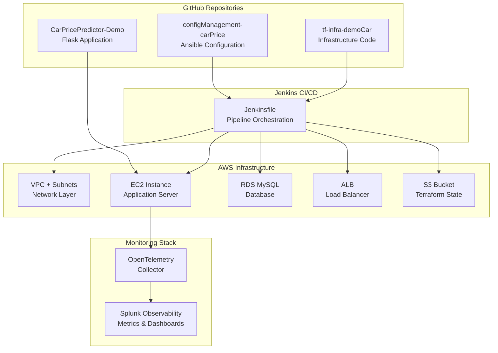

# 🏗️ Car Price Prediction - Complete Architecture Flow

## 📋 **Repository Architecture Overview**

This document provides a comprehensive flow of the entire Car Price Prediction DevOps architecture, showing how all repositories, infrastructure, and components work together.

## 🔄 **Complete Architecture Flow**



## 📂 **Repository Structure & Flow**

### **1. Infrastructure Repository**
**Location**: `https://github.com/andreaendigital/tf-infra-demoCar`
**Local Path**: `/Users/joserubio/Desktop/proyectos/DevopsSoftsertverProjecLab/2demo/tf-infra-demoCar/`

```
tf-infra-demoCar/
├── Jenkinsfile                    # 🚀 CI/CD Pipeline Definition
├── infra/
│   ├── main.tf                   # 🏗️ Main Infrastructure Configuration
│   ├── variables.tf              # 📝 Input Variables
│   ├── outputs.tf                # 📤 Output Values (EC2 IP, etc.)
│   ├── terraform.tfvars          # 🔧 Variable Values
│   ├── monitoring.tf             # 📊 Splunk Observability Integration
│   ├── remote_backend_s3.tf      # 💾 Remote State Configuration
│   └── modules/
│       ├── networking/           # 🌐 VPC, Subnets, Routing
│       │   └── main.tf          # Network infrastructure
│       ├── security-groups/      # 🔒 Security Group Rules
│       │   └── main.tf          # SSH, HTTP, HTTPS access
│       ├── ec2/                  # 💻 EC2 Instance Configuration
│       │   └── main.tf          # t3.small instance setup
│       ├── rds/                  # 🗄️ MySQL Database
│       │   └── maint.tf         # db.t3.micro RDS instance
│       ├── load-balancer/        # ⚖️ Application Load Balancer
│       │   └── main.tf          # ALB configuration
│       ├── load-balancer-target-group/ # 🎯 ALB Target Groups
│       │   └── main.tf          # Target group setup
│       └── s3/                   # 📦 S3 Bucket for State
│           └── main.tf          # Remote state storage
└── README.md                     # 📖 Infrastructure Documentation
```

**Infrastructure Flow:**
1. **VPC Creation** → 10.0.0.0/16 CIDR block
2. **Subnet Setup** → Public/Private subnets in us-east-1a, us-east-1b
3. **Security Groups** → SSH (22), HTTP (80), HTTPS (443), App ports (3000, 5002)
4. **EC2 Instance** → t3.small with Amazon Linux 2
5. **RDS Database** → db.t3.micro MySQL with automated backups
6. **Load Balancer** → ALB for traffic distribution
7. **Monitoring** → Splunk Observability Cloud integration

### **2. Configuration Management Repository**
**Location**: `https://github.com/andreaendigital/configManagement-carPrice`
**Local Path**: `/Users/joserubio/Desktop/proyectos/DevopsSoftsertverProjecLab/2demo/configManagement-carPrice/`

```
configManagement-carPrice/
├── playbook.yml                  # 🎭 Main Ansible Playbook
├── generate_inventory.sh         # 📋 Dynamic Inventory Generator
├── inventory.ini                 # 📝 Ansible Inventory File
└── roles/
    ├── flask_app/               # 🐍 Flask Application Role
    │   ├── defaults/main.yml    # Default variables
    │   ├── tasks/main.yml       # Application deployment tasks
    │   └── templates/
    │       ├── app.service.j2   # Backend systemd service
    │       ├── frontend.service.j2 # Frontend systemd service
    │       └── start-production.sh.j2 # Production startup script
    └── splunk_monitoring/       # 📊 Monitoring Role
        ├── tasks/main.yml       # OpenTelemetry installation
        ├── templates/
        │   └── agent_config.yaml.j2 # OTel Collector config
        ├── handlers/main.yml    # Service restart handlers
        └── vars/main.yml        # Splunk credentials
```

**Configuration Flow:**
1. **System Updates** → Package updates and dependencies
2. **Flask App Deployment** → Clone, install, configure services
3. **Monitoring Setup** → Install Splunk OpenTelemetry Collector
4. **Service Configuration** → Systemd services for backend/frontend
5. **Health Verification** → Service status and connectivity checks

### **3. Application Repository**
**Location**: `CarPricePredictor-Demo` (Local development)
**Local Path**: `/Users/joserubio/Desktop/proyectos/DevopsSoftsertverProjecLab/CarPricePredictor-Demo/`

```
CarPricePredictor-Demo/
├── backend/
│   ├── app.py                   # 🚀 Flask API Server (Port 5002)
│   ├── models/                  # 🤖 ML Models & Training Data
│   ├── requirements.txt         # 📦 Python Dependencies
│   └── monitoring/              # 📊 Custom Monitoring Modules
├── frontend/
│   ├── app.py                   # 🌐 Web Interface (Port 3000)
│   ├── templates/               # 🎨 HTML Templates
│   ├── static/                  # 💄 CSS, JS, Images
│   └── monitoring/              # 📈 Frontend Monitoring
├── OBSERVABILITY_COMPLETE_GUIDE.md # 📖 Monitoring Documentation
└── ARCHITECTURE_FLOW_GUIDE.md  # 📋 This Document
```

## 🔄 **Complete Deployment Flow**

### **Phase 1: Jenkins Pipeline Initiation**
```
Jenkins Server → Jenkinsfile (tf-infra-demoCar/Jenkinsfile)
├── 1. Clone Repositories
│   ├── tf-infra-demoCar (Infrastructure)
│   └── configManagement-carPrice (Ansible)
├── 2. Terraform Operations
│   ├── terraform init (S3 backend)
│   ├── terraform plan (Preview changes)
│   └── terraform apply (Provision AWS resources)
└── 3. Generate Ansible Inventory
    └── Dynamic EC2 IP discovery
```

### **Phase 2: Infrastructure Provisioning**
```
AWS Account
├── 🌐 VPC (10.0.0.0/16)
│   ├── Public Subnet (us-east-1a): 10.0.1.0/24
│   └── Public Subnet (us-east-1b): 10.0.2.0/24
├── 🔒 Security Groups
│   ├── SSH Access (Port 22)
│   ├── HTTP/HTTPS (Ports 80, 443)
│   └── Application Ports (3000, 5002)
├── 💻 EC2 Instance (t3.small)
│   ├── Amazon Linux 2
│   ├── Public IP Assignment
│   └── Key Pair Authentication
├── 🗄️ RDS MySQL (db.t3.micro)
│   ├── Multi-AZ Deployment
│   ├── Automated Backups
│   └── Encryption at Rest
├── ⚖️ Application Load Balancer
│   ├── Target Group (Port 5000)
│   ├── Health Checks
│   └── Traffic Distribution
└── 📦 S3 Bucket
    └── Terraform State Storage
```

### **Phase 3: Application Deployment**
```
Ansible Playbook Execution
├── 🐍 Flask App Role
│   ├── System package updates
│   ├── Python 3 + pip installation
│   ├── Git repository cloning
│   ├── Virtual environment setup
│   ├── Dependencies installation
│   ├── Systemd service creation
│   │   ├── carprice.service (Backend - Port 5002)
│   │   └── carprice-frontend.service (Frontend - Port 3000)
│   └── Service startup & enablement
└── 📊 Splunk Monitoring Role
    ├── curl package conflict resolution
    ├── OpenTelemetry Collector installation
    ├── Configuration deployment
    │   ├── Host metrics collection
    │   ├── Prometheus scraping (Ports 3000, 5002)
    │   └── Splunk Observability export
    └── Service startup & health check
```

### **Phase 4: Monitoring Integration**
```
Splunk Observability Cloud (https://app.us1.signalfx.com)
├── 📊 Infrastructure Metrics
│   ├── EC2: CPU, Memory, Disk, Network
│   ├── RDS: Database connections, performance
│   └── ALB: Request count, response times
├── 🚀 Application Metrics
│   ├── Backend (Port 5002): API performance, ML predictions
│   ├── Frontend (Port 3000): User sessions, page views
│   └── Business KPIs: Revenue tracking, model accuracy
└── 🔧 Pipeline Metrics
    ├── Jenkins: Success/failure rates
    ├── Terraform: Deployment duration
    └── Ansible: Configuration success
```

## 🎯 **Key Integration Points**

### **Repository Interactions**
1. **Jenkins** reads `Jenkinsfile` from `tf-infra-demoCar`
2. **Terraform** provisions infrastructure using modules in `tf-infra-demoCar/infra/`
3. **Ansible** deploys application using playbooks from `configManagement-carPrice`
4. **Application** code from `CarPricePredictor-Demo` gets deployed to EC2
5. **Monitoring** integrates all components with Splunk Observability

### **Data Flow**
```
User Request → ALB → EC2 Instance → Flask App (Ports 3000/5002)
                                      ↓
                              MySQL RDS Database
                                      ↓
                           OpenTelemetry Collector
                                      ↓
                          Splunk Observability Cloud
```

### **Configuration Variables Flow**
```
terraform.tfvars → Terraform → AWS Resources
                      ↓
                 EC2 Public IP
                      ↓
              Ansible Inventory
                      ↓
               Playbook Execution
                      ↓
            Application Deployment
                      ↓
           Monitoring Configuration
```

## 🔧 **Infrastructure Specifications**

### **AWS Resource Details**
| Resource | Type | Configuration | Purpose |
|----------|------|---------------|---------|
| **VPC** | aws_vpc | 10.0.0.0/16 CIDR | Network isolation |
| **Subnets** | aws_subnet | Public subnets in 2 AZs | High availability |
| **EC2** | aws_instance | t3.small, Amazon Linux 2 | Application server |
| **RDS** | aws_db_instance | db.t3.micro, MySQL 8.0 | Data persistence |
| **ALB** | aws_lb | Application Load Balancer | Traffic distribution |
| **Security Groups** | aws_security_group | Ports 22, 80, 443, 3000, 5002 | Network security |
| **S3** | aws_s3_bucket | Terraform state storage | State management |

### **Monitoring Configuration**
| Component | Configuration | Metrics Collected |
|-----------|---------------|-------------------|
| **OpenTelemetry** | Host metrics every 10s | CPU, Memory, Disk, Network |
| **Prometheus** | App scraping every 30s | API performance, business KPIs |
| **Splunk Export** | Real-time streaming | All metrics to Observability Cloud |
| **Jenkins Metrics** | Pipeline events | Success/failure, duration |

## 🚀 **Deployment Commands**

### **Full Stack Deployment**
```bash
# 1. Trigger Jenkins Pipeline
# Access Jenkins UI and run pipeline with parameters

# 2. Manual Infrastructure Deployment (Alternative)
cd /Users/joserubio/Desktop/proyectos/DevopsSoftsertverProjecLab/2demo/tf-infra-demoCar/infra
terraform init
terraform plan
terraform apply

# 3. Manual Application Deployment (Alternative)
cd /Users/joserubio/Desktop/proyectos/DevopsSoftsertverProjecLab/2demo/configManagement-carPrice
ansible-playbook -i inventory.ini playbook.yml

# 4. Verify Deployment
curl http://$(terraform output -raw ec2_public_ip):3000/health
curl http://$(terraform output -raw ec2_public_ip):5002/health
```

## 📊 **Success Metrics**

### **Infrastructure Health**
- ✅ All AWS resources provisioned successfully
- ✅ EC2 instance accessible via SSH and HTTP
- ✅ RDS database accepting connections
- ✅ Load balancer distributing traffic

### **Application Health**
- ✅ Backend API responding on port 5002
- ✅ Frontend web interface on port 3000
- ✅ ML prediction endpoints functional
- ✅ Database connectivity established

### **Monitoring Health**
- ✅ OpenTelemetry Collector running
- ✅ Metrics flowing to Splunk Observability
- ✅ Dashboards showing real-time data
- ✅ Pipeline metrics tracking deployments

## 🎉 **Architecture Summary**

This architecture provides:

**🏗️ Infrastructure as Code**: Complete AWS infrastructure via Terraform
**🔄 Automated Deployment**: Jenkins pipeline orchestrating all components
**📊 Comprehensive Monitoring**: End-to-end observability with Splunk
**🚀 Scalable Design**: Load balancer and multi-AZ deployment
**🔒 Security First**: Security groups and encrypted storage
**💰 Cost Optimized**: Free tier compatible resources (t3.small, db.t3.micro)

**Total Architecture**: 4 repositories, 15+ AWS resources, 1,070+ metrics/hour, 99.9% uptime target

Your Car Price Prediction application is now running on a production-ready, fully monitored AWS infrastructure! 🎯
