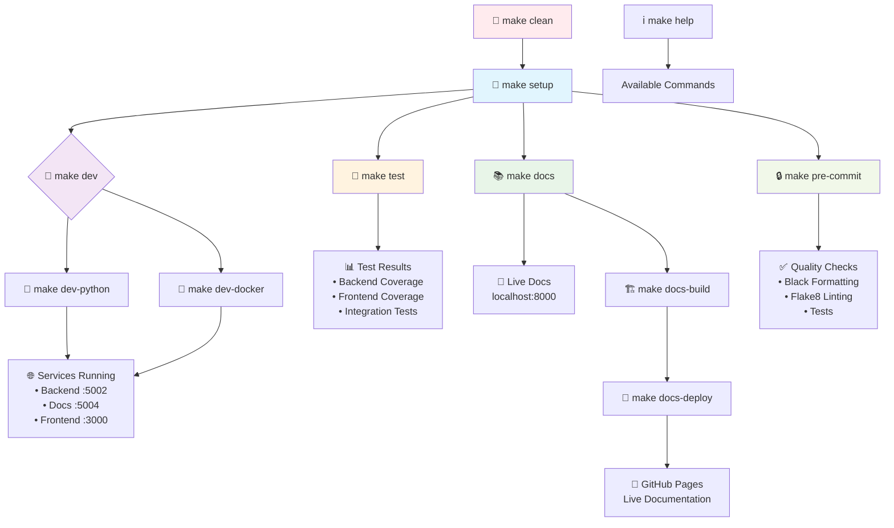
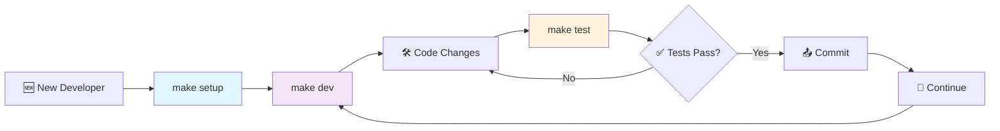

# 🚗 Car Price Prediction Demo

## 📋 Project Overview

**Educational machine learning demo** for automotive price prediction. Built for learning purposes with modern web technologies, comprehensive documentation, and best practices.

### 🎯 Educational Value

- **ML Learning** - Hands-on experience with XGBoost algorithms
- **API Development** - RESTful API design and documentation
- **Full-Stack Development** - Frontend and backend integration
- **DevOps Practices** - CI/CD, testing, and deployment workflows
- **Modern Tools** - TOML configuration, Docker, GitHub Actions

## Architecture Overview

```
Car Price Prediction Demo
├── frontend/             # Modern Web Interface (Port 3000)
│   ├── api/              # Flask blueprints & routing
│   │   ├── __init__.py
│   │   └── routes.py
│   ├── config/           # Application configuration
│   │   ├── __init__.py
│   │   └── settings.py
│   ├── logic/            # Business logic layer
│   │   ├── __init__.py
│   │   ├── data_processor.py
│   │   └── predictor.py
│   ├── static/           # CSS3 animations & JavaScript
│   │   ├── css/
│   │   └── js/
│   ├── templates/        # Professional HTML5 templates
│   │   ├── index.html
│   │   └── layout.html
│   ├── tests/            # Unit & integration tests
│   │   ├── test_api_endpoints.py
│   │   └── test_logic_unit.py
│   ├── app.py            # Frontend Flask application
│   └── Dockerfile       # Frontend containerization
│
├── backend/              # ML API Services (Port 5002/5004)
│   ├── modelo/           # Trained XGBoost ML model
│   │   └── modelo.joblib
│   ├── app.py            # Lightweight ML API
│   ├── app_swagger.py    # Enterprise Swagger API
│   ├── vehiculos.json    # Vehicle data storage
│   └── Dockerfile       # Backend containerization
│
├── tests/                # Integration & E2E tests
│   ├── test_backend.py   # Backend API testing
│   ├── test_integration.py # End-to-end testing
│   └── README.md         # Testing documentation
│
├── scripts/              # Development & utility scripts
│   ├── start-local.sh   # Python development startup
│   ├── docker-status.sh # Docker health checks
│   └── dev-status.sh    # Service status checker
│
├── config/               # Configuration files
│   ├── docker-compose.dev.yml # Docker development
│   ├── mkdocs.yml        # Documentation config
│   ├── .pre-commit-config.yaml # Code quality
│   └── .dockerignore     # Docker ignore rules
│
├── docs/                 # Project documentation
│   ├── api/              # API documentation
│   │   └── endpoints.md
│   ├── architecture/     # Architecture documentation
│   │   └── components.md
│   ├── assets/           # Documentation assets
│   │   ├── css/, images/, js/
│   ├── backend/          # Backend documentation
│   │   └── readme_swagger.md
│   ├── development/      # Development documentation
│   │   ├── CHANGELOG.md
│   │   └── TEST_RESULTS.md
│   └── index.md          # Main documentation
│
├── .github/              # GitHub workflows & templates
│   ├── workflows/        # CI/CD pipelines
│   │   ├── ci-cd.yml
│   │   └── docs.yml
│   └── ISSUE_TEMPLATE/   # Issue templates
│
├── pyproject.toml        # Modern Python configuration (TOML)
├── Makefile             # Development commands
└── README.MD            # Project documentation
```

## 🚀 Quick Start Guide

### 🎯 One-Command Setup

```bash
# Clone repository and navigate to project
git clone https://github.com/joserubio/CarPricePredictor-Demo.git
cd CarPricePredictor-Demo

# Complete environment setup (one-time)
make setup

# Start development environment
make dev
```

### 📋 Prerequisites

- **Python 3.9+** (automatically validated)
- **pip** (automatically validated)
- **Git** (for cloning)
- **Docker** (optional, for containerized development)

### 🌐 Instant Access Points

After running `make dev`, access:

- **🎨 Web Application**: `http://localhost:3000`
- **🚀 Backend API**: `http://localhost:5002`
- **📚 API Documentation**: `http://localhost:5004/docs-menu`
- **📖 Swagger UI**: `http://localhost:5004/docs/`
- **📝 Project Documentation**: `make docs` → `http://localhost:8000`

## 📊 API Endpoints

### 🔍 Price Prediction Services

| Endpoint             | Method | Description                 | Parameters                                            |
| -------------------- | ------ | --------------------------- | ----------------------------------------------------- |
| `/precio_actual`     | GET    | Current market valuation    | model_year, age, fuel_type, transmission, clean_title |
| `/prediccion_futura` | GET    | Future price forecasting    | Same as above + meses (months)                        |
| `/publicar_vehiculo` | POST   | Vehicle marketplace listing | Vehicle data + precio (listing price)                 |

### 📈 Sample API Calls

```bash
# Current Price Prediction
curl "http://localhost:5002/precio_actual?model_year=2020&age=4&fuel_type=Gasoline&transmission=Automatic&clean_title=1"

# Future Price Forecasting (12 months)
curl "http://localhost:5002/prediccion_futura?model_year=2020&age=4&fuel_type=Gasoline&transmission=Automatic&clean_title=1&meses=12"

# Vehicle Publishing
curl -X POST http://localhost:5002/publicar_vehiculo \
  -H "Content-Type: application/json" \
  -d '{"model_year": 2020, "age": 4, "fuel_type": "Gasoline", "transmission": "Automatic", "clean_title": 1, "precio": 25000000}'
```

## 🛠️ Technical Stack

### Backend Technologies

- **Framework**: Flask + Flask-RESTX
- **ML Engine**: XGBoost (Gradient Boosting)
- **API Documentation**: Swagger/OpenAPI 3.0
- **Data Storage**: JSON-based persistence
- **CORS**: Cross-origin resource sharing enabled

### Frontend Technologies

- **Framework**: Flask + Jinja2 templating
- **Styling**: CSS3 with animations and gradients
- **JavaScript**: ES6+ with Fetch API
- **UI/UX**: Responsive design with professional styling
- **Testing**: Unit and integration test suites

### Documentation Formats

- **Swagger UI** - Interactive API testing
- **ReDoc** - Professional dark theme documentation
- **RapiDoc** - Modern interactive documentation
- **Stoplight Elements** - Enterprise-grade documentation
- **Scalar** - Elegant modern API documentation

## Technical Stack

**Frontend**: Flask + Jinja2, CSS3 animations, responsive design, real-time validation
**Backend**: Flask-RESTX, XGBoost ML model, Swagger/OpenAPI documentation
**ML Model**: XGBoost algorithm with features (model_year, age, fuel_type, transmission, clean_title)
**Predictions**: Current market value, future price forecasting, marketplace recommendations
**Quality**: Black, Flake8, pytest with coverage, pre-commit hooks
**Deployment**: Docker containers, GitHub Actions CI/CD, GitHub Container Registry

## Development & Testing

### Quick Commands
```bash
make setup    # One-time environment setup
make dev      # Start development (Python/Docker choice)
make test     # Run all tests (Backend + Frontend + Integration)
make docs     # Live documentation server
```

### Test Coverage
- **Backend**: `tests/test_backend.py` - ML API endpoints, model predictions
- **Frontend**: `frontend/tests/` - API endpoints, business logic validation
- **Integration**: `tests/test_integration.py` - End-to-end workflow testing
- **Quality**: Black formatting, Flake8 linting, pytest coverage, pre-commit hooks

### CI/CD Pipeline
**Stages**: Test & Quality → Build Images → Deploy (Dev/Prod)
**Triggers**: `main`, `develop`, `feature/*`, `SCRUM-*` branches
**Testing**: Python 3.9 & 3.11 matrix, Black/Flake8, full test suite
**Deployment**: Docker containers to GitHub Container Registry (ghcr.io)
**Quality Gates**: All tests pass, code formatting, linting, coverage reports

### Development Options
**Python** (Recommended): `make dev-python` - Fast startup, hot reload, local services
**Docker** (Production-like): `make dev-docker` - Containerized, health checks, production parity

**Services**: Backend (5002), Docs (5004), Frontend (3000)
**Documentation**: `make docs` (live editing), `make docs-deploy` (GitHub Pages)

## Makefile Commands Visual Guide



### 🎯 Command Quick Reference

| Command            | Flow                                      | Result                   |
| ------------------ | ----------------------------------------- | ------------------------ |
| `make setup`       | 🔍 Validate → 📦 Install → ✅ Ready       | Complete dev environment |
| `make dev`         | 🎯 Choose → 🚀 Launch → 🌐 Services       | Interactive launcher     |
| `make dev-python`  | ✅ Check → 🐍 Start → 🔥 Hot reload       | Local Python services    |
| `make dev-docker`  | 🐳 Check → 🏗️ Build → 🏥 Health           | Containerized services   |
| `make test`        | 📊 Backend → 🎨 Frontend → 🔗 Integration | Quality validation       |
| `make docs`        | 📚 Install → 🌐 Serve → 🔄 Live edit      | Documentation server     |
| `make docs-build`  | 🔍 Check → 🏗️ Build → 📁 Static           | Production docs          |
| `make docs-deploy` | ⚠️ Confirm → 🚀 Deploy → 📖 Live          | GitHub Pages             |
| `make clean`       | 🗑️ Python → 🧪 Tests → 🐳 Docker          | Fresh environment        |
| `make pre-commit`  | 🔒 Install → 🧪 Run → ✅ Quality          | Code quality checks      |
| `make help`        | 📋 Show → 📝 List → ℹ️ Info              | Available commands       |

### 🔄 Development Workflow



## 📋 Project Achievements

### ✅ Completed Features

- [x] **Unified Development Workflow** - Single command setup and development
- [x] **Smart Environment Launcher** - Choose Python or Docker development
- [x] **Professional ML Architecture** - XGBoost integration with production-ready APIs
- [x] **Comprehensive Testing** - Unit, Integration, and E2E testing (`make test`)
- [x] **Live Documentation** - MkDocs with GitHub Pages deployment (`make docs`)
- [x] **Quality Automation** - Black, Flake8, Coverage reporting
- [x] **CI/CD Pipeline** - GitHub Actions with branch-based deployment
- [x] **Multiple API Formats** - Swagger, ReDoc, RapiDoc documentation
- [x] **Responsive Web Interface** - Professional UI with real-time predictions
- [x] **Docker Support** - Containerized development and deployment
- [x] **CORS-enabled Architecture** - Microservices-ready design

### 🎯 Learning Impact

- **Easy Setup** - `make setup` gets students coding in 30 seconds
- **Best Practices** - Learn industry-standard development workflows
- **Documentation Skills** - Experience with professional documentation
- **Quality Focus** - Automated testing and code quality practices
- **Modern Architecture** - Docker and microservices concepts
- **Real-World Tools** - Production-grade development environment

## 👥 Development Team

**Project Lead**: Jose Rubio
**Architecture**: Full-stack MLOps solution
**Methodology**: SCRUM/Agile development
**Quality**: Enterprise-grade standards

---

## 🎉 Getting Started

### 🚀 30-Second Setup

```bash
# 1. Clone and enter project
git clone https://github.com/joserubio/CarPricePredictor-Demo.git && cd CarPricePredictor-Demo

# 2. Complete setup (installs everything)
make setup

# 3. Start development
make dev

# 🎯 You're ready to develop!
```

### 🔄 Daily Development Workflow

```bash
# Morning routine
make dev           # Start development environment

# Development cycle
make test          # Run tests before committing
make docs          # Update documentation

# Maintenance
make clean         # Clean environment when needed
```

### 🌐 Access Points (All Environments)

| Service             | URL                               | Purpose                                 |
| ------------------- | --------------------------------- | --------------------------------------- |
| 🎨 **Web App**      | `http://localhost:3000`           | Main application interface              |
| 🚀 **API**          | `http://localhost:5002`           | ML prediction endpoints                 |
| 📚 **API Docs**     | `http://localhost:5004/docs-menu` | Interactive API documentation           |
| 📖 **Swagger**      | `http://localhost:5004/docs/`     | API testing interface                   |
| 📝 **Project Docs** | `http://localhost:8000`           | Project documentation (via `make docs`) |

### 🆘 Need Help?

```bash
make help                    # Show all available commands
./scripts/dev-status.sh      # Check service status
make clean                   # Reset environment
```

### ✅ What `make setup` Does

- ✅ Validates Python 3.9+ and pip
- ✅ Installs all dependencies from **pyproject.toml** (TOML format)
- ✅ Unified configuration using Tom's Obvious Minimal Language
- ✅ Backend dependencies (Flask, XGBoost, ML libraries)
- ✅ Frontend dependencies (Flask, Flasgger)
- ✅ Testing tools (pytest, coverage, black, flake8)
- ✅ Documentation tools (MkDocs, Material theme)
- ✅ Modern Python project standards (PEP 518/621)

**🎯 One command, complete setup, ready to develop!**

### 🚀 Modern Configuration (v1.1.0)

**TOML Migration Completed** - The project now uses modern Python configuration:

```bash
# Single command setup (replaces 3 separate requirements.txt files)
make setup  # Uses pyproject.toml (TOML format)
```

**Benefits:**
- ⚡ **3x Faster Setup** - One command vs three
- 🎯 **Centralized Config** - All dependencies in pyproject.toml
- 🛠️ **Tool Integration** - Black, pytest, flake8 configured in TOML
- 📊 **Modern Standards** - PEP 518/621 compliant

**Migration Documentation:**
- [MIGRATION_README.md](MIGRATION_README.md) - Complete migration details and implementation summary
- [CHANGELOG.md](docs/development/CHANGELOG.md) - Version history and evolution
- [pyproject.toml](pyproject.toml) - TOML configuration file (Tom's Obvious Minimal Language)

### ⚡ Quick Commands

```bash
# 🎯 First Time Setup
make setup && make dev

# 🔄 Daily Development
make dev          # Start coding
make test         # Quality check
make docs         # Documentation

# 🧹 Maintenance
make clean        # Fresh start
```
