# Car Price Prediction Platform - Enterprise MLOps Solution

## Project Overview

**Professional full-stack machine learning platform** for automotive price prediction. Built with enterprise-grade architecture, comprehensive API documentation, and modern web technologies.

### Business Value

- **Real-time ML Predictions** - Instant vehicle valuations using XGBoost algorithms
- **Future Price Forecasting** - AI-powered depreciation modeling for investment decisions
- **Professional Documentation** - API documentation for different stakeholders
- **Modern Configuration** - TOML (Tom's Obvious Minimal Language) unified project setup

## Architecture Overview

```
Car Price Prediction Demo
├── frontend/             # Modern Web Interface (Port 3000)
│   ├── api/              # Flask blueprints & routing
│   │   ├── __init__.py
│   │   └── routes.py
│   ├── config/           # Application configuration
│   │   ├── __init__.py
│   │   └── settings.py
│   ├── logic/            # Business logic layer
│   │   ├── __init__.py
│   │   ├── data_processor.py
│   │   └── predictor.py
│   ├── static/           # CSS3 animations & JavaScript
│   │   ├── css/
│   │   └── js/
│   ├── templates/        # Professional HTML5 templates
│   │   ├── index.html
│   │   └── layout.html
│   ├── tests/            # Unit & integration tests
│   │   ├── test_api_endpoints.py
│   │   └── test_logic_unit.py
│   ├── app.py            # Frontend Flask application
│   └── Dockerfile       # Frontend containerization
│
├── backend/              # ML API Services (Port 5002/5004)
│   ├── modelo/           # Trained XGBoost ML model
│   │   └── modelo.joblib
│   ├── app.py            # Lightweight ML API
│   ├── app_swagger.py    # Enterprise Swagger API
│   ├── vehiculos.json    # Vehicle data storage
│   └── Dockerfile       # Backend containerization
│
├── tests/                # Integration & E2E tests
│   ├── test_backend.py   # Backend API testing
│   ├── test_integration.py # End-to-end testing
│   └── README.md         # Testing documentation
│
├── scripts/              # Development & utility scripts
│   ├── start-local.sh   # Python development startup
│   ├── docker-status.sh # Docker health checks
│   └── dev-status.sh    # Service status checker
│
├── config/               # Configuration files
│   ├── docker-compose.dev.yml # Docker development
│   ├── mkdocs.yml        # Documentation config
│   ├── .pre-commit-config.yaml # Code quality
│   └── .dockerignore     # Docker ignore rules
│
├── docs/                 # Project documentation
│   ├── api/              # API documentation
│   │   └── endpoints.md
│   ├── architecture/     # Architecture documentation
│   │   └── components.md
│   ├── assets/           # Documentation assets
│   │   ├── css/, images/, js/
│   ├── backend/          # Backend documentation
│   │   └── readme_swagger.md
│   ├── development/      # Development documentation
│   │   ├── CHANGELOG.md
│   │   └── TEST_RESULTS.md
│   └── index.md          # Main documentation
│
├── .github/              # GitHub workflows & templates
│   ├── workflows/        # CI/CD pipelines
│   │   ├── ci-cd.yml
│   │   └── docs.yml
│   └── ISSUE_TEMPLATE/   # Issue templates
│
├── pyproject.toml        # Modern Python configuration (TOML)
├── Makefile             # Development commands
└── README.MD            # Project documentation
```

## Quick Start Guide

### One-Command Setup

```bash
# Clone repository and navigate to project
git clone hhttps://github.com/andreaendigital/CarPricePredictor-Demo.git
cd CarPricePredictor-Demo

# Complete environment setup (one-time)
make setup

# Start development environment
make dev
```

### Prerequisites

- **Python 3.9+** (automatically validated)
- **pip** (automatically validated)
- **Git** (for cloning)
- **Docker** (optional, for containerized development)

### 🌐 Instant Access Points

After running `make dev`, access:

- **Web Application**: `http://localhost:3000`
- **Backend API**: `http://localhost:5002`
- **API Documentation**: `http://localhost:5004/docs-menu`
- **Swagger UI**: `http://localhost:5004/docs/`
- **Project Documentation**: `make docs` → `http://localhost:8000`

## API Endpoints

### Price Prediction Services

| Endpoint             | Method | Description                 | Parameters                                            |
| -------------------- | ------ | --------------------------- | ----------------------------------------------------- |
| `/current_value_market`     | GET    | Current market valuation    | model_year, age, fuel_type, transmission, clean_title |
| `/future_prediction` | GET    | Future price forecasting    | Same as above + meses (months)                        |
| `/publish_car` | POST   | Vehicle marketplace listing | Vehicle data + precio (listing price)                 |

### 📈 Sample API Calls

```bash
# Current Price Prediction
curl "http://localhost:5002/current_value_market?model_year=2020&age=4&fuel_type=Gasoline&transmission=Automatic&clean_title=1"

# Future Price Forecasting (12 months)
curl "http://localhost:5002/future_prediction?model_year=2020&age=4&fuel_type=Gasoline&transmission=Automatic&clean_title=1&meses=12"

# Vehicle Publishing
curl -X POST http://localhost:5002/publish_car \
  -H "Content-Type: application/json" \
  -d '{"model_year": 2020, "age": 4, "fuel_type": "Gasoline", "transmission": "Automatic", "clean_title": 1, "precio": 25000000}'
```

## Technical Stack

### Backend Technologies

- **Framework**: Flask + Flask-RESTX
- **ML Engine**: XGBoost (Gradient Boosting)
- **API Documentation**: Swagger/OpenAPI 3.0
- **Data Storage**: JSON-based persistence
- **CORS**: Cross-origin resource sharing enabled

### Frontend Technologies

- **Framework**: Flask + Jinja2 templating
- **Styling**: CSS3 with animations and gradients
- **JavaScript**: ES6+ with Fetch API
- **UI/UX**: Responsive design with professional styling
- **Testing**: Unit and integration test suites

### Documentation Formats

- **Swagger UI** - Interactive API testing
- **ReDoc** - Professional dark theme documentation

## Professional Features

### Frontend Capabilities

- **Professional Animations** - CSS3 transitions and effects
- **Real-time Validation** - Form validation and error handling
- **Modern UI Components** - Cards, gradients, and professional typography

### Backend Capabilities

- **ML Model Integration** - Production-ready XGBoost model
- **Professional API Design** - RESTful architecture with proper HTTP status codes
- **Error Handling** - Robust error handling and validation
- **CORS Support** - Cross-origin requests enabled

## Machine Learning Model

### Model Specifications

- **Algorithm**: XGBoost (Extreme Gradient Boosting)
- **Features**: model_year, age, fuel_type, transmission, clean_title
- **Output**: Price prediction in local currency

### Prediction Types

1. **Current Market Value** - Real-time price estimation
2. **Future Price Forecasting** - Depreciation-based future value prediction

## Development Workflow

### Branch Strategy (SCRUM Methodology)

- **SCRUM-95**: Frontend development and UI/UX
- **SCRUM-57** **SCRUM-58** : Backend API development
- **SCRUM-92**: Documentation and project setup
- **SCRUM-88**: Advanced backend with Swagger integration

### Quality Assurance

- **Unit Testing** - Comprehensive test coverage (`make test`)
- **Integration Testing** - End-to-end workflow testing
- **Code Quality** - Professional coding standards (Black, Flake8)
- **Pre-commit Hooks** - Automatic quality checks before commits
- **Documentation** - Live documentation development (`make docs`)
- **CI/CD Integration** - Same commands locally and in pipeline

## Testing Strategy

### Test Suite Overview

Our comprehensive testing strategy ensures code quality and reliability across all components:

#### **Backend Tests**

- **Location**: `tests/test_backend.py`
- **Coverage**: ML API endpoints, model predictions, error handling
- **Framework**: pytest with coverage reporting
- **Command**: `cd backend && python -m pytest ../tests/test_backend.py -v --cov=.`

#### **Frontend Tests**

- **API Endpoint Tests**: `frontend/tests/test_api_endpoints.py`
  - Tests POST `/valoractual` and `/predictions` endpoints
  - Validates JSON structure and error handling
- **Logic Unit Tests**: `frontend/tests/test_logic_unit.py`
  - Tests business logic functions in isolation
  - Validates price calculation algorithms
  - Tests data processing functions
- **Command**: `cd frontend && python -m pytest tests/ -v --cov=.`

#### **Integration Tests**

- **Location**: `tests/test_integration.py`
- **Purpose**: End-to-end testing with real services
- **Coverage**:
  - Backend service health checks (Port 5002)
  - Frontend service health checks (Port 3000)
  - Complete prediction workflow testing
  - CORS functionality validation
- **Dependencies**: Requires `requests` library
- **Command**: `python -m pytest tests/test_integration.py -v`

### Code Quality Tools

- **Black**: Python code formatting (`black --check backend/ frontend/`)
- **Flake8**: Linting and style checking
- **pytest-cov**: Test coverage reporting
- **Coverage Reports**: XML format for CI/CD integration

## CI/CD Pipeline

### GitHub Actions Workflow

Our automated pipeline ensures code quality and enables continuous deployment:

#### **Pipeline Stages**

**1. Test & Quality Stage**

- **Triggers**: Push to `main`, `develop`, `feature/*`, `SCRUM-*` branches
- **Matrix Testing**: Python 3.9 and 3.11
- **Dependencies**:
  ```bash
  pip install flake8 pytest pytest-cov black requests
  pip install -r backend/requirements.txt
  pip install -r frontend/requirements.txt
  ```
- **Quality Checks**:
  - Code formatting validation with Black
  - Linting with Flake8 (complexity max 10, line length 127)
  - Backend unit tests with coverage
  - Frontend unit tests with coverage
  - Integration tests with service health checks

**2. Build Images Stage** _(Active)_

- **Purpose**: Docker containerization for deployment
- **Images**: Backend and Frontend containers
- **Registry**: GitHub Container Registry (ghcr.io)
- **Triggers**: Only on push events (not pull requests)
- **Tags**: Uses commit SHA for versioning

**3. Deploy to Development**

- **Triggers**: `develop` branch or `SCRUM-*` branches
- **Environment**: Development staging
- **Purpose**: Testing new features before production
- **Dependencies**: Requires successful test and build stages

**4. Deploy to Production**

- **Triggers**: Only `main` branch
- **Environment**: Production
- **Purpose**: Live application deployment
- **Requirements**: All tests must pass, manual approval required

#### **Pipeline Configuration**

```yaml
name: Car Price Prediction CI/CD
triggers: [main, develop, feature/*, SCRUM-*]
matrix: [Python 3.9, Python 3.11]
stages: [Test & Quality → Build → Deploy]
```

#### **Test Execution Flow**

1. **Setup Environment**: Install Python dependencies
2. **Code Quality**: Black formatting + Flake8 linting
3. **Backend Testing**: ML API and model validation
4. **Frontend Testing**: UI components and API integration
5. **Integration Testing**: End-to-end workflow validation
6. **Coverage Reporting**: Generate XML coverage reports
7. **Deployment**: Automatic deployment based on branch

### Branch-Based Deployment Strategy

- **SCRUM-90** (Current) → Development Environment
- **develop** → Development Environment
- **main** → Production Environment
- **feature/** → Development Environment (on push)

### Quality Gates

- ✅ All tests must pass (Backend, Frontend, Integration)
- ✅ Code formatting must comply with Black standards
- ✅ Linting must pass Flake8 checks
- ✅ Test coverage reports generated
- ✅ No critical security vulnerabilities

## 🛠️ Development Workflow


## 📋 Makefile Commands Visual Guide

```mermaid
graph LR
    A["🆕 New Developer"] --> B["make setup"]
    B --> C["make dev"]
    C --> D["🛠️ Code Changes"]
    D --> E["make test"]
    E --> F{"✅ Tests Pass?"}
    F -->|Yes| G["📤 Commit"]
    F -->|No| D
    G --> H["🔄 Continue"]
    H --> C

    style B fill:#e1f5fe
    style C fill:#f3e5f5
    style E fill:#fff3e0
```





### Command Quick Reference

| Command            | Flow                             | Result                   |
| ------------------ | -------------------------------- | ------------------------ |
| `make setup`       | Validate → Install → Ready       | Complete dev environment |
| `make dev`         | Choose → Launch → Services       | Interactive launcher     |
| `make dev-python`  | Check → Start → Hot reload       | Local Python services    |
| `make dev-docker`  | Check → Build → Health           | Containerized services   |
| `make test`        | Backend → Frontend → Integration | Quality validation       |
| `make docs`        | Install → Serve → Live edit      | Documentation server     |
| `make docs-build`  | Check → Build → Static           | Production docs          |
| `make docs-deploy` | Confirm → Deploy → Live          | GitHub Pages             |
| `make clean`       | Python → Tests → Docker          | Fresh environment        |


## Key Project Blockers

This summary identifies risks related to dependency management, development infrastructure (Docker/TOML), and workflow tool adoption (Jira/GitHub).

| Blocker | Potential Impact on the Project | Proposed Solution (Mitigation) | 
 | ----- | ----- | ----- | 
| **1. Migration to TOML : Incompatibility in Docker Builds** | The current Dockerfile process assumes pip install -r requirements.txt. Migration requires changing the builder to install dependencies from pyproject.toml or the lock file. | **Solution:** Refactor the Dockerfile to use the native TOML tool flow (e.g., copying pyproject.toml and poetry.lock and running poetry install --no-root). | 
| **2. Build-Time Dependency Management** | ML dependencies requiring compilation might face issues if the TOML tool doesn't manage them correctly in the Docker build environment. | **Solution:** Identify and isolate complex dependencies. Use a builder pattern or a multi-stage container in Docker to pre-install or configure necessary system tools before Python installation. | 
| **3. Jira and GitHub Learning Curve** | The team's lack of familiarity with the Jira-GitHub workflow (creating branches with ticket IDs, linking commits, auto-moving statuses). | **Solution:** Conduct a mandatory hands-on workshop at the start of the project on the "Branching, Commit, Merge Request, Ticket Closing" flow. Document the commit message convention (e.g., [Ticket-ID] Descriptive message). | 
| **4. Python/ML Library Version Conflict** | A required preprocessing library is incompatible with onnxruntime in the Docker environment. | **Solution:** Define the versions of all dependencies. Use a clean Docker base image to strictly isolate dependencies. | 


## Project Achievements

### Completed Features

- [x] **Unified Development Workflow** - Single command setup and development
- [x] **Smart Environment Launcher** - Choose Python or Docker development
- [x] **Professional ML Architecture** - XGBoost integration with production-ready APIs
- [x] **Comprehensive Testing** - Unit, Integration, and E2E testing (`make test`)
- [x] **Live Documentation** - MkDocs with GitHub Pages deployment (`make docs`)
- [x] **Quality Automation** - Black, Flake8, Coverage reporting
- [x] **CI/CD Pipeline** - GitHub Actions with branch-based deployment
- [x] **Multiple API Formats** - Swagger, ReDoc documentation
- [x] **Responsive Web Interface** - Professional UI with real-time predictions
- [x] **Docker Support** - Containerized development and deployment
- [x] **CORS-enabled Architecture** - Microservices-ready design

### Business Impact

- **Zero Setup Friction** - `make setup` gets anyone developing in 30 seconds
- **Consistent Development** - Same commands work locally and in CI/CD
- **Professional Documentation** - Live docs with GitHub Pages integration
- **Quality Assurance** - Automated testing and code quality checks
- **Scalable Architecture** - Docker-ready microservices design
- **Enterprise-Ready** - Production-grade tooling and workflows

## 👥 Development Team

**Project Lead**: Jose Rubio
**Architecture**: Full-stack MLOps solution
**Methodology**: SCRUM/Agile development
**Quality**: Enterprise-grade standards
