# 🚗 Car Price Prediction Platform - Enterprise MLOps Solution

## 📋 Project Overview

**Professional full-stack machine learning platform** for automotive price prediction and vehicle marketplace management. Built with enterprise-grade architecture, comprehensive API documentation, and modern web technologies.

### 🎯 Business Value

- **Real-time ML Predictions** - Instant vehicle valuations using XGBoost algorithms
- **Future Price Forecasting** - AI-powered depreciation modeling for investment decisions
- **Marketplace Integration** - Complete vehicle listing and price recommendation system
- **Professional Documentation** - Multiple API documentation formats for different stakeholders
- **Modern Configuration** - TOML (Tom's Obvious Minimal Language) unified project setup

## 🏗️ Architecture Overview

```
📁 Car Price Prediction Platform
├── 🎨 frontend/          # Modern Web Interface (Port 3000)
│   ├── 🖥️  templates/     # Professional HTML5 templates
│   ├── 🎨 static/        # CSS3 animations & JavaScript
│   ├── 🔧 api/           # Flask blueprints & routing
│   ├── ⚙️  config/       # Application configuration
│   ├── 🧠 logic/         # Business logic layer
│   └── 🧪 tests/         # Unit & integration tests
│
├── 🚀 backend/           # ML API Services (Port 5002/5004)
│   ├── 🤖 modelo/        # Trained XGBoost ML model
│   ├── 📊 app.py         # Lightweight ML API
│   └── 📚 app_swagger.py # Enterprise Swagger API
│
├── 📁 scripts/           # Development & utility scripts
│   ├── 🐍 start-local.sh # Python development startup
│   ├── 🐳 docker-status.sh # Docker health checks
│   └── 📊 dev-status.sh   # Service status checker
│
├── 📁 config/            # Configuration files
│   ├── 🐳 docker-compose.dev.yml # Docker development
│   ├── 📚 mkdocs.yml      # Documentation config
│   ├── 🔒 .pre-commit-config.yaml # Code quality
│   └── 🐳 .dockerignore   # Docker ignore rules
│
└── 📋 docs/              # Project documentation
    ├── 📁 development/    # Development documentation
    └── 📁 backend/       # API documentation
```

## 🚀 Quick Start Guide

### 🎯 One-Command Setup

```bash
# Clone repository and navigate to project
git clone <repository-url>
cd p1.1

# Complete environment setup (one-time)
make setup

# Start development environment
make dev
```

### 📋 Prerequisites

- **Python 3.9+** (automatically validated)
- **pip** (automatically validated)
- **Git** (for cloning)
- **Docker** (optional, for containerized development)

### 🌐 Instant Access Points

After running `make dev`, access:

- **🎨 Web Application**: `http://localhost:3000`
- **🚀 Backend API**: `http://localhost:5002`
- **📚 API Documentation**: `http://localhost:5004/docs-menu`
- **📖 Swagger UI**: `http://localhost:5004/docs/`
- **📝 Project Documentation**: `make docs` → `http://localhost:8000`

## 📊 API Endpoints

### 🔍 Price Prediction Services

| Endpoint             | Method | Description                 | Parameters                                            |
| -------------------- | ------ | --------------------------- | ----------------------------------------------------- |
| `/precio_actual`     | GET    | Current market valuation    | model_year, age, fuel_type, transmission, clean_title |
| `/prediccion_futura` | GET    | Future price forecasting    | Same as above + meses (months)                        |
| `/publicar_vehiculo` | POST   | Vehicle marketplace listing | Vehicle data + precio (listing price)                 |

### 📈 Sample API Calls

```bash
# Current Price Prediction
curl "http://localhost:5002/precio_actual?model_year=2020&age=4&fuel_type=Gasoline&transmission=Automatic&clean_title=1"

# Future Price Forecasting (12 months)
curl "http://localhost:5002/prediccion_futura?model_year=2020&age=4&fuel_type=Gasoline&transmission=Automatic&clean_title=1&meses=12"

# Vehicle Publishing
curl -X POST http://localhost:5002/publicar_vehiculo \
  -H "Content-Type: application/json" \
  -d '{"model_year": 2020, "age": 4, "fuel_type": "Gasoline", "transmission": "Automatic", "clean_title": 1, "precio": 25000000}'
```

## 🛠️ Technical Stack

### Backend Technologies

- **Framework**: Flask + Flask-RESTX
- **ML Engine**: XGBoost (Gradient Boosting)
- **API Documentation**: Swagger/OpenAPI 3.0
- **Data Storage**: JSON-based persistence
- **CORS**: Cross-origin resource sharing enabled

### Frontend Technologies

- **Framework**: Flask + Jinja2 templating
- **Styling**: CSS3 with animations and gradients
- **JavaScript**: ES6+ with Fetch API
- **UI/UX**: Responsive design with professional styling
- **Testing**: Unit and integration test suites

### Documentation Formats

- **Swagger UI** - Interactive API testing
- **ReDoc** - Professional dark theme documentation
- **RapiDoc** - Modern interactive documentation
- **Stoplight Elements** - Enterprise-grade documentation
- **Scalar** - Elegant modern API documentation

## 🎨 Professional Features

### 🖥️ Frontend Capabilities

- **Responsive Design** - Mobile-first approach
- **Professional Animations** - CSS3 transitions and effects
- **Real-time Validation** - Form validation and error handling
- **Modern UI Components** - Cards, gradients, and professional typography
- **Cross-browser Compatibility** - Tested across major browsers

### 🚀 Backend Capabilities

- **ML Model Integration** - Production-ready XGBoost model
- **Professional API Design** - RESTful architecture with proper HTTP status codes
- **Comprehensive Documentation** - Multiple documentation formats
- **Error Handling** - Robust error handling and validation
- **CORS Support** - Cross-origin requests enabled

## 📈 Machine Learning Model

### Model Specifications

- **Algorithm**: XGBoost (Extreme Gradient Boosting)
- **Features**: model_year, age, fuel_type, transmission, clean_title
- **Output**: Price prediction in local currency
- **Accuracy**: Production-ready model with depreciation modeling

### Prediction Types

1. **Current Market Value** - Real-time price estimation
2. **Future Price Forecasting** - Depreciation-based future value prediction
3. **Price Recommendations** - Marketplace listing price suggestions

## 🔧 Development Workflow

### Branch Strategy (SCRUM Methodology)

- **SCRUM-57**: Frontend development and UI/UX
- **SCRUM-58**: Backend API development
- **SCRUM-74**: Documentation and project setup
- **SCRUM-88**: Advanced backend with Swagger integration
- **SCRUM-89**: Unified full-stack solution (Current)

### Quality Assurance

- **Unit Testing** - Comprehensive test coverage (`make test`)
- **Integration Testing** - End-to-end workflow testing
- **Code Quality** - Professional coding standards (Black, Flake8)
- **Pre-commit Hooks** - Automatic quality checks before commits
- **Documentation** - Live documentation development (`make docs`)
- **CI/CD Integration** - Same commands locally and in pipeline

## 🧪 Testing Strategy

### Test Suite Overview

Our comprehensive testing strategy ensures code quality and reliability across all components:

#### **Backend Tests**

- **Location**: `tests/test_backend.py`
- **Coverage**: ML API endpoints, model predictions, error handling
- **Framework**: pytest with coverage reporting
- **Command**: `cd backend && python -m pytest ../tests/test_backend.py -v --cov=.`

#### **Frontend Tests**

- **API Endpoint Tests**: `frontend/tests/test_api_endpoints.py`
  - Tests POST `/valoractual` and `/predictions` endpoints
  - Validates JSON response structure and data types
  - Ensures proper error handling
- **Logic Unit Tests**: `frontend/tests/test_logic_unit.py`
  - Tests business logic functions in isolation
  - Validates price calculation algorithms
  - Tests data processing functions
- **Command**: `cd frontend && python -m pytest tests/ -v --cov=.`

#### **Integration Tests**

- **Location**: `tests/test_integration.py`
- **Purpose**: End-to-end testing with real services
- **Coverage**:
  - Backend service health checks (Port 5002)
  - Frontend service health checks (Port 3000)
  - Complete prediction workflow testing
  - CORS functionality validation
- **Dependencies**: Requires `requests` library
- **Command**: `python -m pytest tests/test_integration.py -v`

### Code Quality Tools

- **Black**: Python code formatting (`black --check backend/ frontend/`)
- **Flake8**: Linting and style checking
- **pytest-cov**: Test coverage reporting
- **Coverage Reports**: XML format for CI/CD integration

## 🚀 CI/CD Pipeline

### GitHub Actions Workflow

Our automated pipeline ensures code quality and enables continuous deployment:

#### **Pipeline Stages**

**1. 🧪 Test & Quality Stage**

- **Triggers**: Push to `main`, `develop`, `feature/*`, `SCRUM-*` branches
- **Matrix Testing**: Python 3.9 and 3.11
- **Dependencies**:
  ```bash
  pip install flake8 pytest pytest-cov black requests
  pip install -r backend/requirements.txt
  pip install -r frontend/requirements.txt
  ```
- **Quality Checks**:
  - Code formatting validation with Black
  - Linting with Flake8 (complexity max 10, line length 127)
  - Backend unit tests with coverage
  - Frontend unit tests with coverage
  - Integration tests with service health checks

**2. 🐳 Build Images Stage** _(Active)_

- **Purpose**: Docker containerization for deployment
- **Images**: Backend and Frontend containers
- **Registry**: GitHub Container Registry (ghcr.io)
- **Triggers**: Only on push events (not pull requests)
- **Tags**: Uses commit SHA for versioning

**3. 🚀 Deploy to Development**

- **Triggers**: `develop` branch or `SCRUM-*` branches
- **Environment**: Development staging
- **Purpose**: Testing new features before production
- **Dependencies**: Requires successful test and build stages

**4. 🌟 Deploy to Production**

- **Triggers**: Only `main` branch
- **Environment**: Production
- **Purpose**: Live application deployment
- **Requirements**: All tests must pass, manual approval required

#### **Pipeline Configuration**

```yaml
name: 🚗 Car Price Prediction CI/CD
triggers: [main, develop, feature/*, SCRUM-*]
matrix: [Python 3.9, Python 3.11]
stages: [Test & Quality → Build → Deploy]
```

#### **Test Execution Flow**

1. **Setup Environment**: Install Python dependencies
2. **Code Quality**: Black formatting + Flake8 linting
3. **Backend Testing**: ML API and model validation
4. **Frontend Testing**: UI components and API integration
5. **Integration Testing**: End-to-end workflow validation
6. **Coverage Reporting**: Generate XML coverage reports
7. **Deployment**: Automatic deployment based on branch

### Branch-Based Deployment Strategy

- **SCRUM-90** (Current) → Development Environment
- **develop** → Development Environment
- **main** → Production Environment
- **feature/** → Development Environment (on push)

### Quality Gates

- ✅ All tests must pass (Backend, Frontend, Integration)
- ✅ Code formatting must comply with Black standards
- ✅ Linting must pass Flake8 checks
- ✅ Test coverage reports generated
- ✅ No critical security vulnerabilities

## 🛠️ Development Workflow

### 📦 Complete Command Reference

| Command           | Purpose           | Description                                        |
| ----------------- | ----------------- | -------------------------------------------------- |
| `make setup`      | 🎯 **Start Here** | One-time environment setup                         |
| `make dev`        | 🚀 Development    | Smart launcher (Python/Docker choice)              |
| `make test`       | 🧪 Quality        | Full test suite (Backend + Frontend + Integration) |
| `make docs`       | 📚 Documentation  | Live documentation server                          |
| `make clean`      | 🧹 Maintenance    | Clean all build artifacts                          |
| `make pre-commit` | 🔒 Quality        | Run pre-commit on all files                        |

### 🎯 Development Options

#### 🐍 Python Development (Recommended)

```bash
make dev-python    # Local services, fast startup
```

- **Fast startup** - Direct Python execution
- **Hot reload** - Instant code changes
- **3 services**: Backend (5002), Docs (5004), Frontend (3000)
- **Best for**: Active development, debugging

#### 🐳 Docker Development (Production-like)

```bash
make dev-docker    # Containerized services
```

- **Isolated environment** - Container-based
- **Health checks** - Service dependency management
- **Production parity** - Same as deployment
- **Best for**: Testing, deployment validation

### 🧪 Quality Assurance

```bash
make test          # Same tests as CI/CD pipeline
make pre-commit    # Run pre-commit checks on all files
make clean         # Fresh environment
```

### 📚 Documentation Development

```bash
make docs          # Live editing at http://localhost:8000
make docs-build    # Static site generation
make docs-deploy   # Deploy to GitHub Pages
```

## 📋 Makefile Commands Visual Guide

```mermaid
flowchart TD
    A[🎯 make setup] --> B{🚀 make dev}
    B --> C[🐍 make dev-python]
    B --> D[🐳 make dev-docker]

    C --> E["🌐 Services Running<br/>• Backend :5002<br/>• Docs :5004<br/>• Frontend :3000"]
    D --> E

    A --> F[🧪 make test]
    F --> G["📊 Test Results<br/>• Backend Coverage<br/>• Frontend Coverage<br/>• Integration Tests"]

    A --> H[📚 make docs]
    H --> I["📝 Live Docs<br/>localhost:8000"]
    H --> J[🏗️ make docs-build]
    J --> K[🚀 make docs-deploy]
    K --> L["📖 GitHub Pages<br/>Live Documentation"]

    M[🧹 make clean] --> A

    style A fill:#e1f5fe
    style B fill:#f3e5f5
    style F fill:#fff3e0
    style H fill:#e8f5e8
    style M fill:#ffebee
```

```mermaid
graph LR
    A["🆕 New Developer"] --> B["make setup"]
    B --> C["make dev"]
    C --> D["🛠️ Code Changes"]
    D --> E["make test"]
    E --> F{"✅ Tests Pass?"}
    F -->|Yes| G["📤 Commit"]
    F -->|No| D
    G --> H["🔄 Continue"]
    H --> C

    style B fill:#e1f5fe
    style C fill:#f3e5f5
    style E fill:#fff3e0
```



### 🎯 Command Quick Reference

| Command            | Flow                                      | Result                   |
| ------------------ | ----------------------------------------- | ------------------------ |
| `make setup`       | 🔍 Validate → 📦 Install → ✅ Ready       | Complete dev environment |
| `make dev`         | 🎯 Choose → 🚀 Launch → 🌐 Services       | Interactive launcher     |
| `make dev-python`  | ✅ Check → 🐍 Start → 🔥 Hot reload       | Local Python services    |
| `make dev-docker`  | 🐳 Check → 🏗️ Build → 🏥 Health           | Containerized services   |
| `make test`        | 📊 Backend → 🎨 Frontend → 🔗 Integration | Quality validation       |
| `make docs`        | 📚 Install → 🌐 Serve → 🔄 Live edit      | Documentation server     |
| `make docs-build`  | 🔍 Check → 🏗️ Build → 📁 Static           | Production docs          |
| `make docs-deploy` | ⚠️ Confirm → 🚀 Deploy → 📖 Live          | GitHub Pages             |
| `make clean`       | 🗑️ Python → 🧪 Tests → 🐳 Docker          | Fresh environment        |

### 🔄 Development Workflow



## 📋 Project Achievements

### ✅ Completed Features

- [x] **Unified Development Workflow** - Single command setup and development
- [x] **Smart Environment Launcher** - Choose Python or Docker development
- [x] **Professional ML Architecture** - XGBoost integration with production-ready APIs
- [x] **Comprehensive Testing** - Unit, Integration, and E2E testing (`make test`)
- [x] **Live Documentation** - MkDocs with GitHub Pages deployment (`make docs`)
- [x] **Quality Automation** - Black, Flake8, Coverage reporting
- [x] **CI/CD Pipeline** - GitHub Actions with branch-based deployment
- [x] **Multiple API Formats** - Swagger, ReDoc, RapiDoc documentation
- [x] **Responsive Web Interface** - Professional UI with real-time predictions
- [x] **Docker Support** - Containerized development and deployment
- [x] **CORS-enabled Architecture** - Microservices-ready design

### 🎯 Business Impact

- **Zero Setup Friction** - `make setup` gets anyone developing in 30 seconds
- **Consistent Development** - Same commands work locally and in CI/CD
- **Professional Documentation** - Live docs with GitHub Pages integration
- **Quality Assurance** - Automated testing and code quality checks
- **Scalable Architecture** - Docker-ready microservices design
- **Enterprise-Ready** - Production-grade tooling and workflows

## 👥 Development Team

**Project Lead**: Jose Rubio
**Architecture**: Full-stack MLOps solution
**Methodology**: SCRUM/Agile development
**Quality**: Enterprise-grade standards

---

## 🎉 Getting Started

### 🚀 30-Second Setup

```bash
# 1. Clone and enter project
git clone <repository-url> && cd p1.1

# 2. Complete setup (installs everything)
make setup

# 3. Start development
make dev

# 🎯 You're ready to develop!
```

### 🔄 Daily Development Workflow

```bash
# Morning routine
make dev           # Start development environment

# Development cycle
make test          # Run tests before committing
make docs          # Update documentation

# Maintenance
make clean         # Clean environment when needed
```

### 🌐 Access Points (All Environments)

| Service             | URL                               | Purpose                                 |
| ------------------- | --------------------------------- | --------------------------------------- |
| 🎨 **Web App**      | `http://localhost:3000`           | Main application interface              |
| 🚀 **API**          | `http://localhost:5002`           | ML prediction endpoints                 |
| 📚 **API Docs**     | `http://localhost:5004/docs-menu` | Interactive API documentation           |
| 📖 **Swagger**      | `http://localhost:5004/docs/`     | API testing interface                   |
| 📝 **Project Docs** | `http://localhost:8000`           | Project documentation (via `make docs`) |

### 🆘 Need Help?

```bash
make help                    # Show all available commands
./scripts/dev-status.sh      # Check service status
make clean                   # Reset environment
```

### ✅ What `make setup` Does

- ✅ Validates Python 3.9+ and pip
- ✅ Installs all dependencies from **pyproject.toml** (TOML format)
- ✅ Unified configuration using Tom's Obvious Minimal Language
- ✅ Backend dependencies (Flask, XGBoost, ML libraries)
- ✅ Frontend dependencies (Flask, Flasgger)
- ✅ Testing tools (pytest, coverage, black, flake8)
- ✅ Documentation tools (MkDocs, Material theme)
- ✅ Modern Python project standards (PEP 518/621)

**🎯 One command, complete setup, ready to develop!**

### 🚀 Modern Configuration (v1.1.0)

**TOML Migration Completed** - The project now uses modern Python configuration:

```bash
# Single command setup (replaces 3 separate requirements.txt files)
make setup  # Uses pyproject.toml (TOML format)
```

**Benefits:**
- ⚡ **3x Faster Setup** - One command vs three
- 🎯 **Centralized Config** - All dependencies in pyproject.toml
- 🛠️ **Tool Integration** - Black, pytest, flake8 configured in TOML
- 📊 **Modern Standards** - PEP 518/621 compliant

**Migration Documentation:**
- [MIGRATION_README.md](MIGRATION_README.md) - Complete migration details and implementation summary
- [CHANGELOG.md](docs/development/CHANGELOG.md) - Version history and evolution
- [pyproject.toml](pyproject.toml) - TOML configuration file (Tom's Obvious Minimal Language)

### ⚡ Quick Commands

```bash
# 🎯 First Time Setup
make setup && make dev

# 🔄 Daily Development
make dev          # Start coding
make test         # Quality check
make docs         # Documentation

# 🧹 Maintenance
make clean        # Fresh start
```
