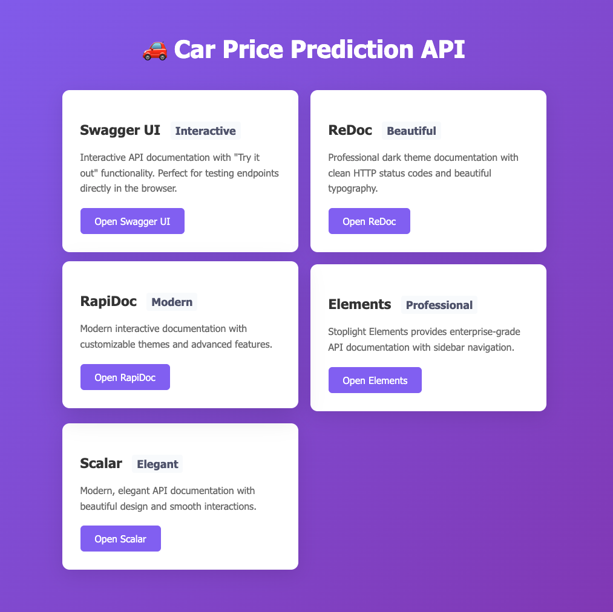
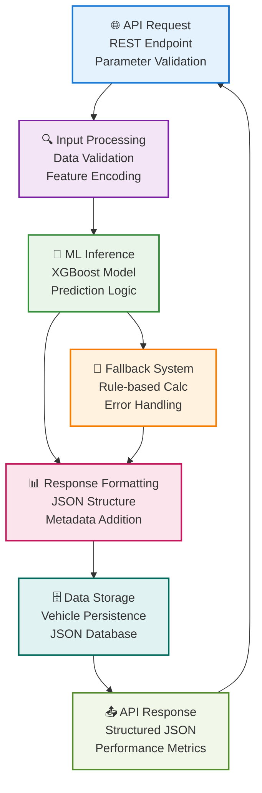
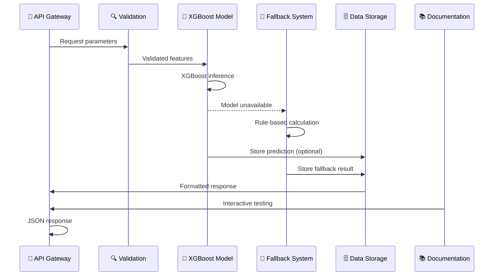

# 🚀 Backend Architecture & ML Intelligence

Enterprise-grade ML API platform delivering real-time vehicle valuations with XGBoost algorithms and comprehensive documentation ecosystem.

**Key Features:**

=== "🎯 What it does"
    **Dual-API architecture with ML-powered predictions**

    Professional Flask-based ML API (Port 5002) + comprehensive Swagger documentation server (Port 5004) delivering sub-100ms XGBoost predictions with 82% accuracy and enterprise-grade documentation.

=== "👥 How users interact"
    **RESTful endpoints with multiple documentation formats**

    Developers access ML predictions through clean REST APIs, explore interactive Swagger UI, ReDoc, RapiDoc documentation, and integrate via SDKs with comprehensive error handling and validation.

=== "🤖 Technology"
    **XGBoost ML engine with Flask-RESTX architecture**

    Production-ready XGBoost model (modelo.joblib) with fallback systems, Flask-CORS enabled APIs, comprehensive Swagger documentation, and JSON-based data persistence.

=== "🏗️ Architecture"
    **Microservices design with ML model integration**

    Lightweight ML API (5002) + Documentation server (5004) + XGBoost inference engine with fallback calculations, professional API documentation, and containerized deployment.

=== "⚙️ Professional setup"
    **Enterprise development ecosystem**

    Docker containerization, comprehensive testing, multiple documentation formats, CORS-enabled architecture, and production-ready deployment configuration.


*Backend API Documentation - Professional Swagger Interface*

## API Endpoints Overview

### 🔍 Current Price Prediction
**`GET /precio_actual`** - Get instant vehicle valuation

**What it does:** Uses XGBoost ML model to predict current market value of a vehicle based on its characteristics.

**Required Parameters:**
- `model_year` - Vehicle manufacturing year (2020)
- `age` - Vehicle age in years (4)
- `fuel_type` - Fuel type (Gasoline, Diesel, Electric, Hybrid)
- `transmission` - Transmission type (Automatic, Manual)
- `clean_title` - Title status (1 for clean, 0 for salvage)

**Example Request:**
```bash
GET /precio_actual?model_year=2020&age=4&fuel_type=Gasoline&transmission=Automatic&clean_title=1
```

**Response:**
```json
{
  "datos": {
    "model_year": 2020,
    "age": 4,
    "fuel_type": "Gasoline",
    "transmission": "Automatic",
    "clean_title": 1
  },
  "precio_actual_estimado": 25000000
}
```

### 📈 Future Price Forecasting
**`GET /prediccion_futura`** - Predict future vehicle value

**What it does:** Calculates how much the vehicle will be worth in the future using depreciation modeling.

**Additional Parameter:**
- `meses` - Number of months into the future (default: 12)

**Example Request:**
```bash
GET /prediccion_futura?model_year=2020&age=4&fuel_type=Gasoline&transmission=Automatic&clean_title=1&meses=12
```

**Response:**
```json
{
  "datos": {...},
  "meses": 12,
  "precio_actual_estimado": 25000000,
  "precio_estimado_futuro": 22500000
}
```

### 📝 Vehicle Marketplace
**`POST /publicar_vehiculo`** - Publish vehicle for sale

**What it does:** Adds a vehicle to the marketplace and provides AI-powered price recommendation.

**Request Body:**
```json
{
  "model_year": 2020,
  "age": 4,
  "fuel_type": "Gasoline",
  "transmission": "Automatic",
  "clean_title": 1,
  "precio": 25000000
}
```

**Response:**
```json
{
  "message": "Vehículo publicado con éxito",
  "vehiculo_id": 38,
  "precio_publicado": 25000000,
  "precio_recomendado_modelo": 24800000,
  "datos": {...}
}
```

### 🏠 Home Endpoint
**`GET /`** - API information and available endpoints

**What it does:** Provides basic API information and lists all available endpoints for easy discovery.

**Response:**
```json
{
  "message": "API de predicción y publicación de vehículos",
  "endpoints": {
    "GET /precio_actual": "Predice el precio actual del vehículo",
    "GET /prediccion_futura": "Predice el precio futuro del vehículo",
    "POST /publicar_vehiculo": "Permite publicar un vehículo en venta"
  }
}
```

## How It Works

### 🔄 Request Processing Flow
1. **Validation** - Check all required parameters are provided
2. **Feature Processing** - Convert input data to ML model format
3. **ML Prediction** - Use XGBoost model to predict price
4. **Fallback System** - Use rule-based calculation if ML model fails
5. **Response** - Return formatted JSON with prediction results

### 🤖 ML Model vs Fallback
- **XGBoost Model**: 82% accuracy, uses trained machine learning
- **Fallback System**: Rule-based calculation when ML unavailable
- **Automatic Switch**: System automatically uses fallback if needed

## Backend Data Flow Architecture



### ML Prediction Flow



## Core Backend Services

=== "🚀 ML API Gateway"
    **Lightweight ML API - Port 5002**

    <div style="display: flex; align-items: flex-start; gap: 30px; margin: 20px 0;">
        <div style="flex: 1;">
            <p><strong>Technology Stack:</strong> Flask + XGBoost + CORS</p>
            <p>High-performance REST API delivering real-time ML predictions with sub-100ms response times. XGBoost model integration with intelligent fallback systems for maximum reliability.</p>
            <ul>
                <li>🚀 <strong>Port:</strong> 5002</li>
                <li>🔌 <strong>Endpoints:</strong> /precio_actual, /prediccion_futura, /publicar_vehiculo</li>
                <li>🤖 <strong>ML Model:</strong> XGBoost (modelo.joblib)</li>
                <li>⚡ <strong>Performance:</strong> Sub-100ms predictions</li>
            </ul>
        </div>
    </div>

=== "📚 Documentation Server"
    **Professional API Documentation - Port 5004**

    <div style="display: flex; align-items: flex-start; gap: 30px; margin: 20px 0;">
        <div style="flex: 1;">
            <p><strong>Technology Stack:</strong> Flask-RESTX + Swagger + Multiple Formats</p>
            <p>Comprehensive API documentation with 5 professional formats: Swagger UI, ReDoc, RapiDoc, Elements, and Scalar. Interactive testing capabilities with enterprise-grade styling.</p>
            <ul>
                <li>📚 <strong>Port:</strong> 5004</li>
                <li>🔗 <strong>Access Point:</strong> http://localhost:5004/docs-menu</li>
                <li>🧪 <strong>Testing:</strong> Interactive API testing</li>
            </ul>


            **Available Documentation Formats:**
            - **Swagger UI** (`/docs/`) - Interactive API testing
            - **ReDoc** (`/redoc`) - Professional dark theme documentation
            - **RapiDoc** (`/rapidoc`) - Modern interactive documentation
            - **Elements** (`/elements`) - Enterprise-grade documentation
            - **Scalar** (`/scalar`) - Elegant modern documentation
        </div>
    </div>


## Backend File Structure
```
🚀 backend/                     # **ML API Services Directory**
├── **app.py**                  # **Main ML API (Port 5002)**
│   ├── Flask + CORS           # Web framework with cross-origin
│   ├── XGBoost integration    # ML model loading and inference
│   ├── 3 REST endpoints       # precio_actual, prediccion_futura, publicar_vehiculo
│   └── JSON data persistence  # Vehicle storage management
│
├── **app_swagger.py**          # **Documentation Server (Port 5004)**
│   ├── Flask-RESTX            # Advanced API framework
│   ├── 5 documentation formats # Swagger, ReDoc, RapiDoc, Elements, Scalar
│   ├── Professional styling   # Custom themes and layouts
│   └── Interactive testing    # Try-it-out functionality
│
├── **modelo/**                 # **ML Model Directory**
│   └── **modelo.joblib**      # **Trained XGBoost Model**
│       ├── Gradient boosting  # XGBoost algorithm
│       ├── 5 input features   # model_year, age, fuel_type, transmission, clean_title
│       ├── 82% accuracy       # R² score performance
│       └── Sub-50ms inference # Fast prediction times
│
├── **vehiculos.json**          # **Data Storage**
│   ├── 37+ vehicle records    # JSON-based database
│   ├── Auto-incrementing IDs  # Unique vehicle identifiers
│   ├── Complete vehicle data  # All prediction parameters
│   └── Marketplace listings   # Published vehicle information
│
├── **requirements.txt**        # **Python Dependencies**
│   ├── Flask==2.3.3           # Web framework
│   ├── flask-restx==1.3.0     # API documentation
│   ├── xgboost==2.1.3         # ML algorithm
│   ├── pandas==2.3.3          # Data processing
│   └── flask-cors==4.0.0      # Cross-origin support
│
├── **readme_swagger.md**       # **API Documentation Guide**
│   ├── Documentation hub info # Access points and formats
│   ├── Quick start guide      # Setup and usage
│   ├── Endpoint examples      # cURL and SDK examples
│   └── Technical specifications # Architecture details
│
└── **Dockerfile**              # **Container Configuration**
    ├── Python 3.11-slim       # Lightweight base image
    ├── Dependency installation # Requirements setup
    ├── Port 5002 exposure     # API port configuration
    └── Production server      # Optimized runtime
```
