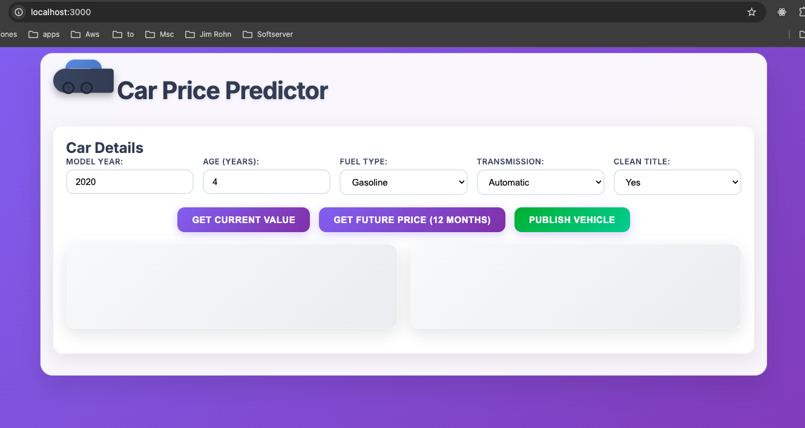
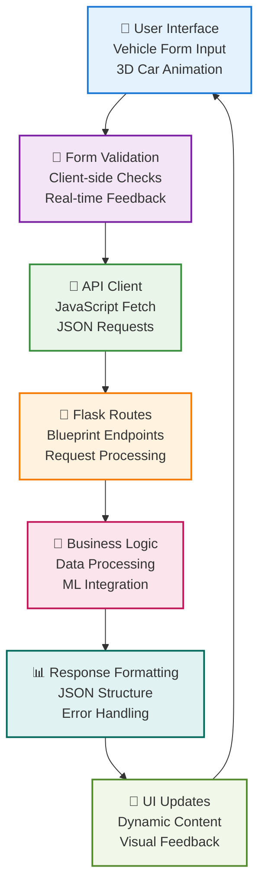
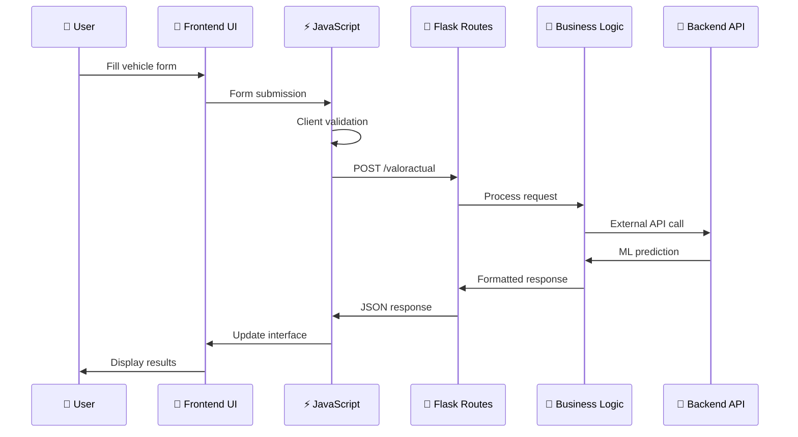

# 🎨 Frontend Architecture & Flow

Professional web interface delivering real-time ML predictions with modern user experience and enterprise-grade architecture.

**Key Features:**

=== "🎯 What it does"
    **Modern web interface for car price predictions**

    Professional Flask-based web application with real-time form validation, 3D CSS animations, and seamless backend integration for instant ML-powered vehicle valuations.

=== "👥 How users interact"
    **Intuitive multi-step prediction workflow**

    Users input vehicle parameters through responsive forms, receive instant current valuations, future price forecasts, and can publish vehicles to marketplace - all with real-time feedback.

=== "🤖 Technology"
    **Flask + Jinja2 + Modern JavaScript architecture**

    Server-side rendering with client-side enhancements, modular API design, comprehensive testing suite, and production-ready containerization.

=== "🏗️ Architecture"
    **Layered frontend architecture with separation of concerns**

    Presentation layer (Templates) + Business logic (Logic) + API layer (Routes) + Configuration management with comprehensive testing and Docker deployment.

=== "⚙️ Professional setup"
    **Enterprise development ecosystem**

    Hot-reload development, automated testing, code quality checks, Docker containerization, and comprehensive API documentation integration.


*Frontend Interface - Professional Car Price Prediction Platform*

## Core Architecture Layers

=== "🎨 Presentation Layer"
    **Templates & Static Assets - User Interface**

    <div style="display: flex; align-items: flex-start; gap: 30px; margin: 20px 0;">
        <div style="flex: 1;">
            <p><strong>Technology Stack:</strong> Jinja2 + CSS3 + JavaScript ES6+</p>
            <p>Professional web interface with responsive design, 3D car animations, and real-time form validation. Modern UI components with gradient styling and smooth transitions.</p>
            <ul>
                <li>🎨 <strong>Templates:</strong> layout.html, index.html</li>
                <li>🎭 <strong>Animations:</strong> 3D car model with CSS transforms</li>
                <li>📱 <strong>Responsive:</strong> Mobile-first design approach</li>
                <li>⚡ <strong>Interactive:</strong> Real-time validation & feedback</li>
            </ul>
        </div>
    </div>

=== "🔧 Business Logic Layer"
    **Logic Module - Data Processing & Predictions**

    <div style="display: flex; align-items: flex-start; gap: 30px; margin: 20px 0;">
        <div style="flex: 1;">
            <p><strong>Technology Stack:</strong> Python + ML Integration</p>
            <p>Modular business logic handling data processing, price calculations, and ML model integration. Fallback systems ensure reliability when external services are unavailable.</p>
            <ul>
                <li>📊 <strong>data_processor.py:</strong> Market value calculations</li>
                <li>🤖 <strong>predictor.py:</strong> ML model integration</li>
                <li>🔄 <strong>Fallback:</strong> Rule-based pricing when ML unavailable</li>
                <li>✅ <strong>Validation:</strong> Input sanitization & validation</li>
            </ul>
        </div>
    </div>

=== "🚀 API Layer"
    **Routes Module - RESTful Endpoints**

    <div style="display: flex; align-items: flex-start; gap: 30px; margin: 20px 0;">
        <div style="flex: 1;">
            <p><strong>Technology Stack:</strong> Flask + Blueprint Architecture</p>
            <p>RESTful API endpoints with Swagger documentation, JSON request/response handling, and comprehensive error management for seamless backend integration.</p>
            <ul>
                <li>🔌 <strong>/valoractual:</strong> Current market value endpoint</li>
                <li>📈 <strong>/predictions:</strong> Future price prediction endpoint</li>
                <li>📋 <strong>Swagger:</strong> Interactive API documentation</li>
                <li>🛡️ <strong>Validation:</strong> Request parameter validation</li>
            </ul>
        </div>
    </div>

=== "⚙️ Configuration Layer"
    **Config Module - Environment Management**

    <div style="display: flex; align-items: flex-start; gap: 30px; margin: 20px 0;">
        <div style="flex: 1;">
            <p><strong>Technology Stack:</strong> Python Configuration Classes</p>
            <p>Environment-specific configuration management with development, testing, and production settings. Secure secret management and flexible deployment options.</p>
            <ul>
                <li>🔧 <strong>DevelopmentConfig:</strong> Debug mode, hot reload</li>
                <li>🧪 <strong>TestingConfig:</strong> Testing environment setup</li>
                <li>🌟 <strong>ProductionConfig:</strong> Optimized production settings</li>
                <li>🔐 <strong>Security:</strong> Secret key management</li>
            </ul>
        </div>
    </div>

## Frontend Data Flow Architecture



### User Interaction Flow



## Component Architecture

### Frontend File Structure
```
🎨 frontend/                    # **Main Application Directory**
├── **app.py**                  # **Flask Application Entry Point**
│   ├── Flask(__name__)         # Application factory
│   ├── Swagger(app)           # API documentation
│   └── Blueprint registration  # Route organization
│
├── **api/**                    # **RESTful API Layer**
│   ├── __init__.py            # Blueprint initialization
│   └── **routes.py**          # **API Endpoints**
│       ├── /valoractual       # Current value endpoint
│       └── /predictions       # Future price endpoint
│
├── **logic/**                  # **Business Logic Layer**
│   ├── __init__.py
│   ├── **data_processor.py**  # **Market Value Calculator**
│   │   └── get_current_value() # Price calculation logic
│   └── **predictor.py**       # **ML Integration**
│       └── get_predictions()   # ML model interface
│
├── **config/**                 # **Configuration Management**
│   ├── __init__.py
│   └── **settings.py**        # **Environment Configs**
│       ├── DevelopmentConfig  # Debug settings
│       ├── TestingConfig      # Test environment
│       └── ProductionConfig   # Production settings
│
├── **templates/**              # **Jinja2 Templates**
│   ├── **layout.html**        # **Base Template**
│   │   ├── HTML5 structure    # Semantic markup
│   │   ├── CSS3 imports       # Styling framework
│   │   └── JavaScript includes # Client-side logic
│   └── **index.html**         # **Main Interface**
│       ├── 3D car animation   # CSS transforms
│       ├── Responsive forms   # Input validation
│       └── Results display    # Dynamic content
│
├── **static/**                 # **Client Assets**
│   ├── **css/**               # **Styling**
│   │   ├── **style.css**      # **Main Styles**
│   │   │   ├── 3D animations  # Car model styling
│   │   │   ├── Form styling   # Professional forms
│   │   │   └── Responsive grid # Mobile-first design
│   │   └── **animations.css** # **CSS Animations**
│   │       ├── Keyframes      # Smooth transitions
│   │       └── Transforms     # 3D effects
│   └── **js/**                # **Client Logic**
│       └── **app.js**         # **Main JavaScript**
│           ├── CarPriceAPI    # API client class
│           ├── Form handling  # User interactions
│           └── UI updates     # Dynamic content
│
├── **tests/**                  # **Testing Suite**
│   ├── **test_api_endpoints.py** # **API Testing**
│   │   ├── /valoractual tests # Endpoint validation
│   │   └── /predictions tests # Response validation
│   └── **test_logic_unit.py** # **Unit Testing**
│       ├── Business logic tests # Function testing
│       └── Data processing tests # Calculation validation
│
├── **Dockerfile**              # **Container Configuration**
│   ├── Python 3.11-slim      # Base image
│   ├── Dependency installation # Requirements setup
│   └── Production server      # Gunicorn configuration
│
└── **requirements.txt**        # **Python Dependencies**
    ├── Flask==2.3.3           # Web framework
    ├── Flasgger==0.9.7.1      # Swagger integration
    ├── pytest==7.4.3          # Testing framework
    └── pytest-cov==4.1.0      # Coverage reporting
```

## Professional Features

### 🎨 User Experience
- **3D Car Animation**: CSS3 transforms with keyframe animations
- **Real-time Validation**: JavaScript form validation with instant feedback
- **Responsive Design**: Mobile-first approach with CSS Grid/Flexbox
- **Professional Styling**: Gradient backgrounds, smooth transitions
- **Interactive Elements**: Hover effects, loading states, success animations

### 🔧 Technical Implementation
- **Modular Architecture**: Separation of concerns with clear layer boundaries
- **API Integration**: RESTful endpoints with comprehensive error handling
- **Configuration Management**: Environment-specific settings
- **Testing Coverage**: Unit tests for business logic, API endpoint testing
- **Docker Ready**: Production containerization with optimized builds

### 🚀 Development Workflow
- **Hot Reload**: Development server with automatic reloading
- **Code Quality**: Automated testing and linting integration
- **Documentation**: Swagger API documentation with interactive testing
- **Deployment**: Docker containerization for consistent environments

## API Integration Flow

### Current Value Prediction
```python
@api_bp.route("/valoractual", methods=["POST"])
def valoractual():
    """Get current market value with comprehensive validation"""
    data = request.get_json()
    return jsonify(get_current_value(data))
```

### Future Price Prediction
```python
@api_bp.route("/predictions", methods=["POST"])
def predictions():
    """Generate ML-powered price predictions"""
    data = request.get_json()
    return jsonify(get_predictions(data))
```

### JavaScript API Client
```javascript
class CarPriceAPI {
    static async makeRequest(endpoint, data, method = "GET") {
        // Professional API client with error handling
        // Supports both GET and POST requests
        // Automatic JSON serialization/deserialization
    }
}
```

## Testing Architecture

### Unit Testing Strategy
- **Business Logic**: Test data processing and calculation functions
- **API Endpoints**: Validate request/response handling
- **Integration**: End-to-end workflow testing
- **Coverage**: Comprehensive test coverage reporting

### Test Implementation
```python
# test_api_endpoints.py
def test_valoractual_endpoint():
    """Test current value API endpoint"""
    response = client.post('/valoractual', json=test_data)
    assert response.status_code == 200
    assert 'current_market_value' in response.json

# test_logic_unit.py  
def test_get_current_value():
    """Test business logic calculations"""
    result = get_current_value(sample_car_data)
    assert result['current_market_value'] > 0
```

## Deployment Configuration

### Docker Containerization
```dockerfile
FROM python:3.11-slim
WORKDIR /app
COPY requirements.txt .
RUN pip install --no-cache-dir -r requirements.txt
COPY . .
EXPOSE 3000
CMD ["python", "app.py"]
```

### Production Optimization
- **Gunicorn**: WSGI server for production deployment
- **Environment Variables**: Secure configuration management
- **Health Checks**: Application monitoring endpoints
- **Static Assets**: Optimized CSS/JS delivery