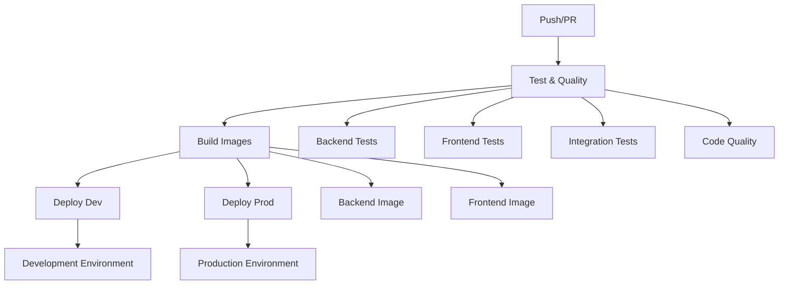

# Full CI/CD Pipeline Actions Documentation

## Pipeline Overview

Complete GitHub Actions workflow for the Car Price Prediction Platform with automated testing, building, and deployment across multiple environments.

## Workflow Structure



## Complete Workflow File

### `.github/workflows/ci-cd.yml`

```yaml
name: Car Price Prediction CI/CD

on:
  push:
    branches: [ main, develop, 'feature/*', 'SCRUM-*' ]
  pull_request:
    branches: [ main, develop ]

env:
  REGISTRY: ghcr.io
  IMAGE_NAME_BACKEND: andreaendigital/carprice-backend
  IMAGE_NAME_FRONTEND: andreaendigital/carprice-frontend

jobs:
  test-and-quality:
    name: Test & Quality Checks
    runs-on: ubuntu-latest
    strategy:
      matrix:
        python-version: [3.9, 3.11]

    steps:
    - name: Checkout Code
      uses: actions/checkout@v4

    - name: Set up Python ${{ matrix.python-version }}
      uses: actions/setup-python@v4
      with:
        python-version: ${{ matrix.python-version }}

    - name: Cache Dependencies
      uses: actions/cache@v3
      with:
        path: ~/.cache/pip
        key: ${{ runner.os }}-pip-${{ hashFiles('**/requirements.txt') }}
        restore-keys: |
          ${{ runner.os }}-pip-

    - name: Install Dependencies
      run: |
        python -m pip install --upgrade pip
        pip install flake8 pytest pytest-cov black requests
        pip install -r backend/requirements.txt
        pip install -r frontend/requirements.txt

    - name: Code Formatting Check
      run: |
        black --check backend/ frontend/

    - name: Lint with Flake8
      run: |
        flake8 backend/ frontend/ --count --select=E9,F63,F7,F82 --show-source --statistics
        flake8 backend/ frontend/ --count --exit-zero --max-complexity=10 --max-line-length=127 --statistics

    - name: Backend Unit Tests
      run: |
        cd backend
        python -m pytest ../tests/test_backend.py -v --cov=. --cov-report=xml

    - name: Frontend Unit Tests
      run: |
        cd frontend
        python -m pytest tests/ -v --cov=. --cov-report=xml

    - name: Integration Tests
      run: |
        python -m pytest tests/test_integration.py -v

    - name: Upload Coverage Reports
      uses: codecov/codecov-action@v3
      with:
        files: ./backend/coverage.xml,./frontend/coverage.xml
        flags: unittests
        name: codecov-umbrella

  build-images:
    name: Build Container Images
    runs-on: ubuntu-latest
    needs: test-and-quality
    if: github.event_name == 'push'

    outputs:
      backend-image: ${{ steps.backend-meta.outputs.tags }}
      frontend-image: ${{ steps.frontend-meta.outputs.tags }}

    steps:
    - name: Checkout Code
      uses: actions/checkout@v4

    - name: Set up Docker Buildx
      uses: docker/setup-buildx-action@v3

    - name: Log in to Container Registry
      uses: docker/login-action@v3
      with:
        registry: ${{ env.REGISTRY }}
        username: ${{ github.actor }}
        password: ${{ secrets.GITHUB_TOKEN }}

    - name: Generate Backend Metadata
      id: backend-meta
      uses: docker/metadata-action@v5
      with:
        images: ${{ env.REGISTRY }}/${{ env.IMAGE_NAME_BACKEND }}
        tags: |
          type=ref,event=branch
          type=ref,event=pr
          type=sha,prefix={{branch}}-
          type=raw,value=latest,enable={{is_default_branch}}
          type=raw,value=develop,enable=${{ github.ref == 'refs/heads/develop' }}

    - name: Generate Frontend Metadata
      id: frontend-meta
      uses: docker/metadata-action@v5
      with:
        images: ${{ env.REGISTRY }}/${{ env.IMAGE_NAME_FRONTEND }}
        tags: |
          type=ref,event=branch
          type=ref,event=pr
          type=sha,prefix={{branch}}-
          type=raw,value=latest,enable={{is_default_branch}}
          type=raw,value=develop,enable=${{ github.ref == 'refs/heads/develop' }}

    - name: Build and Push Backend Image
      uses: docker/build-push-action@v5
      with:
        context: ./backend
        push: true
        tags: ${{ steps.backend-meta.outputs.tags }}
        labels: ${{ steps.backend-meta.outputs.labels }}
        cache-from: type=gha
        cache-to: type=gha,mode=max

    - name: Build and Push Frontend Image
      uses: docker/build-push-action@v5
      with:
        context: ./frontend
        push: true
        tags: ${{ steps.frontend-meta.outputs.tags }}
        labels: ${{ steps.frontend-meta.outputs.labels }}
        cache-from: type=gha
        cache-to: type=gha,mode=max

  security-scan:
    name: Security Scanning
    runs-on: ubuntu-latest
    needs: build-images
    if: github.event_name == 'push'

    steps:
    - name: Run Trivy Vulnerability Scanner - Backend
      uses: aquasecurity/trivy-action@master
      with:
        image-ref: ${{ needs.build-images.outputs.backend-image }}
        format: 'sarif'
        output: 'backend-trivy-results.sarif'

    - name: Run Trivy Vulnerability Scanner - Frontend
      uses: aquasecurity/trivy-action@master
      with:
        image-ref: ${{ needs.build-images.outputs.frontend-image }}
        format: 'sarif'
        output: 'frontend-trivy-results.sarif'

    - name: Upload Trivy Scan Results
      uses: github/codeql-action/upload-sarif@v2
      with:
        sarif_file: '.'

  deploy-development:
    name: Deploy to Development
    runs-on: ubuntu-latest
    needs: [test-and-quality, build-images]
    if: github.ref == 'refs/heads/develop' || startsWith(github.ref, 'refs/heads/SCRUM-')
    environment: development

    steps:
    - name: Deploy to Development Environment
      run: |
        echo "Deploying to development environment..."
        echo "Backend Image: ${{ needs.build-images.outputs.backend-image }}"
        echo "Frontend Image: ${{ needs.build-images.outputs.frontend-image }}"

        # Deployment commands would go here
        # kubectl apply -f k8s/development/
        # helm upgrade --install carprice-dev ./helm-chart

    - name: Health Check
      run: |
        echo "Performing health checks..."
        # curl -f http://dev.carprice.example.com/health || exit 1

    - name: Notify Slack
      uses: 8398a7/action-slack@v3
      with:
        status: ${{ job.status }}
        channel: '#deployments'
        webhook_url: ${{ secrets.SLACK_WEBHOOK }}

  deploy-production:
    name: Deploy to Production
    runs-on: ubuntu-latest
    needs: [test-and-quality, build-images, security-scan]
    if: github.ref == 'refs/heads/main'
    environment: production

    steps:
    - name: Manual Approval Required
      uses: trstringer/manual-approval@v1
      with:
        secret: ${{ github.TOKEN }}
        approvers: andreaendigital
        minimum-approvals: 1
        issue-title: "Production Deployment Approval"

    - name: Deploy to Production Environment
      run: |
        echo "Deploying to production environment..."
        echo "Backend Image: ${{ needs.build-images.outputs.backend-image }}"
        echo "Frontend Image: ${{ needs.build-images.outputs.frontend-image }}"

        # Production deployment commands
        # kubectl apply -f k8s/production/
        # helm upgrade --install carprice-prod ./helm-chart

    - name: Production Health Check
      run: |
        echo "Performing production health checks..."
        # curl -f https://carprice.example.com/health || exit 1

    - name: Create Release
      uses: actions/create-release@v1
      env:
        GITHUB_TOKEN: ${{ secrets.GITHUB_TOKEN }}
      with:
        tag_name: v${{ github.run_number }}
        release_name: Release v${{ github.run_number }}
        draft: false
        prerelease: false

    - name: Notify Production Deployment
      uses: 8398a7/action-slack@v3
      with:
        status: ${{ job.status }}
        channel: '#production'
        webhook_url: ${{ secrets.SLACK_WEBHOOK }}

  cleanup:
    name: Cleanup Old Images
    runs-on: ubuntu-latest
    needs: [deploy-development, deploy-production]
    if: always()

    steps:
    - name: Delete Old Container Images
      uses: actions/delete-package-versions@v4
      with:
        package-name: carprice-backend
        package-type: container
        min-versions-to-keep: 10
        delete-only-untagged-versions: true
```

## Pipeline Features

### Quality Gates
- **Code Formatting**: Black formatter validation
- **Linting**: Flake8 with complexity checks
- **Testing**: Unit, integration, and coverage reporting
- **Security**: Trivy vulnerability scanning
- **Manual Approval**: Production deployment gates

### Multi-Environment Support
- **Development**: Auto-deploy on `develop` and `SCRUM-*` branches
- **Production**: Manual approval required for `main` branch
- **Feature Testing**: Automatic builds for all branches

### Monitoring & Notifications
- **Slack Integration**: Deployment notifications
- **Health Checks**: Automated service validation
- **Release Management**: Automatic GitHub releases
- **Cleanup**: Old image removal to save storage

### Performance Optimizations
- **Caching**: Docker layer and pip dependency caching
- **Matrix Testing**: Parallel Python version testing
- **Conditional Jobs**: Skip unnecessary steps based on branch
- **Build Optimization**: Multi-stage Docker builds

## Usage Examples

### Triggering Deployments
```bash
# Development deployment
git push origin develop

# Feature testing
git push origin SCRUM-96-documentation-enhancement

# Production deployment (requires approval)
git push origin main
```

### Monitoring Pipeline Status
```bash
# Check workflow status
gh workflow list
gh run list --workflow=ci-cd.yml

# View specific run details
gh run view <run-id>
```

## Secrets Configuration

Required repository secrets:
- `GITHUB_TOKEN`: Automatic (GitHub provides)
- `SLACK_WEBHOOK`: Slack notifications
- `KUBECONFIG`: Kubernetes deployment (if using K8s)
- `DOCKER_REGISTRY_TOKEN`: Additional registry access (if needed)

## Best Practices Implemented

1. **Fail Fast**: Quality checks run first
2. **Parallel Execution**: Independent jobs run simultaneously
3. **Conditional Logic**: Environment-specific deployments
4. **Security First**: Vulnerability scanning before production
5. **Rollback Ready**: Tagged images for easy rollbacks
6. **Monitoring**: Health checks and notifications
7. **Cost Optimization**: Image cleanup and caching
