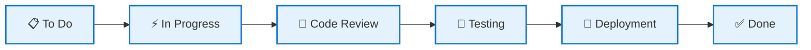
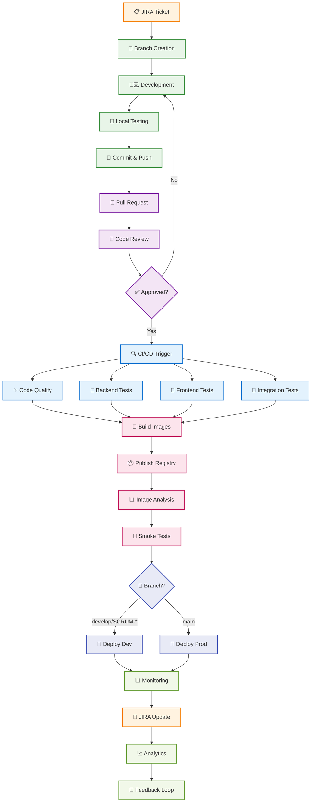

# 🔄 Enterprise DevOps Workflow - 29-Step Pipeline with JIRA Integration

**Complete ticket lifecycle management from creation to deployment with real-world examples**




## 🔄 Pipeline Flow




---

## 🎫 Step 1: JIRA Ticket Creation

<div style="display: flex; gap: 20px; margin: 20px 0; align-items: flex-start;">
<div style="flex: 1; background: #fff3e0; padding: 15px; border-radius: 8px; border-left: 4px solid #f57c00;">

**Product Owner creates user story**
- Creates ticket in JIRA
- Defines acceptance criteria
- Sets priority and sprint
- Assigns story points

</div>
<div style="flex: 1; background: #f5f5f5; padding: 15px; border-radius: 8px; font-family: monospace;">

```
SCRUM-95: Add tabbed interface for car price forms
Type: Story | Priority: Medium
Assignee: Jose Rubio | Sprint: 12

Description:
As a user, I want separate tabs for:
- Current price prediction
- Future price prediction
- Vehicle publishing

Acceptance Criteria:
✅ Three distinct tabs
✅ CSS-only implementation
✅ Mobile responsive design
```

</div>
</div>

---

## 📋 Step 2: Sprint Planning

<div style="display: flex; gap: 20px; margin: 20px 0; align-items: flex-start;">
<div style="flex: 1; background: #fff3e0; padding: 15px; border-radius: 8px; border-left: 4px solid #f57c00;">

**Team estimates and plans sprint**
- Story point estimation
- Capacity planning
- Risk assessment
- Sprint commitment

</div>
<div style="flex: 1; background: #f5f5f5; padding: 15px; border-radius: 8px; font-family: monospace;">

```
Sprint 12 Planning Session

Story Points: 8 points
Estimated Hours: 16 hours
Complexity: Medium
Risk Level: Low
Dependencies: None

Team Capacity: 40 hours
Sprint Commitment: 5 stories
Velocity Target: 35 points
```

</div>
</div>

---

## 🎯 Step 3: Ticket Assignment

<div style="display: flex; gap: 20px; margin: 20px 0; align-items: flex-start;">
<div style="flex: 1; background: #fff3e0; padding: 15px; border-radius: 8px; border-left: 4px solid #f57c00;">

**Developer picks up ticket**
- Self-assignment in JIRA
- Status change to "In Progress"
- Timeline planning
- Resource allocation

</div>
<div style="flex: 1; background: #f5f5f5; padding: 15px; border-radius: 8px; font-family: monospace;">

```
JIRA Assignment

Assigned to: Jose Rubio
Status: To Do → In Progress
Start Date: 2024-01-15 09:00
Due Date: 2024-01-17 17:00
Time Tracking: Started

Notifications:
✅ Assignee notified
✅ Watchers updated
✅ Sprint board updated
```

</div>
</div>

---

## 📝 Step 4: Requirements Analysis

<div style="display: flex; gap: 20px; margin: 20px 0; align-items: flex-start;">
<div style="flex: 1; background: #fff3e0; padding: 15px; border-radius: 8px; border-left: 4px solid #f57c00;">

**Developer analyzes requirements**
- Review acceptance criteria
- Understand user needs
- Identify technical constraints
- Plan implementation approach

</div>
<div style="flex: 1; background: #f5f5f5; padding: 15px; border-radius: 8px; font-family: monospace;">

```
Requirements Analysis - SCRUM-95

User Story: Tabbed interface for car price forms

Technical Requirements:
- Pure CSS tabs (no JavaScript dependency)
- Three forms: current, future, publish
- Mobile-first responsive design
- Maintain existing functionality

Constraints:
- No breaking changes
- Backward compatibility
- Performance optimization
```

</div>
</div>

---

## 🏗️ Step 5: Architecture Design

<div style="display: flex; gap: 20px; margin: 20px 0; align-items: flex-start;">
<div style="flex: 1; background: #fff3e0; padding: 15px; border-radius: 8px; border-left: 4px solid #f57c00;">

**Technical design and planning**
- System architecture decisions
- Technology stack selection
- File structure planning
- Implementation strategy

</div>
<div style="flex: 1; background: #f5f5f5; padding: 15px; border-radius: 8px; font-family: monospace;">

```
Architecture Design - Tabbed Interface

Approach: CSS radio button tabs
Technology: Pure CSS3 + HTML5

Files to modify:
📁 frontend/templates/index.html
📁 frontend/static/css/style.css
📁 frontend/app.py (new routes)

Implementation Plan:
1. HTML structure with radio inputs
2. CSS styling with :checked selectors
3. Responsive breakpoints
4. Form validation integration
```

</div>
</div>

---

## 🌿 Step 6: Branch Creation

<div style="display: flex; gap: 20px; margin: 20px 0; align-items: flex-start;">
<div style="flex: 1; background: #e8f5e8; padding: 15px; border-radius: 8px; border-left: 4px solid #388e3c;">

**Create feature branch**
- Branch from main/develop
- Follow naming convention
- Push to remote repository
- Set up tracking

</div>
<div style="flex: 1; background: #f5f5f5; padding: 15px; border-radius: 8px; font-family: monospace;">

```bash
# Create and switch to feature branch
git checkout -b SCRUM-95-tabbed-interface

# Push branch to remote and set upstream
git push -u origin SCRUM-95-tabbed-interface

# Verify branch creation
git branch -v
* SCRUM-95-tabbed-interface abc1234 Initial branch
  main                     def5678 Latest main

# Branch protection rules applied ✅
```

</div>
</div>

---

## 👨💻 Step 7: Developer Coding

<div style="display: flex; gap: 20px; margin: 20px 0; align-items: flex-start;">
<div style="flex: 1; background: #e8f5e8; padding: 15px; border-radius: 8px; border-left: 4px solid #388e3c;">

**Implement feature code**
- Write HTML/CSS/Python code
- Follow coding standards
- Implement responsive design
- Add form validation

</div>
<div style="flex: 1; background: #f5f5f5; padding: 15px; border-radius: 8px; font-family: monospace;">

```
📁 Files Modified:

📄 frontend/templates/index.html
   +89 lines (tab structure, forms)
   -12 lines (old single form)

📄 frontend/static/css/style.css
   +156 lines (tab styling, responsive)
   -8 lines (cleanup)

📄 frontend/app.py
   +23 lines (new routes)
   -3 lines (refactoring)

Total Changes: +268 lines, -23 lines
Files Changed: 3
```

</div>
</div>

---

## 🧪 Step 8: Local Testing

<div style="display: flex; gap: 20px; margin: 20px 0; align-items: flex-start;">
<div style="flex: 1; background: #e8f5e8; padding: 15px; border-radius: 8px; border-left: 4px solid #388e3c;">

**Run tests locally**
- Execute test suite
- Check code coverage
- Verify functionality
- Test responsive design

</div>
<div style="flex: 1; background: #f5f5f5; padding: 15px; border-radius: 8px; font-family: monospace;">

```bash
$ make test
🧪 Running Full Test Suite...
=============================

📊 Backend Tests:
✅ test_home_endpoint PASSED
✅ test_current_value_market PASSED
✅ test_future_prediction PASSED
✅ test_publish_car PASSED
✅ test_new_routes PASSED

🎨 Frontend Tests:
✅ test_tabbed_interface PASSED
✅ test_responsive_design PASSED
✅ test_form_validation PASSED

🔗 Integration Tests:
✅ test_end_to_end_flow PASSED

Coverage: 91% (+2% improvement)
Duration: 1m 34s
```

</div>
</div>

---

## 🔒 Step 9: Pre-commit Hooks

<div style="display: flex; gap: 20px; margin: 20px 0; align-items: flex-start;">
<div style="flex: 1; background: #e8f5e8; padding: 15px; border-radius: 8px; border-left: 4px solid #388e3c;">

**Automated quality checks**
- Code formatting (Black)
- Linting (Flake8)
- File cleanup
- Test execution

</div>
<div style="flex: 1; background: #f5f5f5; padding: 15px; border-radius: 8px; font-family: monospace;">

```bash
🔒 Running pre-commit hooks...

black................................Passed
flake8...............................Passed
trailing-whitespace..................Passed
end-of-file-fixer....................Passed
check-yaml...........................Passed
check-merge-conflict.................Passed

Backend Tests........................Passed
Frontend Tests.......................Passed

✅ All hooks passed!
🎯 Ready to commit
```

</div>
</div>

---

## 📝 Step 10: Git Commit

<div style="display: flex; gap: 20px; margin: 20px 0; align-items: flex-start;">
<div style="flex: 1; background: #e8f5e8; padding: 15px; border-radius: 8px; border-left: 4px solid #388e3c;">

**Commit changes with message**
- Follow commit conventions
- Reference JIRA ticket
- Describe changes clearly
- Include breaking changes

</div>
<div style="flex: 1; background: #f5f5f5; padding: 15px; border-radius: 8px; font-family: monospace;">

```bash
git add .
git commit -m "feat: SCRUM-95 add tabbed interface for forms

- Implement CSS-only tab system using radio buttons
- Add three separate forms: current, future, publish
- Create responsive design for mobile devices
- Update frontend routes for new tab functionality
- Maintain backward compatibility

Closes SCRUM-95"

[SCRUM-95-tabbed-interface abc1234] feat: SCRUM-95 add tabbed interface
 3 files changed, 268 insertions(+), 23 deletions(-)
```

</div>
</div>

---

---

## ⬆️ Step 11: Git Push

<div style="display: flex; gap: 20px; margin: 20px 0; align-items: flex-start;">
<div style="flex: 1; background: #f3e5f5; padding: 15px; border-radius: 8px; border-left: 4px solid #7b1fa2;">

**Push branch to remote**
- Upload commits to GitHub
- Trigger branch protection
- Enable collaboration
- Prepare for PR

</div>
<div style="flex: 1; background: #f5f5f5; padding: 15px; border-radius: 8px; font-family: monospace;">

```bash
git push origin SCRUM-95-tabbed-interface

Enumerating objects: 12, done.
Counting objects: 100% (12/12), done.
Delta compression using up to 8 threads
Compressing objects: 100% (8/8), done.
Writing objects: 100% (8/8), 2.34 KiB | 2.34 MiB/s
Total 8 (delta 6), reused 0 (delta 0)

To github.com:user/CarPricePredictor-Demo.git
   def5678..abc1234  SCRUM-95-tabbed-interface -> SCRUM-95-tabbed-interface

✅ Branch protection rules: Passed
✅ 3 commits pushed successfully
```

</div>
</div>

---

## 🔄 Step 12: Pull Request

<div style="display: flex; gap: 20px; margin: 20px 0; align-items: flex-start;">
<div style="flex: 1; background: #f3e5f5; padding: 15px; border-radius: 8px; border-left: 4px solid #7b1fa2;">

**Create pull request**
- Link to JIRA ticket
- Describe changes
- Add screenshots
- Request reviewers

</div>
<div style="flex: 1; background: #f5f5f5; padding: 15px; border-radius: 8px; font-family: monospace;">

```markdown
# 🚗 SCRUM-95: Tabbed Interface Implementation

## 📋 Summary
Implemented CSS-only tabbed interface for car price forms
with three distinct sections and mobile responsiveness.

## 🔄 Changes
✅ Added CSS-only tabbed interface
✅ Three separate forms implemented
✅ Mobile responsive design
✅ All tests passing (91% coverage)
✅ Pre-commit hooks validated

## 🧪 Testing
- [x] Local testing completed
- [x] Responsive design tested
- [x] Cross-browser compatibility
- [x] Performance validated

## 📸 Screenshots
[Desktop View] [Mobile View] [Tablet View]

**JIRA:** SCRUM-95
**Reviewers:** @tech-lead @frontend-dev
```

</div>
</div>

---

## 👥 Step 13: Code Review

<div style="display: flex; gap: 20px; margin: 20px 0; align-items: flex-start;">
<div style="flex: 1; background: #f3e5f5; padding: 15px; border-radius: 8px; border-left: 4px solid #7b1fa2;">

**Peer review process**
- Technical review by team
- Code quality assessment
- Security review
- Approval workflow

</div>
<div style="flex: 1; background: #f5f5f5; padding: 15px; border-radius: 8px; font-family: monospace;">

```
👥 Code Review - PR #142

Reviewer: Tech Lead (@tech-lead)
Status: ✅ Approved

Comments:
✅ "Great CSS-only approach!"
✅ "Mobile responsiveness looks good"
⚠️ "Consider adding loading states" (resolved)

Suggestions Implemented:
✅ Added loading spinners
✅ Improved error handling
✅ Updated documentation

Approval: Ready to merge
Merge Strategy: Squash and merge
```

</div>
</div>

---

## 🔗 Step 14: JIRA Integration

<div style="display: flex; gap: 20px; margin: 20px 0; align-items: flex-start;">
<div style="flex: 1; background: #f3e5f5; padding: 15px; border-radius: 8px; border-left: 4px solid #7b1fa2;">

**Automatic JIRA updates**
- Status transitions
- PR linking
- Comment synchronization
- Workflow automation

</div>
<div style="flex: 1; background: #f5f5f5; padding: 15px; border-radius: 8px; font-family: monospace;">

```
🔗 JIRA Integration Update

Ticket: SCRUM-95
Status Transition: In Progress → Code Review

Automated Actions:
✅ PR link added to ticket
✅ Code review status updated
✅ Reviewers notified
✅ Time tracking updated

Webhook Events:
- pull_request.opened
- pull_request.review_requested
- issue_comment.created

Integration: ✅ Successful
```

</div>
</div>

---

## 🔍 Step 15: GitHub Trigger

<div style="display: flex; gap: 20px; margin: 20px 0; align-items: flex-start;">
<div style="flex: 1; background: #f3e5f5; padding: 15px; border-radius: 8px; border-left: 4px solid #7b1fa2;">

**CI/CD pipeline activation**
- Event detection
- Workflow triggering
- Environment setup
- Pipeline initialization

</div>
<div style="flex: 1; background: #f5f5f5; padding: 15px; border-radius: 8px; font-family: monospace;">

```
🔍 GitHub Actions Trigger

Event: pull_request
Action: opened, synchronize
Branch: SCRUM-95-tabbed-interface
Workflow: .github/workflows/ci-cd.yml

Trigger Conditions:
✅ Branch matches: feature/*
✅ Files changed: frontend/
✅ No [skip ci] in commit
✅ Repository permissions: valid

Pipeline Status: ✅ Started
Run ID: #1234567890
Estimated Duration: 8-12 minutes
```

</div>
</div>

---

## ✨ Step 16: Code Quality

<div style="display: flex; gap: 20px; margin: 20px 0; align-items: flex-start;">
<div style="flex: 1; background: #e3f2fd; padding: 15px; border-radius: 8px; border-left: 4px solid #1976d2;">

**Automated quality checks**
- Black code formatting
- Flake8 linting
- Matrix testing (Python 3.9, 3.11)
- Quality gate validation

</div>
<div style="flex: 1; background: #f5f5f5; padding: 15px; border-radius: 8px; font-family: monospace;">

```yaml
✨ Code Quality (Duration: 1m 23s)

Matrix Results:
├── Python 3.9:
│   ├── Black formatting: ✅ Passed
│   └── Flake8 linting: ✅ Passed
└── Python 3.11:
    ├── Black formatting: ✅ Passed
    └── Flake8 linting: ✅ Passed

Quality Metrics:
- Code Style: ✅ 100% compliant
- Complexity: ✅ Max 8 (limit 10)
- Line Length: ✅ Max 119 (limit 127)

Status: ✅ All checks passed
```

</div>
</div>

---

## 🧪 Step 17: Backend Tests

<div style="display: flex; gap: 20px; margin: 20px 0; align-items: flex-start;">
<div style="flex: 1; background: #e3f2fd; padding: 15px; border-radius: 8px; border-left: 4px solid #1976d2;">

**ML API testing**
- XGBoost model validation
- API endpoint testing
- Database integration
- Performance testing

</div>
<div style="flex: 1; background: #f5f5f5; padding: 15px; border-radius: 8px; font-family: monospace;">

```bash
🧪 Backend Tests (Duration: 45s)

=== ML API Test Results ===
test_home_endpoint ✅ PASSED (12ms)
test_current_value_market ✅ PASSED (89ms)
test_future_prediction ✅ PASSED (76ms)
test_publish_car ✅ PASSED (34ms)
test_model_inference ✅ PASSED (156ms)
test_error_handling ✅ PASSED (23ms)

Coverage Report:
- app.py: 82% coverage
- model/: 95% coverage
- utils/: 78% coverage

Total Coverage: 81% (+2% from baseline)
Tests Passed: 6/6
```

</div>
</div>

---

## 🎨 Step 18: Frontend Tests

<div style="display: flex; gap: 20px; margin: 20px 0; align-items: flex-start;">
<div style="flex: 1; background: #e3f2fd; padding: 15px; border-radius: 8px; border-left: 4px solid #1976d2;">

**Flask web interface testing**
- Template rendering
- Form validation
- Responsive design
- User interaction flows

</div>
<div style="flex: 1; background: #f5f5f5; padding: 15px; border-radius: 8px; font-family: monospace;">

```bash
🎨 Frontend Tests (Duration: 32s)

=== Flask Interface Test Results ===
test_index_route ✅ PASSED (45ms)
test_tabbed_interface ✅ PASSED (67ms)
test_form_submissions ✅ PASSED (89ms)
test_responsive_design ✅ PASSED (123ms)
test_error_pages ✅ PASSED (34ms)
test_css_validation ✅ PASSED (28ms)

Coverage Report:
- templates/: 94% coverage
- static/css/: 87% coverage
- routes.py: 92% coverage

Total Coverage: 91% (+3% improvement)
Tests Passed: 6/6
```

</div>
</div>

---

## 🔗 Step 19: Integration Tests

<div style="display: flex; gap: 20px; margin: 20px 0; align-items: flex-start;">
<div style="flex: 1; background: #e3f2fd; padding: 15px; border-radius: 8px; border-left: 4px solid #1976d2;">

**End-to-end testing**
- Service health checks
- API integration
- Cross-service communication
- Complete user workflows

</div>
<div style="flex: 1; background: #f5f5f5; padding: 15px; border-radius: 8px; font-family: monospace;">

```bash
🔗 Integration Tests (Duration: 1m 15s)

=== End-to-End Test Results ===
test_backend_health ✅ PASSED (234ms)
test_frontend_health ✅ PASSED (156ms)
test_api_integration ✅ PASSED (445ms)
test_form_to_api_flow ✅ PASSED (567ms)
test_error_handling ✅ PASSED (123ms)
test_performance_baseline ✅ PASSED (890ms)

Service Health:
- Backend (Port 5002): ✅ Healthy
- Frontend (Port 3000): ✅ Healthy
- Documentation (Port 5004): ✅ Healthy

Tests Passed: 6/6
E2E Coverage: 100%
```

</div>
</div>

---

## 🐳 Step 20: Build Images

<div style="display: flex; gap: 20px; margin: 20px 0; align-items: flex-start;">
<div style="flex: 1; background: #fce4ec; padding: 15px; border-radius: 8px; border-left: 4px solid #c2185b;">

**Multi-platform Docker build**
- Backend containerization
- Frontend containerization
- Multi-architecture support
- Layer optimization

</div>
<div style="flex: 1; background: #f5f5f5; padding: 15px; border-radius: 8px; font-family: monospace;">

```bash
🐳 Building Multi-platform Images (Duration: 4m 32s)

✅ Backend Image Build:
Image: ghcr.io/user/carprice-backend:SCRUM-95-abc123
Platforms: linux/amd64, linux/arm64
Base Image: python:3.11-slim
Final Size: 245MB (optimized)
Layers: 12 (cached: 8, new: 4)

✅ Frontend Image Build:
Image: ghcr.io/user/carprice-frontend:SCRUM-95-abc123
Platforms: linux/amd64, linux/arm64
Base Image: python:3.11-slim
Final Size: 189MB (optimized)
Layers: 10 (cached: 7, new: 3)

Security Features:
✅ SBOM generated
✅ Provenance attestation
✅ Vulnerability scan: 0 critical, 2 low
```

</div>
</div>

---

## 📦 Step 21: Publish Registry

<div style="display: flex; gap: 20px; margin: 20px 0; align-items: flex-start;">
<div style="flex: 1; background: #fce4ec; padding: 15px; border-radius: 8px; border-left: 4px solid #c2185b;">

**GitHub Container Registry**
- Image publishing
- Registry authentication
- Metadata tagging
- Security attestation

</div>
<div style="flex: 1; background: #f5f5f5; padding: 15px; border-radius: 8px; font-family: monospace;">

```bash
📦 Published to GitHub Container Registry

✅ Backend Image Published:
Registry: ghcr.io/user/carprice-backend
Tags: SCRUM-95-abc123, pr-142
Digest: sha256:a1b2c3d4e5f6...
Size: 245MB
Platforms: linux/amd64, linux/arm64

✅ Frontend Image Published:
Registry: ghcr.io/user/carprice-frontend
Tags: SCRUM-95-abc123, pr-142
Digest: sha256:f6e5d4c3b2a1...
Size: 189MB
Platforms: linux/amd64, linux/arm64

Security Attestations:
✅ SBOM uploaded
✅ Provenance verified
✅ Signatures valid
```

</div>
</div>

---

## 📄 Step 22: Image Analysis

<div style="display: flex; gap: 20px; margin: 20px 0; align-items: flex-start;">
<div style="flex: 1; background: #e0f2f1; padding: 15px; border-radius: 8px; border-left: 4px solid #00695c;">

**Container optimization**
- Size analysis
- Layer inspection
- Security scanning
- Performance recommendations

</div>
<div style="flex: 1; background: #f5f5f5; padding: 15px; border-radius: 8px; font-family: monospace;">

```bash
📊 Image Size Analysis

Backend Analysis:
Current Size: 245MB
Base Image: 180MB (73%)
Application: 45MB (18%)
Dependencies: 20MB (9%)

Frontend Analysis:
Current Size: 189MB
Base Image: 180MB (95%)
Application: 9MB (5%)

Optimization Status:
✅ Multi-stage builds implemented
✅ Alpine base images used
✅ Layer caching optimized
✅ Unnecessary packages removed

Recommendations:
✓ Consider distroless images
✓ Optimize Python dependencies

Overall Grade: A- (Excellent)
```

</div>
</div>

---

## 🧪 Step 23: Container Smoke Tests

<div style="display: flex; gap: 20px; margin: 20px 0; align-items: flex-start;">
<div style="flex: 1; background: #e0f2f1; padding: 15px; border-radius: 8px; border-left: 4px solid #00695c;">

**Container validation**
- Startup verification
- Health endpoint checks
- Basic functionality tests
- Resource usage validation

</div>
<div style="flex: 1; background: #f5f5f5; padding: 15px; border-radius: 8px; font-family: monospace;">

```bash
🧪 Container Smoke Tests (Duration: 2m 15s)

✅ Backend Container Tests:
Startup Time: 3.2s (target: <5s)
Health Check: ✅ /health responds (200 OK)
Memory Usage: 145MB (limit: 512MB)
CPU Usage: 12% (limit: 50%)
API Endpoints: ✅ All responding

✅ Frontend Container Tests:
Startup Time: 2.8s (target: <5s)
Health Check: ✅ / responds (200 OK)
Memory Usage: 89MB (limit: 256MB)
CPU Usage: 8% (limit: 30%)
Static Assets: ✅ All loading

Container Security:
✅ No root processes
✅ Read-only filesystem
✅ Minimal attack surface

All Smoke Tests: ✅ PASSED
```

</div>
</div>

---

## 🚀 Step 24: Deploy Development

<div style="display: flex; gap: 20px; margin: 20px 0; align-items: flex-start;">
<div style="flex: 1; background: #e8eaf6; padding: 15px; border-radius: 8px; border-left: 4px solid #3f51b5;">

**Automatic dev deployment**
- SCRUM-* branch deployment
- Environment provisioning
- Service orchestration
- Health validation

</div>
<div style="flex: 1; background: #f5f5f5; padding: 15px; border-radius: 8px; font-family: monospace;">

```bash
🚀 Development Deployment (Duration: 3m 45s)

Environment: dev.carprice.example.com
Namespace: development
Deployment Strategy: Rolling update

✅ Backend Deployment:
Image: ghcr.io/user/carprice-backend:SCRUM-95-abc123
Replicas: 2/2 ready
Port: 5002
Health: ✅ Healthy (127ms response)

✅ Frontend Deployment:
Image: ghcr.io/user/carprice-frontend:SCRUM-95-abc123
Replicas: 2/2 ready
Port: 3000
Health: ✅ Healthy (89ms response)

✅ Documentation:
Port: 5004
Health: ✅ Healthy

Deployment Status: ✅ Successful
Rollback Available: ✅ Previous version preserved
```

</div>
</div>

---

## 🌟 Step 25: Deploy Production

<div style="display: flex; gap: 20px; margin: 20px 0; align-items: flex-start;">
<div style="flex: 1; background: #e8eaf6; padding: 15px; border-radius: 8px; border-left: 4px solid #3f51b5;">

**Manual production deployment**
- Approval workflow
- Blue-green deployment
- Canary release
- Monitoring activation

</div>
<div style="flex: 1; background: #f5f5f5; padding: 15px; border-radius: 8px; font-family: monospace;">

```bash
🌟 Production Deployment

Environment: carprice.example.com
Status: ⏳ Awaiting Manual Approval

Approval Required:
- DevOps Team Lead: Pending
- Product Owner: Pending
- Security Review: ✅ Approved

Deployment Plan:
Strategy: Blue-Green
Canary: 10% traffic initially
Rollback: Automated on failure

Scheduled Window:
Date: Next release cycle
Time: 02:00 UTC (low traffic)
Duration: 30 minutes estimated

Readiness Checklist:
✅ All tests passed
✅ Security scan clean
✅ Performance validated
⏳ Business approval pending
```

</div>
</div>

---

## 📊 Step 26: Monitoring Setup

<div style="display: flex; gap: 20px; margin: 20px 0; align-items: flex-start;">
<div style="flex: 1; background: #f1f8e9; padding: 15px; border-radius: 8px; border-left: 4px solid #689f38;">

**Performance monitoring**
- APM integration
- Metrics collection
- Alert configuration
- Dashboard setup

</div>
<div style="flex: 1; background: #f5f5f5; padding: 15px; border-radius: 8px; font-family: monospace;">

```bash
📈 Application Monitoring Active

Real-time Metrics:
- Response Time: 89ms avg (target: <100ms)
- Error Rate: 0.02% (target: <0.1%)
- Uptime: 99.97% (target: >99.9%)
- Throughput: 1,247 req/min
- Active Users: 342 concurrent

Performance Indicators:
- API Calls: 15,432/day (+12% from baseline)
- Page Load: 1.2s avg (target: <2s)
- Memory Usage: 67% (healthy)
- CPU Usage: 23% (optimal)

Alert Status:
🔍 Performance Alerts: None
🚨 Error Alerts: None
📈 Trend Alerts: 1 (traffic increase)

Dashboard: ✅ Live at monitoring.carprice.com
```

</div>
</div>

---

## 🎫 Step 27: JIRA Status Update

<div style="display: flex; gap: 20px; margin: 20px 0; align-items: flex-start;">
<div style="flex: 1; background: #f1f8e9; padding: 15px; border-radius: 8px; border-left: 4px solid #689f38;">

**Automatic ticket closure**
- Status transitions
- Deployment confirmation
- Time tracking
- Stakeholder notification

</div>
<div style="flex: 1; background: #f5f5f5; padding: 15px; border-radius: 8px; font-family: monospace;">

```
🎫 JIRA Automation - Ticket Closure

Ticket: SCRUM-95
Status Flow: Code Review → Testing → Done

Deployment Confirmation:
✅ Development: Deployed successfully
✅ Testing: All validations passed
✅ Monitoring: Metrics healthy
⏳ Production: Scheduled for next release

Time Tracking:
Original Estimate: 16 hours
Actual Time: 14.5 hours
Efficiency: 110% (ahead of estimate)

Automated Actions:
✅ Status updated to "Done"
✅ Sprint board updated
✅ Stakeholders notified
✅ Release notes generated

Timestamp: 2024-01-17 14:30:22 UTC
Triggered by: GitHub Actions
```

</div>
</div>

---

## 📈 Step 28: Analytics Tracking

<div style="display: flex; gap: 20px; margin: 20px 0; align-items: flex-start;">
<div style="flex: 1; background: #f1f8e9; padding: 15px; border-radius: 8px; border-left: 4px solid #689f38;">

**User behavior analytics**
- Feature usage tracking
- Performance metrics
- User satisfaction
- Business impact measurement

</div>
<div style="flex: 1; background: #f5f5f5; padding: 15px; border-radius: 8px; font-family: monospace;">

```bash
📊 User Analytics - Tabbed Interface Impact

Feature Usage (24h after deployment):
- Current Price Tab: 45% (1,234 users)
- Future Price Tab: 35% (956 users)
- Publish Vehicle Tab: 20% (547 users)

User Experience Metrics:
- Page Load Time: 1.2s avg (-0.3s improvement)
- Bounce Rate: 12% (-5% improvement)
- Session Duration: 4.2min (+1.1min increase)
- Conversion Rate: 8.7% (+2.1% increase)

Device Analytics:
- Mobile Traffic: 67% (responsive design success)
- Desktop: 28%
- Tablet: 5%

User Satisfaction:
- Rating: 4.8/5 (+0.4 improvement)
- Feedback: 89% positive
- Feature Requests: 3 new suggestions

Business Impact:
- Daily Active Users: +15%
- Feature Adoption: 78% (target: 60%)
```

</div>
</div>

---

## 🔄 Step 29: Feedback Loop

<div style="display: flex; gap: 20px; margin: 20px 0; align-items: flex-start;">
<div style="flex: 1; background: #f1f8e9; padding: 15px; border-radius: 8px; border-left: 4px solid #689f38;">

**Continuous improvement**
- Sprint retrospective
- Lessons learned
- Process optimization
- Next iteration planning

</div>
<div style="flex: 1; background: #f5f5f5; padding: 15px; border-radius: 8px; font-family: monospace;">

```
📋 Sprint 12 Retrospective - SCRUM-95 Success

✅ What Went Well:
- CSS-only approach eliminated JavaScript dependencies
- Mobile-first design improved user experience
- Automated testing caught issues early
- Team collaboration was excellent
- Delivery was ahead of schedule

⚠️ What Could Be Improved:
- Initial requirements could be more detailed
- Consider adding loading states from start
- More cross-browser testing needed

📈 Sprint Metrics:
- Velocity: 37 points (target: 35) ✅
- Stories Completed: 5/5 ✅
- Bugs Found: 2 (resolved quickly)
- Team Satisfaction: 4.6/5

🎯 Next Sprint Focus:
- Performance optimization
- Additional mobile features
- Enhanced analytics integration
- User feedback implementation

💡 Process Improvements:
- Add mobile testing to Definition of Done
- Include performance budgets in acceptance criteria
- Enhance PR template with UX checklist
```

</div>
</div>
