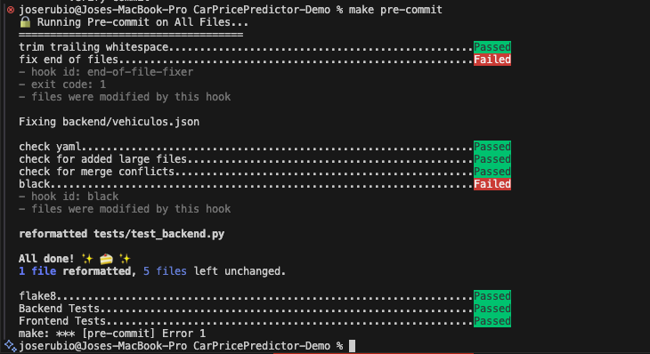

# 🔄 Enterprise DevOps Workflow - 13-Step Pipeline Flow

```mermaid
flowchart TD
    A[📋 Step 1: JIRA Ticket] --> B[🌿 Step 4: Branch Creation]
    B --> C[👨💻 Step 5: Development]
    C --> D[🧪 Step 6: Local Testing]
    D --> E[📝 Step 8: Git Commit]
    E --> F[⬆️ Step 9: Git Push]
    F --> G[🔄 Step 10: Pull Request]
    G --> H[👥 Step 11: Code Review]
    H --> I[🔗 Step 12: JIRA Integration]
    I --> J[🔍 Step 13: GitHub Trigger]
    J --> K[🏷️ Container Image Tagging]
    K --> L[📦 Backend: SCRUM-95, pr-142, latest]
    K --> M[📦 Frontend: SCRUM-95, pr-142, latest]

    classDef planning fill:#fff3e0,stroke:#f57c00,stroke-width:2px
    classDef development fill:#e8f5e8,stroke:#388e3c,stroke-width:2px
    classDef review fill:#f3e5f5,stroke:#7b1fa2,stroke-width:2px
    classDef cicd fill:#e3f2fd,stroke:#1976d2,stroke-width:2px
    classDef build fill:#fce4ec,stroke:#c2185b,stroke-width:2px

    class A planning
    class B,C,D,E development
    class F,G,H review
    class I,J cicd
    class K,L,M build
```




---

## 🎫 Step 1: JIRA Ticket Creation


**Product Owner creates user story**
- Creates ticket in JIRA
- Defines acceptance criteria
- Sets priority and sprint
- Assigns story points

---

## 📋 Step 2: Sprint Planning


**Team estimates and plans sprint**
- Story point estimation
- Capacity planning
- Risk assessment
- Sprint commitment

---

## 🎯 Step 3: Ticket Assignment


**Developer picks up ticket**
- Self-assignment in JIRA
- Status change to "In Progress"
- Timeline planning
- Resource allocation

---

## 🌿 Step 4: Branch Creation


**Create feature branch**
- Branch from main/develop
- Follow naming convention
- Push to remote repository
- Set up tracking

---

## 👨💻 Step 5: Developer Coding


**Implement feature code**
- Write HTML/CSS/Python code
- Follow coding standards
- Implement responsive design
- Add form validation

---

## 🧪 Step 6: Local Testing


**Run tests locally**
- Execute test suite
- Check code coverage
- Verify functionality
- Test responsive design

---

## 🔒 Step 7: Pre-commit Hooks



**Automated quality checks**
- Code formatting (Black)
- Linting (Flake8)
- File cleanup
- Test execution

---

## 📝 Step 8: Git Commit


**Commit changes with message**
- Follow commit conventions
- Reference JIRA ticket
- Describe changes clearly
- Include breaking changes

---

---

## ⬆️ Step 9: Git Push

<div style="display: flex; gap: 20px; margin: 20px 0; align-items: flex-start;">
<div style="flex: 1; background: #f3e5f5; padding: 15px; border-radius: 8px; border-left: 4px solid #7b1fa2;">

**Push branch to remote**
- Upload commits to GitHub
- Trigger branch protection
- Enable collaboration
- Prepare for PR

</div>
<div style="flex: 1; background: #f5f5f5; padding: 15px; border-radius: 8px; font-family: monospace;">

```bash
git push origin SCRUM-95-tabbed-interface

Enumerating objects: 12, done.
Counting objects: 100% (12/12), done.
Delta compression using up to 8 threads
Compressing objects: 100% (8/8), done.
Writing objects: 100% (8/8), 2.34 KiB | 2.34 MiB/s
Total 8 (delta 6), reused 0 (delta 0)

To github.com:user/CarPricePredictor-Demo.git
   def5678..abc1234  SCRUM-95-tabbed-interface -> SCRUM-95-tabbed-interface

✅ Branch protection rules: Passed
✅ 3 commits pushed successfully
```

</div>
</div>

---

## 🔄 Step 10: Pull Request

==Commit changes with message and Push branch to remote==

<div style="display: flex; gap: 20px; margin: 20px 0; align-items: flex-start;">
<div style="flex: 1; background: #f3e5f5; padding: 15px; border-radius: 8px; border-left: 4px solid #7b1fa2;">

**Create pull request**
- Link to JIRA ticket
- Describe changes
- Add screenshots
- Request reviewers

</div>
<div style="flex: 1; background: #0d1117; padding: 15px; border-radius: 8px; color: #e6edf3; font-size: 12px;">

<h3 style="color: #f0f6fc; margin-top: 0;">Pull Request</h3>
<h4 style="color: #7d8590; margin: 12px 0 6px 0;">Summary</h4>
<p style="margin: 4px 0;"><strong style="color: #f0f6fc;">SCRUM Ticket:</strong> <code style="background: #21262d; padding: 2px 4px; border-radius: 3px; color: #f85149;">SCRUM-XXX</code></p>
<p style="margin: 4px 0;"><strong style="color: #f0f6fc;">Type:</strong></p>
<div style="margin: 2px 0;">☐ Frontend</div>
<div style="margin: 2px 0;">☐ Backend</div>
<div style="margin: 2px 0;">☐ Bug Fix</div>
<div style="margin: 2px 0;">☐ Enhancement</div>

<h5 style="color: #7d8590; margin: 8px 0 4px 0;">What does this PR do?</h5>
<p style="color: #7d8590; margin: 2px 0; font-style: italic;">&lt;!-- Describe your changes here --&gt;</p>

<h5 style="color: #7d8590; margin: 8px 0 4px 0;">Related Issues</h5>
<p style="color: #7d8590; margin: 2px 0; font-style: italic;">&lt;!-- Link related issues: Closes #XXX, Fixes #XXX --&gt;</p>

<hr style="border: none; border-top: 1px solid #21262d; margin: 12px 0;">

<h4 style="color: #7d8590; margin: 12px 0 6px 0;">Testing</h4>
<h5 style="color: #7d8590; margin: 8px 0 4px 0;">Quick Test Commands</h5>
<pre style="background: #161b22; padding: 8px; border-radius: 4px; margin: 4px 0; font-size: 11px; border: 1px solid #30363d;"># Backend Test
python backend/app.py  # Port 5002
# Frontend Test
python frontend/app.py # Port 3000</pre>

<h5 style="color: #7d8590; margin: 8px 0 4px 0;">Testing Status</h5>
<div style="margin: 2px 0;">☐ Backend API tested (Port 5002)</div>
<div style="margin: 2px 0;">☐ Frontend app tested (Port 3000)</div>
<div style="margin: 2px 0;">☐ Integration working</div>
<div style="margin: 2px 0;">☐ Manual testing completed</div>

<h4 style="color: #7d8590; margin: 12px 0 6px 0;">Technical Changes</h4>
<h5 style="color: #7d8590; margin: 8px 0 4px 0;">Backend Changes</h5>
<div style="margin: 2px 0;">☐ New API endpoints added</div>
<div style="margin: 2px 0;">☐ ML prediction logic updated</div>
<div style="margin: 2px 0;">☐ Error handling improved</div>

<h5 style="color: #7d8590; margin: 8px 0 4px 0;">Frontend Changes</h5>
<div style="margin: 2px 0;">☐ UI components updated</div>
<div style="margin: 2px 0;">☐ CSS styling improvements</div>
<div style="margin: 2px 0;">☐ API integration updated</div>

<hr style="border: none; border-top: 1px solid #21262d; margin: 12px 0;">

<h4 style="color: #7d8590; margin: 12px 0 6px 0;">Screenshots</h4>
<details style="margin: 8px 0;">
<summary style="color: #58a6ff; cursor: pointer;">Click to view screenshots</summary>
<h5 style="color: #7d8590; margin: 6px 0 2px 0;">Before Changes</h5>
<p style="color: #7d8590; margin: 2px 0; font-style: italic;">&lt;!-- Screenshot here --&gt;</p>
<h5 style="color: #7d8590; margin: 6px 0 2px 0;">After Changes</h5>
<p style="color: #7d8590; margin: 2px 0; font-style: italic;">&lt;!-- Screenshot here --&gt;</p>
</details>

<hr style="border: none; border-top: 1px solid #21262d; margin: 12px 0;">

<h4 style="color: #7d8590; margin: 12px 0 6px 0;">Pre-merge Checklist</h4>
<div style="margin: 2px 0;">☐ Code reviewed</div>
<div style="margin: 2px 0;">☐ Services tested locally</div>
<div style="margin: 2px 0;">☐ No breaking changes</div>
<div style="margin: 2px 0;">☐ Ready for deployment</div>

<p style="margin: 8px 0 4px 0;"><strong style="color: #f0f6fc;">Reviewer:</strong> @&lt;!-- username --&gt;</p>

<h5 style="color: #7d8590; margin: 8px 0 4px 0;">Test URLs</h5>
<table style="width: 100%; border-collapse: collapse; margin: 4px 0; font-size: 11px;">
<tr style="background: #21262d;">
<th style="border: 1px solid #30363d; padding: 4px 6px; color: #f0f6fc;">Service</th>
<th style="border: 1px solid #30363d; padding: 4px 6px; color: #f0f6fc;">URL</th>
<th style="border: 1px solid #30363d; padding: 4px 6px; color: #f0f6fc;">Status</th>
</tr>
<tr>
<td style="border: 1px solid #30363d; padding: 4px 6px;">Backend API</td>
<td style="border: 1px solid #30363d; padding: 4px 6px;"><code style="background: #21262d; padding: 1px 3px; border-radius: 2px; color: #f85149;">http://localhost:5002</code></td>
<td style="border: 1px solid #30363d; padding: 4px 6px;">☐ Tested</td>
</tr>
<tr>
<td style="border: 1px solid #30363d; padding: 4px 6px;">Frontend App</td>
<td style="border: 1px solid #30363d; padding: 4px 6px;"><code style="background: #21262d; padding: 1px 3px; border-radius: 2px; color: #f85149;">http://localhost:3000</code></td>
<td style="border: 1px solid #30363d; padding: 4px 6px;">☐ Tested</td>
</tr>
</table>

</div>
</div>

---

## 👥 Step 11: Code Review

<div style="display: flex; gap: 20px; margin: 20px 0; align-items: flex-start;">
<div style="flex: 1; background: #f3e5f5; padding: 15px; border-radius: 8px; border-left: 4px solid #7b1fa2;">

**Peer review process**
- Technical review by team
- Code quality assessment
- Security review
- Approval workflow

</div>
<div style="flex: 1; background: #f5f5f5; padding: 15px; border-radius: 8px; font-family: monospace;">

```
👥 Code Review - PR #142

Reviewer: Tech Lead (@tech-lead)
Status: ✅ Approved

Comments:
✅ "Great CSS-only approach!"
✅ "Mobile responsiveness looks good"
⚠️ "Consider adding loading states" (resolved)

Suggestions Implemented:
✅ Added loading spinners
✅ Improved error handling
✅ Updated documentation

Approval: Ready to merge
Merge Strategy: Squash and merge
```

</div>
</div>

---

## 🔗 Step 12: JIRA Integration

<div style="display: flex; gap: 20px; margin: 20px 0; align-items: flex-start;">
<div style="flex: 1; background: #f3e5f5; padding: 15px; border-radius: 8px; border-left: 4px solid #7b1fa2;">

**Automatic JIRA updates**
- Status transitions
- PR linking
- Comment synchronization
- Workflow automation

</div>
<div style="flex: 1; background: #f5f5f5; padding: 15px; border-radius: 8px; font-family: monospace;">

```
🔗 JIRA Integration Update

Ticket: SCRUM-95
Status Transition: In Progress → Code Review

Automated Actions:
✅ PR link added to ticket
✅ Code review status updated
✅ Reviewers notified
✅ Time tracking updated

Webhook Events:
- pull_request.opened
- pull_request.review_requested
- issue_comment.created

Integration: ✅ Successful
```

</div>
</div>

---

## 🔍 Step 13: GitHub Trigger

<div style="display: flex; gap: 20px; margin: 20px 0; align-items: flex-start;">
<div style="flex: 1; background: #f3e5f5; padding: 15px; border-radius: 8px; border-left: 4px solid #7b1fa2;">

<strong>CI/CD Pipeline Activation</strong>

<br>

- Event detection
- Workflow triggering
- Environment setup
- Pipeline initialization

<br>

<strong>Container Image Tagging Examples</strong>

<br>

<strong>Backend Tags:</strong>
```
ghcr.io/user/carpriceprediction-backend:SCRUM-95
ghcr.io/user/carpriceprediction-backend:pr-142
ghcr.io/user/carpriceprediction-backend:latest
```

<br>

<strong>Frontend Tags:</strong>
```
ghcr.io/user/carpriceprediction-frontend:SCRUM-95
ghcr.io/user/carpriceprediction-frontend:pr-142
ghcr.io/user/carpriceprediction-frontend:latest
```

<strong>Registry:</strong> ghcr.io | <strong>Platforms:</strong> linux/amd64, linux/arm64

</div>
<div style="flex: 1; background: #f5f5f5; padding: 15px; border-radius: 8px; font-family: monospace;">

```yaml
🔍 GitHub Actions Trigger

name: Car Price Prediction CI/CD Pipeline

on:
  push:
    branches: [ main, develop, 'feature/*', 'SCRUM-*' ]
  pull_request:
    branches: [ main, develop ]

env:
  REGISTRY: ghcr.io
  IMAGE_NAME: ${{ github.repository }}
  PYTHON_VERSION: '3.11'

permissions:
  contents: read
  packages: write
  security-events: write

jobs:
  code-quality:
    name: Code Quality Validation
    runs-on: ubuntu-latest
    strategy:
      matrix:
        python-version: ['3.9', '3.11']

    steps:
    - name: Checkout repository
      uses: actions/checkout@v4
    - name: Configure Python
      uses: actions/setup-python@v5
      with:
        python-version: ${{ matrix.python-version }}
    - name: Execute quality checks
      run: |
        black --check --diff .
        flake8 .

Trigger Status: ✅ Pipeline Started
Run ID: #1234567890
```

</div>
</div>

---

## 🐳 Step 11: Container Image Tagging Examples


## 📚 Step 12: Full CI/CD Pipeline Actions Documentation


