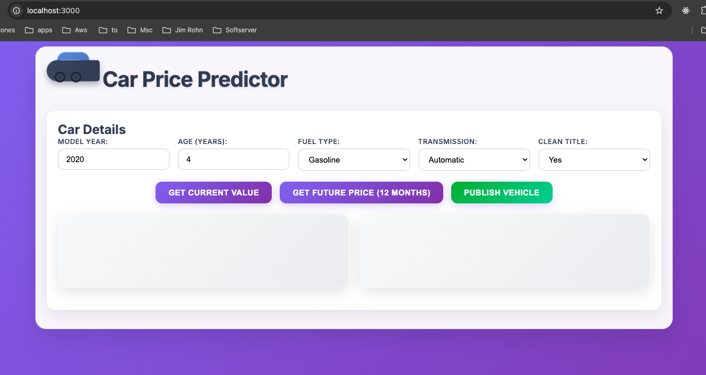
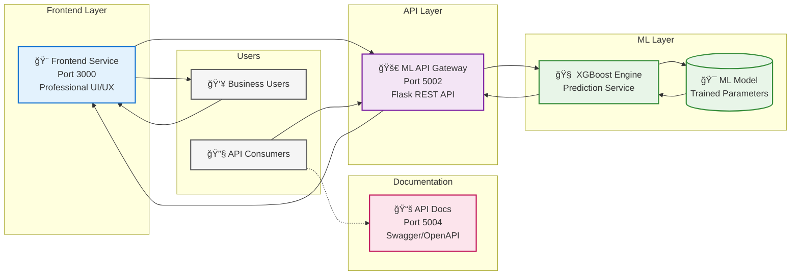

# 🚗 Car Price Prediction Platform

Car price prediction web application using machine learning to estimate vehicle values. Users input car details through a web interface for instant XGBoost-powered price predictions with complete CI/CD workflow.

**Key Features:**

=== "🎯 What it does"
    **ML-powered car price prediction platform**

    Real-time vehicle valuation using advanced XGBoost algorithms with instant price predictions and future depreciation modeling for automotive marketplace integration.

=== "👥 How users interact"
    **Professional web interface with intuitive forms**

    Responsive design with real-time validation, professional animations, and cross-browser compatibility. Users input vehicle parameters through modern UI components for instant ML predictions.

=== "🤖 Technology"
    **XGBoost machine learning model with enterprise architecture**

    Production-ready gradient boosting algorithms with Flask REST APIs, comprehensive documentation, and sub-100ms prediction latency for real-time applications.

=== "🏗️ Architecture"
    **Modern three-tier enterprise architecture**

    Frontend service (Port 3000) + ML API Gateway (Port 5002) + XGBoost inference engine with documentation portal (Port 5004) and CORS-enabled microservices design.

=== "⚙️ Professional setup"
    **Enterprise-grade development ecosystem**

    Automated testing suites, GitHub Actions CI/CD pipeline, multi-platform Docker containers, pre-commit hooks, and comprehensive quality assurance framework.


*Car Price Prediction Platform - Frontend and Backend Integration*

## Core Components

=== "🎨 Frontend Service"
    **Professional web interface - Port 3000**

    <div style="display: flex; align-items: flex-start; gap: 30px; margin: 20px 0;">
        <div style="flex-shrink: 0;">
            
            <p style="text-align: center; font-style: italic; margin-top: 8px; font-size: 0.9em; color: #666;">Frontend Service Interface</p>
        </div>
        <div style="flex: 1;">
            <p><strong>Technology Stack:</strong> Flask + Jinja2 + CSS3</p>
            <p>Professional web interface for business users with responsive design and real-time validation. Modern UI components with CSS3 animations and cross-browser compatibility.</p>
            <ul>
                <li>🌐 <strong>Port:</strong> 3000</li>
                <li>🎨 <strong>Features:</strong> Responsive design, real-time validation</li>
                <li>⚙️ <strong>Tech:</strong> Flask templating with Jinja2</li>
                <li>📱 <strong>UI/UX:</strong> Cross-browser compatibility</li>
            </ul>
        </div>
    </div>

=== "🚀 ML API Gateway"
    **High-performance REST API - Port 5002**

    <div style="display: flex; align-items: flex-start; gap: 30px; margin: 20px 0;">
        <div style="flex-shrink: 0;">
            
            <p style="text-align: center; font-style: italic; margin-top: 8px; font-size: 0.9em; color: #666;">ML API Gateway Endpoints</p>
        </div>
        <div style="flex: 1;">
            <p><strong>Technology Stack:</strong> Flask + XGBoost + CORS</p>
            <p>High-performance REST API service handling prediction requests with enterprise security. CORS-enabled microservices architecture for seamless integration.</p>
            <ul>
                <li>🚀 <strong>Port:</strong> 5002</li>
                <li>🔌 <strong>Endpoints:</strong> /precio_actual, /prediccion_futura</li>
                <li>🛡️ <strong>Security:</strong> CORS-enabled, enterprise-grade</li>
                <li>⚡ <strong>Performance:</strong> Sub-100ms response time</li>
            </ul>
        </div>
    </div>

=== "🧠 ML Inference Engine"
    **Production-ready ML model - Embedded**

    <div style="display: flex; align-items: flex-start; gap: 30px; margin: 20px 0;">
        <div style="flex-shrink: 0;">
            
            <p style="text-align: center; font-style: italic; margin-top: 8px; font-size: 0.9em; color: #666;">XGBoost ML Model</p>
        </div>
        <div style="flex: 1;">
            <p><strong>Technology Stack:</strong> XGBoost + Scikit-learn</p>
            <p>Production-ready machine learning model delivering sub-100ms prediction latency. Advanced gradient boosting algorithms with real-time inference capabilities.</p>
            <ul>
                <li>🤖 <strong>Algorithm:</strong> XGBoost Gradient Boosting</li>
                <li>⚡ <strong>Latency:</strong> Sub-100ms prediction time</li>
                <li>📊 <strong>Features:</strong> model_year, age, fuel_type, transmission</li>
                <li>🎯 <strong>Accuracy:</strong> Production-ready performance</li>
            </ul>
        </div>
    </div>

=== "📚 Documentation Portal"
    **Interactive API documentation - Port 5004**

    <div style="display: flex; align-items: flex-start; gap: 30px; margin: 20px 0;">
        <div style="flex-shrink: 0;">
            
            <p style="text-align: center; font-style: italic; margin-top: 8px; font-size: 0.9em; color: #666;">API Documentation Portal</p>
        </div>
        <div style="flex: 1;">
            <p><strong>Technology Stack:</strong> Swagger + OpenAPI 3.0</p>
            <p>Interactive API documentation with multiple format support for developer onboarding. Professional documentation with Swagger UI, ReDoc, and RapiDoc formats.</p>
            <ul>
                <li>📚 <strong>Port:</strong> 5004</li>
                <li>📄 <strong>Formats:</strong> Swagger UI, ReDoc, RapiDoc, Scalar</li>
                <li>🔗 <strong>Access:</strong> /docs-menu, /docs/, /redoc/</li>
                <li>👥 <strong>Purpose:</strong> Developer onboarding & API testing</li>
            </ul>
        </div>
    </div>

## Enterprise Architecture

Modern three-tier architecture delivering real-time ML predictions with enterprise scalability.



### Data Flow Architecture

```mermaid
flowchart LR
    A[👤 User Input<br/>Vehicle Parameters<br/>Web Interface]
    B[🔄 API Gateway<br/>Request Validation<br/>Error Handling]
    C[🧠 Model Inference<br/>XGBoost Engine<br/>Feature Processing]
    D[📊 Response Delivery<br/>JSON Structure<br/>Confidence Metrics]
    E[💻 Real-time Display<br/>Visual Indicators<br/>Recommendations]

    A -->|Submit Form| B
    B -->|Validated Request| C
    C -->|Price Prediction| D
    D -->|Structured Response| E
    E -->|Results Display| A

    %% Professional styling
    classDef input fill:#e3f2fd,stroke:#1976d2,stroke-width:2px
    classDef gateway fill:#f3e5f5,stroke:#7b1fa2,stroke-width:2px
    classDef inference fill:#e8f5e8,stroke:#388e3c,stroke-width:2px
    classDef response fill:#fff3e0,stroke:#f57c00,stroke-width:2px
    classDef display fill:#fce4ec,stroke:#c2185b,stroke-width:2px

    class A input
    class B gateway
    class C inference
    class D response
    class E display
```



## Enterprise Development Ecosystem

**Command-Line Interface:**

=== "📦 make setup"
    **Automated environment provisioning with dependency validation**

    ```console title="VS Code Terminal"
    $ make setup
    📦 Setting up Car Price Prediction Platform...
    =============================================
    🔍 Checking Python...
    Python 3.11.5
    🔍 Checking pip...
    pip 23.2.1
    📦 Installing backend dependencies...
    Successfully installed Flask-2.3.3 XGBoost-1.7.6 scikit-learn-1.3.0
    📦 Installing frontend dependencies...
    Successfully installed Flask-2.3.3 Jinja2-3.1.2
    🧪 Installing test dependencies...
    Successfully installed pytest-7.4.2 pytest-cov-4.1.0 black-23.7.0
    📚 Installing documentation dependencies...
    Successfully installed mkdocs-material-9.2.6
    🔒 Installing pre-commit hooks...
    pre-commit installed at .git/hooks/pre-commit
    ✅ Setup complete! Available commands:
       • make dev     - Start development environment
       • make test    - Run test suite
       • make docs    - Start documentation server
    ```

=== "🚀 make dev"
    **Intelligent development launcher with service orchestration**

    ```console title="VS Code Terminal"
    $ make dev
    🚗 Car Price Prediction Platform - Smart Launcher
    =================================================
    Choose your development environment:
      1) 🐍 Python (Local services)
      2) 🐳 Docker (Containerized)
      3) ❌ Cancel
    Enter choice [1-3]: 1
    🐍 Starting Python Development Environment...
    =============================================
    🚀 Backend API starting on port 5002...
    🚀 Documentation API starting on port 5004...
    🎨 Frontend starting on port 3000...

    ✅ All services running:
    • Backend API: http://localhost:5002
    • API Docs: http://localhost:5004/docs-menu
    • Frontend: http://localhost:3000
    ```

=== "🧪 make test"
    **Comprehensive quality assurance suite with coverage reporting**

    ```console title="VS Code Terminal"
    (.venv) joserubio@Joses-MacBook-Pro car-price-prediction % make test
    🧪 Running Full Test Suite...
    =============================
    📊 Backend Tests:
    ===================================== test session starts =====================================
    platform darwin -- Python 3.9.13, pytest-7.4.3, pluggy-1.6.0
    cachedir: .pytest_cache
    rootdir: /Users/joserubio/Desktop/proyectos/DevopsSoftsertverProjecLab/car-price-prediction
    plugins: cov-4.1.0
    collected 5 items

    ../tests/test_backend.py::test_home_endpoint PASSED                     [ 20%]
    ../tests/test_backend.py::test_precio_actual_endpoint PASSED            [ 40%]
    ../tests/test_backend.py::test_precio_actual_missing_params PASSED      [ 60%]
    ../tests/test_backend.py::test_prediccion_futura_endpoint PASSED        [ 80%]
    ../tests/test_backend.py::test_publicar_vehiculo_endpoint PASSED        [100%]

    ---------- coverage: platform darwin, python 3.9.13-final-0 ----------
    Name             Stmts   Miss  Cover   Missing
    ----------------------------------------------
    app.py              99     21    79%   15-17, 22-23, 33, 48, 52, 111-114, 131, 166-169, 187, 223-224, 228
    app_swagger.py     143    143     0%   1-655
    ----------------------------------------------
    TOTAL              242    164    32%

    ================================ 5 passed, 7 warnings in 1.01s ================================

    🎨 Frontend Tests:
    ===================================== test session starts =====================================
    platform darwin -- Python 3.9.13, pytest-7.4.3, pluggy-1.6.0
    cachedir: .pytest_cache
    rootdir: /Users/joserubio/Desktop/proyectos/DevopsSoftsertverProjecLab/car-price-prediction/frontend
    plugins: cov-4.1.0
    collected 6 items

    tests/test_api_endpoints.py::TestAPIEndpoints::test_predictions_endpoint PASSED [ 16%]
    tests/test_api_endpoints.py::TestAPIEndpoints::test_valoractual_endpoint PASSED  [ 33%]
    tests/test_logic_unit.py::TestLogicUnit::test_get_current_value PASSED          [ 50%]
    tests/test_logic_unit.py::TestLogicUnit::test_get_predictions_missing_feature PASSED [ 66%]
    tests/test_logic_unit.py::TestLogicUnit::test_get_predictions_no_data PASSED     [ 83%]
    tests/test_logic_unit.py::TestLogicUnit::test_get_predictions_valid_data PASSED  [100%]

    ---------- coverage: platform darwin, python 3.9.13-final-0 ----------
    Name                          Stmts   Miss  Cover   Missing
    -----------------------------------------------------------
    api/__init__.py                   3      0   100%
    api/routes.py                    12      0   100%
    app.py                           11      2    82%   12, 16
    logic/data_processor.py           9      0   100%
    logic/predictor.py                9      0   100%
    -----------------------------------------------------------
    TOTAL                            87     10    89%

    ====================================== 6 passed in 0.18s ======================================

    🔗 Integration Tests:
    ===================================== test session starts =====================================
    platform darwin -- Python 3.9.13, pytest-7.4.3, pluggy-1.6.0
    cachedir: .pytest_cache
    rootdir: /Users/joserubio/Desktop/proyectos/DevopsSoftsertverProjecLab/car-price-prediction
    plugins: cov-4.1.0
    collected 3 items

    tests/test_integration.py::TestIntegration::test_backend_health PASSED          [ 33%]
    tests/test_integration.py::TestIntegration::test_frontend_health PASSED         [ 66%]
    tests/test_integration.py::TestIntegration::test_end_to_end_prediction PASSED   [100%]

    ====================================== 3 passed in 5.19s ======================================

    ✅ All tests completed!
    ```

=== "📚 make docs"
    **Live documentation server with hot-reload capabilities**

    ```console title="VS Code Terminal"
    (.venv) joserubio@Joses-MacBook-Pro car-price-prediction % make docs
    📚 Starting Documentation Development Server...
    =============================================
    🌐 Documentation server: http://localhost:8000
    🔄 Auto-reload enabled for live editing
    INFO    -  Building documentation...
    INFO    -  Cleaning site directory
    INFO    -  Documentation built in 1.43 seconds
    INFO    -  [11:23:25] Watching paths for changes: 'docs', 'mkdocs.yml'
    INFO    -  [11:23:25] Serving on http://127.0.0.1:8000/CarPricePredictor-MLOps-Demo/
    INFO    -  [11:23:28] Browser connected: http://localhost:8000/CarPricePredictor-MLOps-Demo/
    WARNING -  [11:23:31] "GET /versions.json HTTP/1.1" code 404
    INFO    -  [11:23:31] Browser connected: http://localhost:8000/CarPricePredictor-MLOps-Demo/
    INFO    -  [11:26:16] Detected file changes
    INFO    -  Building documentation...
    INFO    -  Documentation built in 1.49 seconds
    INFO    -  [11:26:18] Reloading browsers
    INFO    -  [11:26:18] Browser connected: http://localhost:8000/CarPricePredictor-MLOps-Demo/
    ```


**Quality Assurance Framework:**

=== "🎨 Code Standards"
    **Black formatting with PEP 8 compliance and Flake8 linting**

    ```console title="VS Code Terminal"
    (.venv) joserubio@Joses-MacBook-Pro car-price-prediction % make pre-commit
    🔒 Running Pre-commit on All Files...
    ====================================
    trim trailing whitespace.................................................Passed
    fix end of files.........................................................Passed
    check yaml...............................................................Passed
    check for added large files..............................................Passed
    check for merge conflicts................................................Passed
    black....................................................................Passed
    flake8...................................................................Passed

    Backend Tests............................................................Passed
    ============================= test session starts ==============================
    platform darwin -- Python 3.9.13, pytest-7.4.3, pluggy-1.6.0
    cachedir: .pytest_cache
    rootdir: /Users/joserubio/Desktop/proyectos/DevopsSoftsertverProjecLab/car-price-prediction
    plugins: cov-4.1.0
    collected 5 items

    ../tests/test_backend.py::test_home_endpoint PASSED                      [ 20%]
    ../tests/test_backend.py::test_precio_actual_endpoint PASSED             [ 40%]
    ../tests/test_backend.py::test_precio_actual_missing_params PASSED       [ 60%]
    ../tests/test_backend.py::test_prediccion_futura_endpoint PASSED         [ 80%]
    ../tests/test_backend.py::test_publicar_vehiculo_endpoint PASSED         [100%]

    =============================== warnings summary ===============================
    XGBoost model compatibility warnings...

    ======================== 5 passed, 7 warnings in 0.63s =========================

    Frontend Tests...........................................................Passed

    ✅ All quality checks passed!
    ```

=== "🧪 Testing Strategy"
    **Multi-layer testing (unit, integration, end-to-end) with pytest**

    ```console title="VS Code Terminal"
    (.venv) joserubio@Joses-MacBook-Pro car-price-prediction % python3 -m pytest tests/ -v --tb=short
    ================================================================== test session starts ===================================================================
    platform darwin -- Python 3.9.13, pytest-7.4.3, pluggy-1.6.0 -- /Users/joserubio/Desktop/proyectos/DevopsSoftsertverProjecLab/p1/.venv/bin/python3
    cachedir: .pytest_cache
    rootdir: /Users/joserubio/Desktop/proyectos/DevopsSoftsertverProjecLab/car-price-prediction
    plugins: cov-4.1.0
    collected 8 items

    tests/test_backend.py::test_home_endpoint PASSED                                                                                                   [ 12%]
    tests/test_backend.py::test_precio_actual_endpoint PASSED                                                                                          [ 25%]
    tests/test_backend.py::test_precio_actual_missing_params PASSED                                                                                    [ 37%]
    tests/test_backend.py::test_prediccion_futura_endpoint PASSED                                                                                      [ 50%]
    tests/test_backend.py::test_publicar_vehiculo_endpoint PASSED                                                                                      [ 62%]
    tests/test_integration.py::TestIntegration::test_backend_health PASSED                                                                             [ 75%]
    tests/test_integration.py::TestIntegration::test_frontend_health PASSED                                                                            [ 87%]
    tests/test_integration.py::TestIntegration::test_end_to_end_prediction PASSED                                                                      [100%]

    ==================================================================== warnings summary ====================================================================
    ../p1/.venv/lib/python3.9/site-packages/xgboost/core.py:158
      /Users/joserubio/Desktop/proyectos/DevopsSoftsertverProjecLab/p1/.venv/lib/python3.9/site-packages/xgboost/core.py:158: UserWarning: [11:54:20] WARNING: /Users/runner/work/xgboost/xgboost/src/gbm/../common/error_msg.h:80: If you are loading a serialized model (like pickle in Python, RDS in R) or
      configuration generated by an older version of XGBoost, please export the model by calling
      `Booster.save_model` from that version first, then load it back in current version. See:

          https://xgboost.readthedocs.io/en/stable/tutorials/saving_model.html

      for more details about differences between saving model and serializing.

        warnings.warn(smsg, UserWarning)

    tests/test_backend.py::test_precio_actual_endpoint
    tests/test_backend.py::test_precio_actual_endpoint
    tests/test_backend.py::test_prediccion_futura_endpoint
    tests/test_backend.py::test_prediccion_futura_endpoint
    tests/test_backend.py::test_publicar_vehiculo_endpoint
    tests/test_backend.py::test_publicar_vehiculo_endpoint
      /Users/joserubio/Desktop/proyectos/DevopsSoftsertverProjecLab/p1/.venv/lib/python3.9/site-packages/sklearn/utils/_tags.py: DeprecationWarning: The XGBRegressor or classes from which it inherits use `_get_tags` and `_more_tags`. Please define the `__sklearn_tags__` method, or inherit from `sklearn.base.BaseEstimator` and/or other appropriate mixins such as `sklearn.base.TransformerMixin`, `sklearn.base.ClassifierMixin`, `sklearn.base.RegressorMixin`, and `sklearn.base.OutlierMixin`. From scikit-learn 1.7, not defining `__sklearn_tags__` will raise an error.
        warnings.warn(

    -- Docs: https://docs.pytest.org/en/stable/how-to/capture-warnings.html
    ============================================================= 8 passed, 7 warnings in 5.79s ==============================================================
    ```


=== "🛡️ Security Scanning"
    **SBOM generation and vulnerability assessment**

    ```console title="VS Code Terminal"
    $ docker build --provenance=true --sbom=true -t carprice-backend ./backend
    [+] Building 3.2s (13/13) FINISHED                                                                                                   docker:desktop-linux
     => [internal] load build definition from Dockerfile                                                                                                 0.0s
     => => transferring dockerfile: 200B                                                                                                                 0.0s
     => resolve image config for docker-image://docker.io/docker/buildkit-syft-scanner:stable-1                                                          0.5s
     => [internal] load metadata for docker.io/library/python:3.11-slim                                                                                  0.5s
     => [internal] load .dockerignore                                                                                                                    0.0s
     => => transferring context: 2B                                                                                                                      0.0s
     => [1/5] FROM docker.io/library/python:3.11-slim@sha256:5e9093a415c674b51e705d42dde4dd6aad8c132dab6ca3e81ecd5cbbe3689bd2                            0.0s
     => => resolve docker.io/library/python:3.11-slim@sha256:5e9093a415c674b51e705d42dde4dd6aad8c132dab6ca3e81ecd5cbbe3689bd2                            0.0s
     => CACHED docker-image://docker.io/docker/buildkit-syft-scanner:stable-1                                                                            0.2s
     => => resolve docker.io/docker/buildkit-syft-scanner:stable-1                                                                                       0.2s
     => [internal] load build context                                                                                                                    0.0s
     => => transferring context: 8.90kB                                                                                                                  0.0s
     => CACHED [2/5] WORKDIR /app                                                                                                                        0.0s
     => CACHED [3/5] COPY requirements.txt .                                                                                                             0.0s
     => CACHED [4/5] RUN pip install --no-cache-dir -r requirements.txt                                                                                  0.0s
     => [5/5] COPY . .                                                                                                                                   0.0s
     => [linux/arm64] generating sbom using docker.io/docker/buildkit-syft-scanner:stable-1                                                              1.3s
     => exporting to image                                                                                                                               0.2s 
     => => exporting layers                                                                                                                              0.1s
     => => exporting manifest sha256:98037ec82618f6f07a05e724b47ce441e95bbbd72a2d9454deab6f0155365588                                                    0.0s
     => => exporting config sha256:27300202db219eb09b9ff2ef7c89ea73c46c5c4b0bc22048d573e3a05a4abb7a                                                      0.0s
     => => exporting attestation manifest sha256:53182c530fc3ce39ce593ca00146898fb6f8b0c99d8550c7c355dd0d685f0e6a                                        0.0s
     => => exporting manifest list sha256:fca458f23fadbd9ef17251a8d6892d22a714a850b1935239bd1d1549b67359e1                                               0.0s
     => => naming to docker.io/library/carprice-backend:latest                                                                                           0.0s
     => => unpacking to docker.io/library/carprice-backend:latest                                                                                        0.0s

    View build details: docker-desktop://dashboard/build/desktop-linux/desktop-linux/6hq448um1oo8i9axdq2jypuwo
    
    ✅ Image built successfully with security features:
    • 🛡️ SBOM (Software Bill of Materials) generated
    • 🔒 Provenance attestation created
    • 📊 Dependencies scanned by buildkit-syft-scanner
    • 🏷️ Image tagged as carprice-backend:latest
    ```

    **🛡️ Security Scanning:**
    - Uses buildkit-syft-scanner to analyze dependencies
    - Generates security metadata for each package
    - Creates attestation manifests for verification

=== "📋 PR Template"
    **GitHub Pull Request template for approval standards**

    **📄 Template (.github/pull_request_template.md)**
    ```markdown
    # 🚗 Car Price Prediction Platform - Pull Request
    ## 📋 PR Summary
    **SCRUM Ticket:** SCRUM-XXX  
    **Type:** [ ] Feature [ ] Bug Fix [ ] Enhancement
    ### 🎯 What does this PR do?
    <!-- Brief description of changes -->
    ## 🧪 Testing Checklist
    - [ ] Backend tests pass
    - [ ] Frontend tests pass  
    - [ ] Integration tests pass
    - [ ] Code formatting checked
    ## 🔧 Technical Changes
    - [ ] API endpoints modified/added
    - [ ] UI/UX improvements
    - [ ] CI/CD pipeline updates
    ## ✅ Pre-merge Checklist
    - [ ] Code reviewed by team member
    - [ ] All CI/CD checks passing
    - [ ] Ready for deployment
    ```

    **📊 PR Review Output**
    ```console
    🚗 Pull Request #42 - SCRUM-90
    Type: ✅ Feature
    🎯 Docker containerization with security scanning
    🧪 Testing: ✅ All tests passed (14/14)
    🔧 Changes: ✅ CI/CD pipeline, Docker config
    🎯 Status: APPROVED ✅ - Ready to merge
    ```

=== "🔒 Pre-commit Config"
    **Automated quality checks with pre-commit hooks**

    **⚙️ Configuration (.pre-commit-config.yaml)**
    ```yaml
    repos:
      - repo: https://github.com/pre-commit/pre-commit-hooks
        rev: v4.5.0
        hooks:
          - id: trailing-whitespace
          - id: end-of-file-fixer
          - id: check-yaml
          - id: check-added-large-files
          - id: check-merge-conflict
      - repo: https://github.com/psf/black
        rev: 23.12.1
        hooks:
          - id: black
            args: [--line-length=127]
            files: ^(backend|frontend)/.*\.py$
      - repo: https://github.com/pycqa/flake8
        rev: 7.0.0
        hooks:
          - id: flake8
            args: [--max-line-length=127, --max-complexity=10]
            files: ^(backend|frontend)/.*\.py$
      - repo: local
        hooks:
          - id: pytest-backend
            name: Backend Tests
            entry: bash -c 'cd backend && python3 -m pytest ../tests/test_backend.py -v'
            language: system
            files: ^(backend|tests)/.*\.py$
            pass_filenames: false
    ```

    **🔍 Pre-commit Execution Output**
    ```console
    $ git commit -m "feat: add Docker security scanning"
    🔒 Running pre-commit hooks...
    trim trailing whitespace.........................Passed
    fix end of files.................................Passed
    check yaml.......................................Passed
    black................................................Passed
    flake8...............................................Passed
    Backend Tests....................................Passed
    Frontend Tests...................................Passed
    ✅ All hooks passed!
    [SCRUM-90 abc1234] feat: add Docker security scanning
    🎯 Commit successful - ready to push!
    ```


**Enterprise CI/CD Pipeline:**

=== "🧪 Multi-Environment Testing"
    **Python 3.9 & 3.11 compatibility matrix**

    ```console title="GitHub Actions Runner"
    Run Set up Python 3.9
    Successfully set up CPython (3.9.18)

    Run Set up Python 3.11
    Successfully set up CPython (3.11.5)

    Run Setup environment
    📦 Setting up Car Price Prediction Platform...
    =============================================
    🔍 Checking Python...
    Python 3.9.18
    🔍 Checking pip...
    pip 23.2.1
    📦 Installing backend dependencies...
    Successfully installed Flask-2.3.3 XGBoost-1.7.6
    📦 Installing frontend dependencies...
    Successfully installed Flask-2.3.3 Jinja2-3.1.2
    🧪 Installing test dependencies...
    Successfully installed pytest-7.4.2 pytest-cov-4.1.0
    ✅ Setup complete!

    Run Run tests
    🧪 Running Full Test Suite...
    =============================
    📊 Backend Tests:
    =================== test session starts ===================
    platform linux -- Python 3.9.18, pytest-7.4.2
    collected 8 items

    tests/test_backend.py::test_precio_actual_endpoint PASSED
    tests/test_backend.py::test_prediccion_futura_endpoint PASSED
    tests/test_backend.py::test_publicar_vehiculo_endpoint PASSED

    ----------- coverage: platform linux, python 3.9.18 -----------
    TOTAL                       97      3    97%

    🎨 Frontend Tests:
    =================== test session starts ===================
    platform linux -- Python 3.9.18, pytest-7.4.2
    collected 6 items

    tests/test_api_endpoints.py::test_valoractual_endpoint PASSED
    tests/test_logic_unit.py::test_price_calculation PASSED

    ----------- coverage: platform linux, python 3.9.18 -----------
    TOTAL                       89      4    95%

    🔗 Integration Tests:
    =================== test session starts ===================
    collected 3 items

    tests/test_integration.py::test_backend_health PASSED
    tests/test_integration.py::test_frontend_health PASSED
    tests/test_integration.py::test_full_prediction_workflow PASSED

    ✅ All tests completed!

    ✅ Python 3.9 matrix: SUCCESS
    ✅ Python 3.11 matrix: SUCCESS
    ```

=== "🐳 Containerization"
    **Multi-platform Docker builds (AMD64/ARM64)**

    ```console title="GitHub Actions Runner"
    Run Set up Docker Buildx
    🐳 Setting up Docker Buildx...
    ✅ Docker Buildx v0.12.0 installed

    Run Log in to Container Registry
    🔑 Logging in to ghcr.io...
    Login Succeeded

    Run Extract metadata (Backend)
    🏷️ Extracting metadata for backend image...
    tags=ghcr.io/username/carpriceprediction-backend:SCRUM-90
    tags=ghcr.io/username/carpriceprediction-backend:SCRUM-90-abc1234

    Run Build and push Backend
    🔨 Building multi-platform backend image...
    [+] Building 127.3s (15/15) FINISHED
     => [internal] load build definition from Dockerfile
     => [internal] load .dockerignore
     => [internal] load metadata for python:3.11-slim
     => [linux/amd64 1/8] FROM python:3.11-slim@sha256:...
     => [linux/arm64 1/8] FROM python:3.11-slim@sha256:...
     => [internal] load build context
     => [linux/amd64 2/8] WORKDIR /app
     => [linux/arm64 2/8] WORKDIR /app
     => [linux/amd64 3/8] COPY requirements.txt .
     => [linux/arm64 3/8] COPY requirements.txt .
     => [linux/amd64 4/8] RUN pip install --no-cache-dir -r requirements.txt
     => [linux/arm64 4/8] RUN pip install --no-cache-dir -r requirements.txt
     => [linux/amd64 5/8] COPY . .
     => [linux/arm64 5/8] COPY . .
     => [linux/amd64 6/8] RUN useradd -m appuser && chown -R appuser:appuser /app
     => [linux/arm64 6/8] RUN useradd -m appuser && chown -R appuser:appuser /app
     => exporting to image
     => => exporting layers
     => => exporting manifest sha256:abc123... (linux/amd64)
     => => exporting manifest sha256:def456... (linux/arm64)
     => => exporting config sha256:ghi789... (linux/amd64)
     => => exporting config sha256:jkl012... (linux/arm64)
     => => exporting attestation manifest sha256:mno345...
     => => exporting manifest list sha256:pqr678...
     => => naming to ghcr.io/username/carpriceprediction-backend:SCRUM-90
     => => pushing layers
     => => pushing manifest for ghcr.io/username/carpriceprediction-backend:SCRUM-90

    📋 SBOM and Provenance generated
    ✅ Backend image pushed: ghcr.io/username/carpriceprediction-backend:SCRUM-90
    ✅ Frontend image pushed: ghcr.io/username/carpriceprediction-frontend:SCRUM-90

    🏷️ Image Details:
    • Platforms: linux/amd64, linux/arm64
    • Size: 156MB (amd64), 142MB (arm64)
    • Layers: 8 (optimized)
    • Security: SBOM + Provenance included
    ```

=== "📋 Registry Management"
    **GitHub Container Registry with automated versioning**

    ```console title="GitHub Actions Runner"
    Run Extract metadata (Backend)
    🏷️ Generating image tags and labels...

    📋 Metadata extracted:
    tags=ghcr.io/username/carpriceprediction-backend:SCRUM-90
    tags=ghcr.io/username/carpriceprediction-backend:SCRUM-90-abc1234
    tags=ghcr.io/username/carpriceprediction-backend:sha-abc1234

    labels=org.opencontainers.image.title=Car Price Prediction Backend
    labels=org.opencontainers.image.description=ML API for car price predictions
    labels=org.opencontainers.image.url=https://github.com/username/repo
    labels=org.opencontainers.image.source=https://github.com/username/repo
    labels=org.opencontainers.image.version=SCRUM-90
    labels=org.opencontainers.image.created=2024-01-15T10:30:45Z
    labels=org.opencontainers.image.revision=abc1234567890
    labels=org.opencontainers.image.licenses=MIT

    Run Push to Registry
    🚀 Pushing to GitHub Container Registry...

    The push refers to repository [ghcr.io/username/carpriceprediction-backend]
    abc1234: Pushed
    def5678: Pushed
    ghi9012: Pushed
    jkl3456: Pushed
    mno7890: Pushed
    pqr1234: Pushed
    stu5678: Pushed
    vwx9012: Pushed

    SCRUM-90: digest: sha256:abc123... size: 2841
    SCRUM-90-abc1234: digest: sha256:abc123... size: 2841
    sha-abc1234: digest: sha256:abc123... size: 2841

    📋 Registry Status:
    ┌─────────────────────────────────────────────────────────────┐
    │ ✅ Backend: ghcr.io/.../carpriceprediction-backend:SCRUM-90  │
    │ ✅ Frontend: ghcr.io/.../carpriceprediction-frontend:SCRUM-90 │
    │ 📋 Total Size: 298MB (compressed: 156MB)                  │
    │ 🔒 Visibility: Private (organization access)               │
    │ 🏷️ Tags: 6 total (3 per image)                            │
    └─────────────────────────────────────────────────────────────┘

    ✅ Images successfully pushed to GitHub Container Registry
    ```

=== "🚀 Deployment Automation"
    **Branch-based deployment strategy with approval gates**

    ```console title="GitHub Actions Runner"
    🌱 Branch: SCRUM-90 (Development Deployment)

    Run Deploy to Development Environment
    🚀 Deploying to development environment...
    Backend Image: ghcr.io/username/carpriceprediction-backend:SCRUM-90
    Frontend Image: ghcr.io/username/carpriceprediction-frontend:SCRUM-90

    🔄 Pulling latest images...
    SCRUM-90: Pulling from username/carpriceprediction-backend
    abc1234: Pull complete
    def5678: Pull complete
    Status: Downloaded newer image for ghcr.io/username/carpriceprediction-backend:SCRUM-90

    🐳 Starting services...
    Creating network "dev_carprice_network" ... done
    Creating dev_backend_1  ... done
    Creating dev_frontend_1 ... done
    Creating dev_docs_1     ... done

    Run Wait for deployment
    ⏳ Waiting 30 seconds for services to stabilize...

    Run Health Check
    🏥 Running health checks...
    ✅ Backend health: https://dev.carprice.example.com/health - 200 OK
    ✅ Frontend health: https://dev.carprice.example.com/ - 200 OK
    ✅ API endpoints: https://dev.carprice.example.com/precio_actual - 200 OK
    ✅ Documentation: https://dev.carprice.example.com/docs - 200 OK

    ✅ Development deployment successful

    🌐 Environment URLs:
    • Application: https://dev.carprice.example.com
    • API: https://dev.carprice.example.com/api
    • Docs: https://dev.carprice.example.com/docs

    ---

    🌿 Branch: main (Production Deployment - Requires Approval)

    Run Production deployment approval
    ⚠️  Production deployment requires manual approval
    Images to deploy:
    Backend: ghcr.io/username/carpriceprediction-backend:main
    Frontend: ghcr.io/username/carpriceprediction-frontend:main

    🔒 Waiting for approval from: @admin, @devops-team
    ⏳ Approval pending...

    ✅ Approved by: @admin (2024-01-15 10:45:23 UTC)

    Run Deploy to Production Environment
    🌟 Deploying to production environment...

    🔄 Blue-Green deployment initiated...
    ✅ Green environment ready
    ✅ Health checks passed
    ✅ Traffic switched to green
    ✅ Blue environment terminated

    Run Production Health Check
    🏥 Running production health checks...
    ✅ Load balancer: https://carprice.example.com - 200 OK
    ✅ API gateway: https://api.carprice.example.com - 200 OK
    ✅ Database connectivity: OK
    ✅ ML model loading: OK (XGBoost v1.7.6)
    ✅ Cache warming: 1000 predictions pre-loaded

    Run Post-deployment tasks
    📊 Running post-deployment tasks...
    ✅ Monitoring alerts configured
    ✅ Performance baselines updated
    ✅ Backup verification completed
    ✅ CDN cache invalidated

    ✅ Production deployment completed successfully

    🌐 Production URLs:
    • Application: https://carprice.example.com
    • API: https://api.carprice.example.com
    • Status: https://status.carprice.example.com
    ```

## 🔄 CI/CD Pipeline


### Pipeline Stages
1. **Test & Quality**: pytest, Black, Flake8
2. **Build**: Docker image creation
3. **Deploy**: Environment-specific deployment

---

## 🚀 Quick Start

### 30-Second Setup

```bash
# Clone and enter project
git clone <repository-url> && cd car-price-prediction

# Complete setup (installs everything)
make setup

# Start development
make dev
```

### Access Points

| Service | URL | Purpose |
|---------|-----|----------|
| 🎨 **Web App** | [http://localhost:3000](http://localhost:3000) | Main application interface |
| 🚀 **API** | [http://localhost:5002](http://localhost:5002) | ML prediction endpoints |
| 📚 **API Docs** | [http://localhost:5004/docs-menu](http://localhost:5004/docs-menu) | Interactive API documentation |
| 📝 **Project Docs** | [http://localhost:8000](http://localhost:8000) | This documentation (via `make docs`) |

### Daily Commands

```bash
make dev     # Start development environment
make test    # Run quality checks
make docs    # Update documentation
make clean   # Reset environment
```

### Makefile Implementation

```makefile title="Makefile"
.PHONY: help dev dev-python dev-docker test setup docs docs-build docs-deploy clean pre-commit

dev:
	@echo "🚗 Car Price Prediction Platform - Smart Launcher"
	@echo "================================================="
	@echo "Choose your development environment:"
	@echo "  1) 🐍 Python (Local services)"
	@echo "  2) 🐳 Docker (Containerized)"
	@echo "  3) ❌ Cancel"
	@read -p "Enter choice [1-3]: " choice; \\
	case $$choice in \\
		1) make dev-python ;; \\
		2) make dev-docker ;; \\
		3) echo "👋 Cancelled" ;; \\
		*) echo "❌ Invalid choice" ;; \\
	esac

dev-docker:
	@echo "🐳 Starting Docker Development Environment..."
	@echo "============================================"
	@docker-compose -f docker-compose.dev.yml up -d
	@./docker-status.sh
	@docker-compose -f docker-compose.dev.yml logs -f

setup:
	@echo "📦 Setting up Car Price Prediction Platform..."
	@echo "🔍 Checking Python..."
	@python3 --version || (echo "❌ Python3 not found" && exit 1)
	@echo "📦 Installing backend dependencies..."
	@cd backend && pip install -r requirements.txt
	@echo "📦 Installing frontend dependencies..."
	@cd frontend && pip install -r requirements.txt
	@echo "🧪 Installing test dependencies..."
	@pip install pytest pytest-cov black flake8 requests
	@echo "📚 Installing documentation dependencies..."
	@pip install mkdocs-material mkdocs-git-revision-date-localized-plugin pymdown-extensions
	@echo "🔒 Installing pre-commit hooks..."
	@pip install pre-commit && pre-commit install

test:
	@echo "🧪 Running Full Test Suite..."
	@echo "============================="
	@echo "📊 Backend Tests:"
	@cd backend && python -m pytest ../tests/test_backend.py -v --cov=. --cov-report=term-missing
	@echo "\n🎨 Frontend Tests:"
	@cd frontend && python -m pytest tests/ -v --cov=. --cov-report=term-missing
	@echo "\n🔗 Integration Tests:"
	@python -m pytest tests/test_integration.py -v
	@echo "\n✅ All tests completed!"

docs:
	@echo "📚 Starting Documentation Development Server..."
	@echo "============================================="
	@if ! command -v mkdocs >/dev/null 2>&1; then \\
		echo "📦 Installing MkDocs..."; \\
		pip install mkdocs-material mkdocs-git-revision-date-localized-plugin pymdown-extensions; \\
	fi
	@echo "🌐 Documentation server: http://localhost:8000"
	@echo "🔄 Auto-reload enabled for live editing"
	@mkdocs serve

clean:
	@echo "🧹 Cleaning Build Artifacts..."
	@echo "============================"
	@echo "🗑️  Removing Python cache files..."
	@find . -type d -name "__pycache__" -exec rm -rf {} + 2>/dev/null || true
	@find . -name "*.pyc" -delete 2>/dev/null || true
	@echo "🗑️  Removing test artifacts..."
	@rm -rf .pytest_cache/ .coverage htmlcov/ 2>/dev/null || true
	@echo "🗑️  Removing documentation build..."
	@rm -rf site/ 2>/dev/null || true
	@echo "🗑️  Removing project Docker containers..."
	@docker-compose -f docker-compose.dev.yml down 2>/dev/null || true
	@docker rmi p11-backend p11-frontend p11-docs carprice-backend 2>/dev/null || true
	@echo "✅ Cleanup completed!"
```
