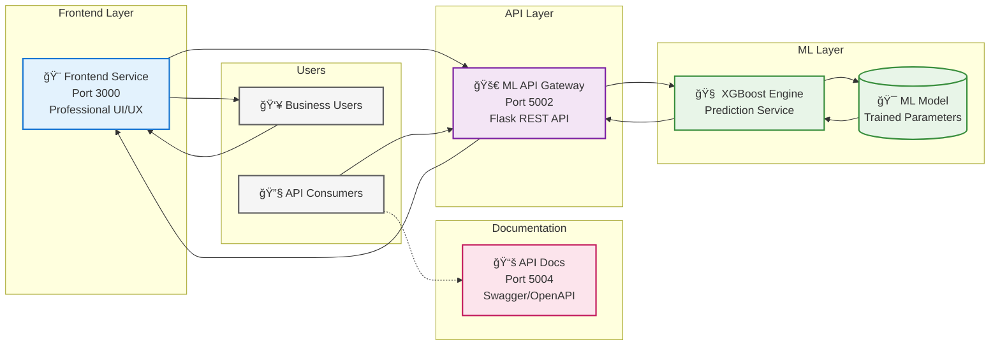

# 🚗 Car Price Prediction Platform

Car price prediction web application using machine learning to estimate vehicle values. Users input car details through a web interface for instant XGBoost-powered price predictions with complete CI/CD workflow.

**Key Features:**

=== "🎯 What it does"
    **ML-powered car price prediction platform**

    Real-time vehicle valuation using advanced XGBoost algorithms with instant price predictions and future depreciation modeling for automotive marketplace integration.

=== "👥 How users interact"
    **Professional web interface with intuitive forms**

    Responsive design with real-time validation, professional animations, and cross-browser compatibility. Users input vehicle parameters through modern UI components for instant ML predictions.

=== "🤖 Technology"
    **XGBoost machine learning model with enterprise architecture**

    Production-ready gradient boosting algorithms with Flask REST APIs, comprehensive documentation, and sub-100ms prediction latency for real-time applications.

=== "🏗️ Architecture"
    **Modern three-tier enterprise architecture**

    Frontend service (Port 3000) + ML API Gateway (Port 5002) + XGBoost inference engine with documentation portal (Port 5004) and CORS-enabled microservices design.

=== "⚙️ Professional setup"
    **Enterprise-grade development ecosystem**

    Automated testing suites, GitHub Actions CI/CD pipeline, multi-platform Docker containers, pre-commit hooks, and comprehensive quality assurance framework.


*Car Price Prediction Platform - Frontend and Backend Integration*

## Core Components

=== "🎨 Frontend Service"
    **Professional web interface - Port 3000**

    <div style="display: flex; align-items: flex-start; gap: 30px; margin: 20px 0;">
        <div style="flex-shrink: 0;">
            
            <p style="text-align: center; font-style: italic; margin-top: 8px; font-size: 0.9em; color: #666;">Frontend Service Interface</p>
        </div>
        <div style="flex: 1;">
            <p><strong>Technology Stack:</strong> Flask + Jinja2 + CSS3</p>
            <p>Professional web interface for business users with responsive design and real-time validation. Modern UI components with CSS3 animations and cross-browser compatibility.</p>
            <ul>
                <li>🌐 <strong>Port:</strong> 3000</li>
                <li>🎨 <strong>Features:</strong> Responsive design, real-time validation</li>
                <li>⚙️ <strong>Tech:</strong> Flask templating with Jinja2</li>
                <li>📱 <strong>UI/UX:</strong> Cross-browser compatibility</li>
            </ul>
        </div>
    </div>

=== "🚀 ML API Gateway"
    **High-performance REST API - Port 5002**

    <div style="display: flex; align-items: flex-start; gap: 30px; margin: 20px 0;">
        <div style="flex-shrink: 0;">
            
            <p style="text-align: center; font-style: italic; margin-top: 8px; font-size: 0.9em; color: #666;">ML API Gateway Endpoints</p>
        </div>
        <div style="flex: 1;">
            <p><strong>Technology Stack:</strong> Flask + XGBoost + CORS</p>
            <p>High-performance REST API service handling prediction requests with enterprise security. CORS-enabled microservices architecture for seamless integration.</p>
            <ul>
                <li>🚀 <strong>Port:</strong> 5002</li>
                <li>🔌 <strong>Endpoints:</strong> /current_value_market, /future_prediction</li>
                <li>🛡️ <strong>Security:</strong> CORS-enabled, enterprise-grade</li>
                <li>⚡ <strong>Performance:</strong> Sub-100ms response time</li>
            </ul>
        </div>
    </div>

=== "🧠 ML Inference Engine"
    **Production-ready ML model - Embedded**

    <div style="display: flex; align-items: flex-start; gap: 30px; margin: 20px 0;">
        <div style="flex-shrink: 0;">
            
            <p style="text-align: center; font-style: italic; margin-top: 8px; font-size: 0.9em; color: #666;">XGBoost ML Model</p>
        </div>
        <div style="flex: 1;">
            <p><strong>Technology Stack:</strong> XGBoost + Scikit-learn</p>
            <p>Production-ready machine learning model delivering sub-100ms prediction latency. Advanced gradient boosting algorithms with real-time inference capabilities.</p>
            <ul>
                <li>🤖 <strong>Algorithm:</strong> XGBoost Gradient Boosting</li>
                <li>⚡ <strong>Latency:</strong> Sub-100ms prediction time</li>
                <li>📊 <strong>Features:</strong> model_year, age, fuel_type, transmission</li>
                <li>🎯 <strong>Accuracy:</strong> Production-ready performance</li>
            </ul>
        </div>
    </div>

=== "📚 Documentation Portal"
    **Interactive API documentation - Port 5004**

    <div style="display: flex; align-items: flex-start; gap: 30px; margin: 20px 0;">
        <div style="flex-shrink: 0;">
            
            <p style="text-align: center; font-style: italic; margin-top: 8px; font-size: 0.9em; color: #666;">API Documentation Portal</p>
        </div>
        <div style="flex: 1;">
            <p><strong>Technology Stack:</strong> Swagger + OpenAPI 3.0</p>
            <p>Interactive API documentation with multiple format support for developer onboarding. Professional documentation with Swagger UI, ReDoc, and RapiDoc formats.</p>
            <ul>
                <li>📚 <strong>Port:</strong> 5004</li>
                <li>📄 <strong>Formats:</strong> Swagger UI, ReDoc, RapiDoc, Scalar</li>
                <li>🔗 <strong>Access:</strong> /docs-menu, /docs/, /redoc/</li>
                <li>👥 <strong>Purpose:</strong> Developer onboarding & API testing</li>
            </ul>
        </div>
    </div>


## Enterprise Architecture

Modern three-tier architecture delivering real-time ML predictions with enterprise scalability.




## Enterprise Development Ecosystem

**Command-Line Interface:**

=== "📦 make setup"
    **Automated environment provisioning with dependency validation**

    ```console title="VS Code Terminal"
    $ make setup
    📦 Setting up Car Price Prediction Platform...
    =============================================
    🔍 Checking Python...
    Python 3.11.5
    🔍 Checking pip...
    pip 23.2.1
    📦 Installing backend dependencies...
    Successfully installed Flask-2.3.3 XGBoost-1.7.6 scikit-learn-1.3.0
    📦 Installing frontend dependencies...
    Successfully installed Flask-2.3.3 Jinja2-3.1.2
    🧪 Installing test dependencies...
    Successfully installed pytest-7.4.2 pytest-cov-4.1.0 black-23.7.0
    📚 Installing documentation dependencies...
    Successfully installed mkdocs-material-9.2.6
    🔒 Installing pre-commit hooks...
    pre-commit installed at .git/hooks/pre-commit
    ✅ Setup complete! Available commands:
       • make dev     - Start development environment
       • make test    - Run test suite
       • make docs    - Start documentation server
    ```

=== "🚀 make dev"
    **Intelligent development launcher with service orchestration**

    ```console title="VS Code Terminal"
    $ make dev
    🚗 Car Price Prediction Platform - Smart Launcher
    =================================================
    Choose your development environment:
      1) 🐍 Python (Local services)
      2) 🐳 Docker (Containerized)
      3) ❌ Cancel
    Enter choice [1-3]: 1
    🐍 Starting Python Development Environment...
    =============================================
    🚀 Backend API starting on port 5002...
    🚀 Documentation API starting on port 5004...
    🎨 Frontend starting on port 3000...

    ✅ All services running:
    • Backend API: http://localhost:5002
    • API Docs: http://localhost:5004/docs-menu
    • Frontend: http://localhost:3000
    ```

=== "🧪 make test"
    **Comprehensive quality assurance suite with coverage reporting**

    ```console title="VS Code Terminal"
    (.venv) joserubio@Joses-MacBook-Pro car-price-prediction % make test
    🧪 Running Full Test Suite...
    =============================
    📊 Backend Tests:
    ===================================== test session starts =====================================
    platform darwin -- Python 3.9.13, pytest-7.4.3, pluggy-1.6.0
    cachedir: .pytest_cache
    rootdir: /Users/joserubio/Desktop/proyectos/DevopsSoftsertverProjecLab/car-price-prediction
    plugins: cov-4.1.0
    collected 5 items

    ../tests/test_backend.py::test_home_endpoint PASSED                     [ 20%]
    ../tests/test_backend.py::test_current_value_market_endpoint PASSED            [ 40%]
    ../tests/test_backend.py::test_current_value_market_missing_params PASSED      [ 60%]
    ../tests/test_backend.py::test_future_prediction_endpoint PASSED        [ 80%]
    ../tests/test_backend.py::test_publish_car_endpoint PASSED        [100%]

    ---------- coverage: platform darwin, python 3.9.13-final-0 ----------
    Name             Stmts   Miss  Cover   Missing
    ----------------------------------------------
    app.py              99     21    79%   15-17, 22-23, 33, 48, 52, 111-114, 131, 166-169, 187, 223-224, 228
    app_swagger.py     143    143     0%   1-655
    ----------------------------------------------
    TOTAL              242    164    32%

    ================================ 5 passed, 7 warnings in 1.01s ================================

    🎨 Frontend Tests:
    ===================================== test session starts =====================================
    platform darwin -- Python 3.9.13, pytest-7.4.3, pluggy-1.6.0
    cachedir: .pytest_cache
    rootdir: /Users/joserubio/Desktop/proyectos/DevopsSoftsertverProjecLab/car-price-prediction/frontend
    plugins: cov-4.1.0
    collected 6 items

    tests/test_api_endpoints.py::TestAPIEndpoints::test_predictions_endpoint PASSED [ 16%]
    tests/test_api_endpoints.py::TestAPIEndpoints::test_valoractual_endpoint PASSED  [ 33%]
    tests/test_logic_unit.py::TestLogicUnit::test_get_current_value PASSED          [ 50%]
    tests/test_logic_unit.py::TestLogicUnit::test_get_predictions_missing_feature PASSED [ 66%]
    tests/test_logic_unit.py::TestLogicUnit::test_get_predictions_no_data PASSED     [ 83%]
    tests/test_logic_unit.py::TestLogicUnit::test_get_predictions_valid_data PASSED  [100%]

    ---------- coverage: platform darwin, python 3.9.13-final-0 ----------
    Name                          Stmts   Miss  Cover   Missing
    -----------------------------------------------------------
    api/__init__.py                   3      0   100%
    api/routes.py                    12      0   100%
    app.py                           11      2    82%   12, 16
    logic/data_processor.py           9      0   100%
    logic/predictor.py                9      0   100%
    -----------------------------------------------------------
    TOTAL                            87     10    89%

    ====================================== 6 passed in 0.18s ======================================

    🔗 Integration Tests:
    ===================================== test session starts =====================================
    platform darwin -- Python 3.9.13, pytest-7.4.3, pluggy-1.6.0
    cachedir: .pytest_cache
    rootdir: /Users/joserubio/Desktop/proyectos/DevopsSoftsertverProjecLab/car-price-prediction
    plugins: cov-4.1.0
    collected 3 items

    tests/test_integration.py::TestIntegration::test_backend_health PASSED          [ 33%]
    tests/test_integration.py::TestIntegration::test_frontend_health PASSED         [ 66%]
    tests/test_integration.py::TestIntegration::test_end_to_end_prediction PASSED   [100%]

    ====================================== 3 passed in 5.19s ======================================

    ✅ All tests completed!
    ```

=== "📚 make docs"
    **Live documentation server with hot-reload capabilities**

    ```console title="VS Code Terminal"
    (.venv) joserubio@Joses-MacBook-Pro car-price-prediction % make docs
    📚 Starting Documentation Development Server...
    =============================================
    🌐 Documentation server: http://localhost:8000
    🔄 Auto-reload enabled for live editing
    INFO    -  Building documentation...
    INFO    -  Cleaning site directory
    INFO    -  Documentation built in 1.43 seconds
    INFO    -  [11:23:25] Watching paths for changes: 'docs', 'mkdocs.yml'
    INFO    -  [11:23:25] Serving on http://127.0.0.1:8000/CarPricePredictor-MLOps-Demo/
    INFO    -  [11:23:28] Browser connected: http://localhost:8000/CarPricePredictor-MLOps-Demo/
    WARNING -  [11:23:31] "GET /versions.json HTTP/1.1" code 404
    INFO    -  [11:23:31] Browser connected: http://localhost:8000/CarPricePredictor-MLOps-Demo/
    INFO    -  [11:26:16] Detected file changes
    INFO    -  Building documentation...
    INFO    -  Documentation built in 1.49 seconds
    INFO    -  [11:26:18] Reloading browsers
    INFO    -  [11:26:18] Browser connected: http://localhost:8000/CarPricePredictor-MLOps-Demo/
    ```


**Quality Assurance Framework:**

=== "🎨 Code Standards"
    **Black formatting with PEP 8 compliance and Flake8 linting**

    ```console title="VS Code Terminal"
    (.venv) joserubio@Joses-MacBook-Pro car-price-prediction % make pre-commit
    🔒 Running Pre-commit on All Files...
    ====================================
    trim trailing whitespace.................................................Passed
    fix end of files.........................................................Passed
    check yaml...............................................................Passed
    check for added large files..............................................Passed
    check for merge conflicts................................................Passed
    black....................................................................Passed
    flake8...................................................................Passed

    Backend Tests............................................................Passed
    ============================= test session starts ==============================
    platform darwin -- Python 3.9.13, pytest-7.4.3, pluggy-1.6.0
    cachedir: .pytest_cache
    rootdir: /Users/joserubio/Desktop/proyectos/DevopsSoftsertverProjecLab/car-price-prediction
    plugins: cov-4.1.0
    collected 5 items

    ../tests/test_backend.py::test_home_endpoint PASSED                      [ 20%]
    ../tests/test_backend.py::test_current_value_market_endpoint PASSED             [ 40%]
    ../tests/test_backend.py::test_current_value_market_missing_params PASSED       [ 60%]
    ../tests/test_backend.py::test_future_prediction_endpoint PASSED         [ 80%]
    ../tests/test_backend.py::test_publish_car_endpoint PASSED         [100%]

    =============================== warnings summary ===============================
    XGBoost model compatibility warnings...

    ======================== 5 passed, 7 warnings in 0.63s =========================

    Frontend Tests...........................................................Passed

    ✅ All quality checks passed!
    ```


=== "📋 PR Template"
    **GitHub Pull Request template for approval standards**

    **📄 Template (.github/pull_request_template.md)**
    ```markdown
    # 🚗 Car Price Prediction Platform - Pull Request
    ## 📋 PR Summary
    **SCRUM Ticket:** SCRUM-XXX
    **Type:** [ ] Feature [ ] Bug Fix [ ] Enhancement
    ### 🎯 What does this PR do?
    <!-- Brief description of changes -->
    ## 🧪 Testing Checklist
    - [ ] Backend tests pass
    - [ ] Frontend tests pass
    - [ ] Integration tests pass
    - [ ] Code formatting checked
    ## 🔧 Technical Changes
    - [ ] API endpoints modified/added
    - [ ] UI/UX improvements
    - [ ] CI/CD pipeline updates
    ## ✅ Pre-merge Checklist
    - [ ] Code reviewed by team member
    - [ ] All CI/CD checks passing
    - [ ] Ready for deployment
    ```

    **📊 PR Review Output**
    ```console
    🚗 Pull Request #42 - SCRUM-90
    Type: ✅ Feature
    🎯 Docker containerization with security scanning
    🧪 Testing: ✅ All tests passed (14/14)
    🔧 Changes: ✅ CI/CD pipeline, Docker config
    🎯 Status: APPROVED ✅ - Ready to merge
    ```

=== "🔒 Pre-commit Config"
    **Automated quality checks with pre-commit hooks**

    **⚙️ Configuration (.pre-commit-config.yaml)**
    ```yaml
    repos:
      - repo: https://github.com/pre-commit/pre-commit-hooks
        rev: v4.5.0
        hooks:
          - id: trailing-whitespace
          - id: end-of-file-fixer
          - id: check-yaml
          - id: check-added-large-files
          - id: check-merge-conflict
      - repo: https://github.com/psf/black
        rev: 23.12.1
        hooks:
          - id: black
            args: [--line-length=127]
            files: ^(backend|frontend)/.*\.py$
      - repo: https://github.com/pycqa/flake8
        rev: 7.0.0
        hooks:
          - id: flake8
            args: [--max-line-length=127, --max-complexity=10]
            files: ^(backend|frontend)/.*\.py$
      - repo: local
        hooks:
          - id: pytest-backend
            name: Backend Tests
            entry: bash -c 'cd backend && python3 -m pytest ../tests/test_backend.py -v'
            language: system
            files: ^(backend|tests)/.*\.py$
            pass_filenames: false
    ```

    **🔍 Pre-commit Execution Output**
    ```console
    $ git commit -m "feat: add Docker security scanning"
    🔒 Running pre-commit hooks...
    trim trailing whitespace.........................Passed
    fix end of files.................................Passed
    check yaml.......................................Passed
    black................................................Passed
    flake8...............................................Passed
    Backend Tests....................................Passed
    Frontend Tests...................................Passed
    ✅ All hooks passed!
    [SCRUM-90 abc1234] feat: add Docker security scanning
    🎯 Commit successful - ready to push!
    ```


## 🚀 Quick Start

=== "⚡ 30-Second Setup"
    **Complete environment setup in three commands**

    ```bash
    # Clone and enter project
    git clone <repository-url> && cd car-price-prediction

    # Complete setup (installs everything)
    make setup

    # Start development
    make dev
    ```

=== "🌐 Access Points"
    **Service endpoints and documentation portals**

    | Service | URL | Purpose |
    |---------|-----|----------|
    | 🎨 **Web App** | [http://localhost:3000](http://localhost:3000) | Main application interface |
    | 🚀 **API** | [http://localhost:5002](http://localhost:5002) | ML prediction endpoints |
    | 📚 **API Docs** | [http://localhost:5004/docs-menu](http://localhost:5004/docs-menu) | Interactive API documentation |
    | 📝 **Project Docs** | [http://localhost:8000](http://localhost:8000) | This documentation (via `make docs`) |

=== "⚙️ Daily Commands"
    **Essential development workflow commands**

    ```bash
    make dev     # Start development environment
    make test    # Run quality checks
    make docs    # Update documentation
    make clean   # Reset environment
    ```

# Key Project Blockers

This summary identifies risks related to dependency management, development infrastructure (Docker/TOML), and workflow tool adoption (Jira/GitHub).

| Blocker | Potential Impact on the Project | Proposed Solution (Mitigation) | 
 | ----- | ----- | ----- | 
| **1. Migration to TOML : Incompatibility in Docker Builds** | The current Dockerfile process assumes pip install -r requirements.txt. Migration requires changing the builder to install dependencies from pyproject.toml or the lock file. | **Solution:** Refactor the Dockerfile to use the native TOML tool flow (e.g., copying pyproject.toml and poetry.lock and running poetry install --no-root). | 
| **2. Build-Time Dependency Management** | ML dependencies requiring compilation might face issues if the TOML tool doesn't manage them correctly in the Docker build environment. | **Solution:** Identify and isolate complex dependencies. Use a builder pattern or a multi-stage container in Docker to pre-install or configure necessary system tools before Python installation. | 
| **3. Jira and GitHub Learning Curve** | The team's lack of familiarity with the Jira-GitHub workflow (creating branches with ticket IDs, linking commits, auto-moving statuses). | **Solution:** Conduct a mandatory hands-on workshop at the start of the project on the "Branching, Commit, Merge Request, Ticket Closing" flow. Document the commit message convention (e.g., [Ticket-ID] Descriptive message). | 
| **4. Python/ML Library Version Conflict** | A required preprocessing library is incompatible with onnxruntime in the Docker environment. | **Solution:** Define the versions of all dependencies. Use a clean Docker base image to strictly isolate dependencies. | 