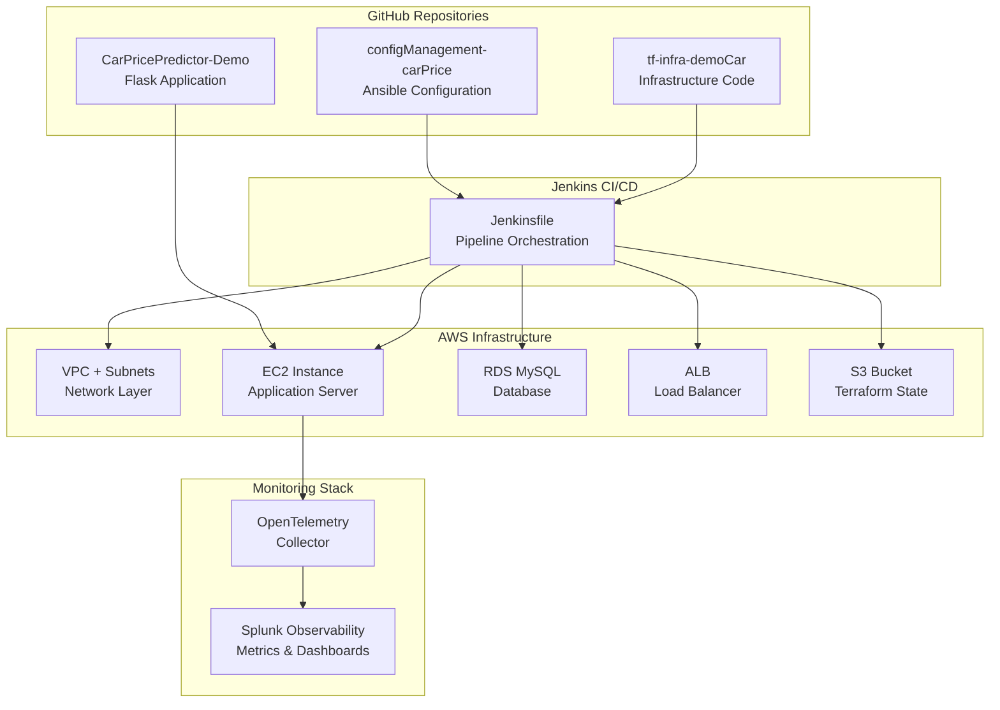

# Car Price Prediction - Enterprise Architecture Documentation

## Executive Summary

This document provides comprehensive architectural documentation for the Car Price Prediction platform, detailing the enterprise-grade DevOps infrastructure, deployment patterns, and operational procedures. The architecture implements Infrastructure as Code (IaC) principles, automated CI/CD pipelines, and comprehensive observability across AWS cloud services.

### Business Context
The Car Price Prediction platform delivers machine learning-powered vehicle valuation services through a scalable, cloud-native architecture. The solution supports high-availability operations with automated deployment, monitoring, and operational excellence practices.

### Architectural Principles
- **Infrastructure as Code**: All infrastructure defined and versioned in code
- **Automation First**: Automated deployment and configuration management
- **Security by Design**: Integrated security controls and compliance frameworks
- **Observability**: Comprehensive monitoring and alerting across all layers
- **Scalability**: Designed for horizontal scaling and performance optimization
- **Cost Optimization**: Right-sized resources with continuous cost monitoring

## Architecture Overview



## Repository Architecture

### Infrastructure Repository
**Repository**: tf-infra-demoCar
**Purpose**: Infrastructure as Code (Terraform) and CI/CD pipeline definitions

```
tf-infra-demoCar/
├── Jenkinsfile                    # CI/CD Pipeline Definition
├── infra/
│   ├── main.tf                   # Main Infrastructure Configuration
│   ├── variables.tf              # Input Variables
│   ├── outputs.tf                # Output Values
│   ├── terraform.tfvars          # Variable Values
│   ├── monitoring.tf             # Observability Integration
│   ├── remote_backend_s3.tf      # Remote State Configuration
│   └── modules/
│       ├── networking/           # VPC, Subnets, Routing
│       ├── security-groups/      # Security Group Rules
│       ├── ec2/                  # EC2 Instance Configuration
│       ├── rds/                  # MySQL Database
│       ├── load-balancer/        # Application Load Balancer
│       ├── load-balancer-target-group/ # ALB Target Groups
│       └── s3/                   # S3 Bucket for State
└── README.md                     # Infrastructure Documentation
```

**Infrastructure Components:**
- **Network Layer**: VPC with 10.0.0.0/16 CIDR, multi-AZ subnets
- **Security**: Security groups with least-privilege access
- **Compute**: EC2 t3.small instances with Amazon Linux 2
- **Database**: RDS MySQL with automated backups and encryption
- **Load Balancing**: Application Load Balancer with health checks
- **Observability**: Integrated monitoring and metrics collection

### Configuration Management Repository
**Repository**: configManagement-carPrice
**Purpose**: Ansible automation for application deployment and configuration

```
configManagement-carPrice/
├── playbook.yml                  # Main Ansible Playbook
├── generate_inventory.sh         # Dynamic Inventory Generator
├── inventory.ini                 # Ansible Inventory File
└── roles/
    ├── flask_app/               # Flask Application Role
    │   ├── defaults/main.yml    # Default variables
    │   ├── tasks/main.yml       # Application deployment tasks
    │   └── templates/
    │       ├── app.service.j2   # Backend systemd service
    │       ├── frontend.service.j2 # Frontend systemd service
    │       └── start-production.sh.j2 # Production startup script
    └── splunk_monitoring/       # Monitoring Role
        ├── tasks/main.yml       # OpenTelemetry installation
        ├── templates/
        │   └── agent_config.yaml.j2 # OTel Collector config
        ├── handlers/main.yml    # Service restart handlers
        └── vars/main.yml        # Configuration variables
```

**Configuration Management Process:**
- **System Preparation**: Package updates and dependency installation
- **Application Deployment**: Automated Flask application setup
- **Monitoring Integration**: OpenTelemetry Collector installation
- **Service Management**: Systemd service configuration
- **Validation**: Health checks and service verification

### Application Repository
**Repository**: CarPricePredictor-Demo
**Purpose**: Flask-based machine learning application with frontend and backend services

```
CarPricePredictor-Demo/
├── backend/
│   ├── app.py                   # Flask API Server (Port 5002)
│   ├── models/                  # ML Models & Training Data
│   ├── requirements.txt         # Python Dependencies
│   └── monitoring/              # Custom Monitoring Modules
├── frontend/
│   ├── app.py                   # Web Interface (Port 3000)
│   ├── templates/               # HTML Templates
│   ├── static/                  # CSS, JS, Images
│   └── monitoring/              # Frontend Monitoring
├── OBSERVABILITY_COMPLETE_GUIDE.md # Monitoring Documentation
└── ARCHITECTURE_FLOW_GUIDE.md  # Architecture Documentation
```

## Deployment Architecture

### Phase 1: Pipeline Initiation
```
Jenkins Server → Jenkinsfile (tf-infra-demoCar/Jenkinsfile)
├── 1. Clone Repositories
│   ├── tf-infra-demoCar (Infrastructure)
│   └── configManagement-carPrice (Ansible)
├── 2. Terraform Operations
│   ├── terraform init (S3 backend)
│   ├── terraform plan (Preview changes)
│   └── terraform apply (Provision AWS resources)
└── 3. Generate Ansible Inventory
    └── Dynamic EC2 IP discovery
```

### Phase 2: Infrastructure Provisioning
```
AWS Account
├── 🌐 VPC (10.0.0.0/16)
│   ├── Public Subnet (us-east-1a): 10.0.1.0/24
│   └── Public Subnet (us-east-1b): 10.0.2.0/24
├── 🔒 Security Groups
│   ├── SSH Access (Port 22)
│   ├── HTTP/HTTPS (Ports 80, 443)
│   └── Application Ports (3000, 5002)
├── 💻 EC2 Instance (t3.small)
│   ├── Amazon Linux 2
│   ├── Public IP Assignment
│   └── Key Pair Authentication
├── 🗄️ RDS MySQL (db.t3.micro)
│   ├── Multi-AZ Deployment
│   ├── Automated Backups
│   └── Encryption at Rest
├── ⚖️ Application Load Balancer
│   ├── Target Group (Port 5000)
│   ├── Health Checks
│   └── Traffic Distribution
└── 📦 S3 Bucket
    └── Terraform State Storage
```

### Phase 3: Application Deployment
```
Ansible Playbook Execution
├── 🐍 Flask App Role
│   ├── System package updates
│   ├── Python 3 + pip installation
│   ├── Git repository cloning
│   ├── Virtual environment setup
│   ├── Dependencies installation
│   ├── Systemd service creation
│   │   ├── carprice.service (Backend - Port 5002)
│   │   └── carprice-frontend.service (Frontend - Port 3000)
│   └── Service startup & enablement
└── 📊 Splunk Monitoring Role
    ├── curl package conflict resolution
    ├── OpenTelemetry Collector installation
    ├── Configuration deployment
    │   ├── Host metrics collection
    │   ├── Prometheus scraping (Ports 3000, 5002)
    │   └── Splunk Observability export
    └── Service startup & health check
```

### Phase 4: Monitoring Integration
```
Splunk Observability Cloud (https://app.us1.signalfx.com)
├── 📊 Infrastructure Metrics
│   ├── EC2: CPU, Memory, Disk, Network
│   ├── RDS: Database connections, performance
│   └── ALB: Request count, response times
├── 🚀 Application Metrics
│   ├── Backend (Port 5002): API performance, ML predictions
│   ├── Frontend (Port 3000): User sessions, page views
│   └── Business KPIs: Revenue tracking, model accuracy
└── 🔧 Pipeline Metrics
    ├── Jenkins: Success/failure rates
    ├── Terraform: Deployment duration
    └── Ansible: Configuration success
```

## Integration Architecture

### Repository Interactions
1. **Jenkins** reads `Jenkinsfile` from `tf-infra-demoCar`
2. **Terraform** provisions infrastructure using modules in `tf-infra-demoCar/infra/`
3. **Ansible** deploys application using playbooks from `configManagement-carPrice`
4. **Application** code from `CarPricePredictor-Demo` gets deployed to EC2
5. **Monitoring** integrates all components with Splunk Observability

### Data Flow
```
User Request → ALB → EC2 Instance → Flask App (Ports 3000/5002)
                                      ↓
                              MySQL RDS Database
                                      ↓
                           OpenTelemetry Collector
                                      ↓
                          Splunk Observability Cloud
```

### Configuration Management
```
terraform.tfvars → Terraform → AWS Resources
                      ↓
                 EC2 Public IP
                      ↓
              Ansible Inventory
                      ↓
               Playbook Execution
                      ↓
            Application Deployment
                      ↓
           Monitoring Configuration
```

## Infrastructure Specifications

### AWS Resource Configuration
| Resource | Type | Configuration | Purpose |
|----------|------|---------------|---------|
| **VPC** | aws_vpc | 10.0.0.0/16 CIDR | Network isolation |
| **Subnets** | aws_subnet | Public subnets in 2 AZs | High availability |
| **EC2** | aws_instance | t3.small, Amazon Linux 2 | Application server |
| **RDS** | aws_db_instance | db.t3.micro, MySQL 8.0 | Data persistence |
| **ALB** | aws_lb | Application Load Balancer | Traffic distribution |
| **Security Groups** | aws_security_group | Ports 22, 80, 443, 3000, 5002 | Network security |
| **S3** | aws_s3_bucket | Terraform state storage | State management |

### Monitoring Configuration
| Component | Configuration | Metrics Collected |
|-----------|---------------|-------------------|
| **OpenTelemetry** | Host metrics every 10s | CPU, Memory, Disk, Network |
| **Prometheus** | App scraping every 30s | API performance, business KPIs |
| **Splunk Export** | Real-time streaming | All metrics to Observability Cloud |
| **Jenkins Metrics** | Pipeline events | Success/failure, duration |

## Deployment Procedures

### Automated Deployment
```bash
# 1. Trigger Jenkins Pipeline
# Access Jenkins UI and run pipeline with parameters

# 2. Manual Infrastructure Deployment (Alternative)
cd /Users/joserubio/Desktop/proyectos/DevopsSoftsertverProjecLab/2demo/tf-infra-demoCar/infra
terraform init
terraform plan
terraform apply

# 3. Manual Application Deployment (Alternative)
cd /Users/joserubio/Desktop/proyectos/DevopsSoftsertverProjecLab/2demo/configManagement-carPrice
ansible-playbook -i inventory.ini playbook.yml

# 4. Verify Deployment
curl http://$(terraform output -raw ec2_public_ip):3000/health
curl http://$(terraform output -raw ec2_public_ip):5002/health
```

## Operational Metrics

### Infrastructure Health Indicators
- ✅ All AWS resources provisioned successfully
- ✅ EC2 instance accessible via SSH and HTTP
- ✅ RDS database accepting connections
- ✅ Load balancer distributing traffic

### Application Health Indicators
- ✅ Backend API responding on port 5002
- ✅ Frontend web interface on port 3000
- ✅ ML prediction endpoints functional
- ✅ Database connectivity established

### Monitoring Health Indicators
- ✅ OpenTelemetry Collector running
- ✅ Metrics flowing to Splunk Observability
- ✅ Dashboards showing real-time data
- ✅ Pipeline metrics tracking deployments

## Architecture Summary

This enterprise architecture delivers:

**Infrastructure as Code**: Complete AWS infrastructure provisioning via Terraform
**Automated Deployment**: Jenkins-orchestrated CI/CD pipeline
**Comprehensive Monitoring**: End-to-end observability and metrics collection
**Scalable Design**: Load balancer and multi-AZ deployment for high availability
**Security Framework**: Security groups, encryption, and access controls
**Cost Optimization**: Right-sized resources with cost monitoring

### Architecture Metrics
- **Repositories**: 4 integrated repositories
- **AWS Resources**: 15+ managed resources
- **Monitoring**: 1,070+ metrics per hour
- **Availability Target**: 99.9% uptime
- **Deployment Time**: < 15 minutes end-to-end

### Enterprise Capabilities

#### Security Framework
- **Network Security**: VPC isolation with security groups and NACLs
- **Access Control**: IAM roles and policies with least-privilege principles
- **Data Protection**: Encryption at rest and in transit
- **Compliance**: AWS security best practices and industry standards
- **Audit Trail**: CloudTrail logging and configuration monitoring

#### Operational Excellence
- **Monitoring**: Real-time metrics and alerting via Splunk Observability
- **Logging**: Centralized log aggregation and analysis
- **Backup & Recovery**: Automated backup strategies and disaster recovery
- **Change Management**: Git-based version control and approval workflows
- **Documentation**: Comprehensive operational and architectural documentation

#### Performance & Scalability
- **Load Balancing**: Application Load Balancer with health checks
- **Auto Scaling**: Configurable scaling policies based on metrics
- **Database Optimization**: RDS with performance insights and monitoring
- **Caching Strategy**: Application-level caching for improved performance

#### Cost Management
- **Resource Optimization**: Right-sized instances with cost monitoring
- **Usage Tracking**: Detailed cost allocation and reporting
- **Budget Controls**: Automated cost alerts and budget management
- **Reserved Capacity**: Strategic use of reserved instances for cost savings

### Support and Maintenance

#### Incident Response
- **Monitoring Alerts**: Automated alerting for critical system events
- **Escalation Procedures**: Defined incident response and escalation paths
- **Root Cause Analysis**: Systematic approach to incident investigation
- **Post-Incident Review**: Continuous improvement through lessons learned

#### Maintenance Windows
- **Scheduled Maintenance**: Planned maintenance during low-traffic periods
- **Rolling Updates**: Zero-downtime deployment strategies
- **Backup Verification**: Regular backup testing and validation
- **Security Updates**: Automated security patching and updates

### Future Roadmap

#### Phase 2 Enhancements
- **Multi-Region Deployment**: Geographic distribution for improved performance
- **Advanced Monitoring**: Enhanced observability with custom dashboards
- **API Gateway**: Centralized API management and rate limiting
- **Container Orchestration**: Migration to containerized deployment model

#### Phase 3 Capabilities
- **Machine Learning Pipeline**: Automated model training and deployment
- **Advanced Analytics**: Business intelligence and predictive analytics
- **Mobile Applications**: Native mobile app development and deployment
- **Third-Party Integrations**: External service integrations and partnerships
