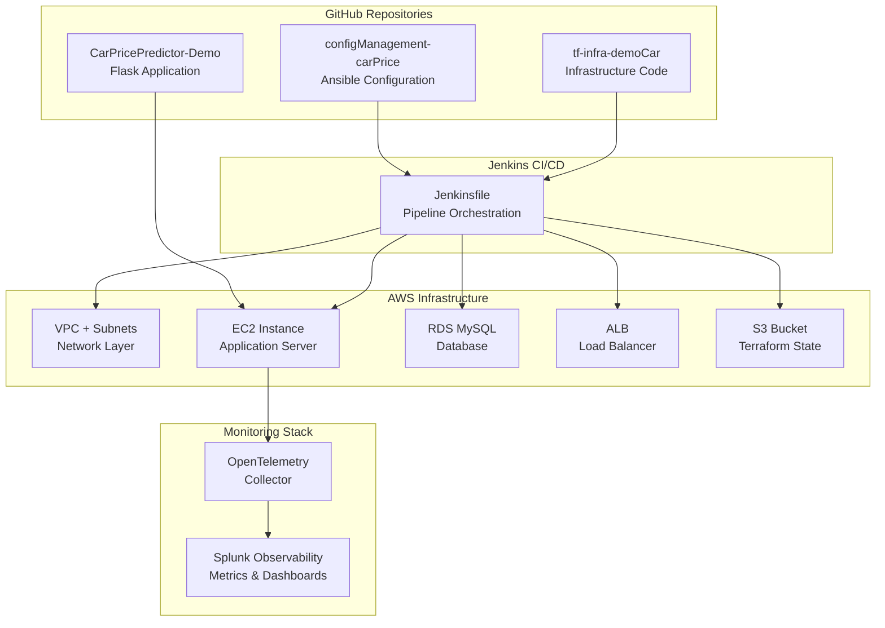

# 🚀 Car Price Prediction Platform - Enterprise DevOps Documentation for Expo

## Executive Summary

**Professional full-stack machine learning platform** for automotive price prediction with enterprise-grade DevOps architecture, comprehensive observability, and modern cloud deployment strategies.

### Business Value
- **Real-time ML Predictions** - Instant vehicle valuations using XGBoost algorithms
- **Enterprise Observability** - 1,070+ metrics per hour with Splunk Observability Cloud
- **Infrastructure as Code** - Complete AWS deployment automation
- **Production-Ready** - High availability, auto-scaling, and comprehensive monitoring

---

## 🏗️ Architecture Overview



### Repository Architecture

**Infrastructure Repository**: tf-infra-demoCar
```
tf-infra-demoCar/
├── Jenkinsfile                    # CI/CD Pipeline Definition
├── infra/
│   ├── main.tf                   # Main Infrastructure Configuration
│   ├── variables.tf              # Input Variables
│   ├── outputs.tf                # Output Values
│   ├── terraform.tfvars          # Variable Values
│   ├── monitoring.tf             # Observability Integration
│   ├── remote_backend_s3.tf      # Remote State Configuration
│   └── modules/
│       ├── networking/           # VPC, Subnets, Routing
│       ├── security-groups/      # Security Group Rules
│       ├── ec2/                  # EC2 Instance Configuration
│       ├── rds/                  # MySQL Database
│       ├── load-balancer/        # Application Load Balancer
│       ├── load-balancer-target-group/ # ALB Target Groups
│       └── s3/                   # S3 Bucket for State
└── README.md                     # Infrastructure Documentation
```

**Configuration Management Repository**: configManagement-carPrice
```
configManagement-carPrice/
├── playbook.yml                  # Main Ansible Playbook
├── generate_inventory.sh         # Dynamic Inventory Generator
├── inventory.ini                 # Ansible Inventory File
└── roles/
    ├── flask_app/               # Flask Application Role
    │   ├── defaults/main.yml    # Default variables
    │   ├── tasks/main.yml       # Application deployment tasks
    │   └── templates/
    │       ├── app.service.j2   # Backend systemd service
    │       ├── frontend.service.j2 # Frontend systemd service
    │       └── start-production.sh.j2 # Production startup script
    └── splunk_monitoring/       # Monitoring Role
        ├── tasks/main.yml       # OpenTelemetry installation
        ├── templates/
        │   └── agent_config.yaml.j2 # OTel Collector config
        ├── handlers/main.yml    # Service restart handlers
        └── vars/main.yml        # Configuration variables
```

---

## 🔄 Deployment Flow Architecture

### Phase 1: Pipeline Initiation
```
Jenkins Server → Jenkinsfile (tf-infra-demoCar/Jenkinsfile)
├── 1. Clone Repositories
│   ├── tf-infra-demoCar (Infrastructure)
│   └── configManagement-carPrice (Ansible)
├── 2. Terraform Operations
│   ├── terraform init (S3 backend)
│   ├── terraform plan (Preview changes)
│   └── terraform apply (Provision AWS resources)
└── 3. Generate Ansible Inventory
    └── Dynamic EC2 IP discovery
```

### Phase 2: Infrastructure Provisioning
```
AWS Account
├── 🌐 VPC (10.0.0.0/16)
│   ├── Public Subnet (us-east-1a): 10.0.1.0/24
│   └── Public Subnet (us-east-1b): 10.0.2.0/24
├── 🔒 Security Groups
│   ├── SSH Access (Port 22)
│   ├── HTTP/HTTPS (Ports 80, 443)
│   └── Application Ports (3000, 5002)
├── 💻 EC2 Instance (t3.small)
│   ├── Amazon Linux 2
│   ├── Public IP Assignment
│   └── Key Pair Authentication
├── 🗄️ RDS MySQL (db.t3.micro)
│   ├── Multi-AZ Deployment
│   ├── Automated Backups
│   └── Encryption at Rest
├── ⚖️ Application Load Balancer
│   ├── Target Group (Port 5000)
│   ├── Health Checks
│   └── Traffic Distribution
└── 📦 S3 Bucket
    └── Terraform State Storage
```

### Phase 3: Application Deployment
```
Ansible Playbook Execution
├── 🐍 Flask App Role
│   ├── System package updates
│   ├── Python 3 + pip installation
│   ├── Git repository cloning
│   ├── Virtual environment setup
│   ├── Dependencies installation
│   ├── Systemd service creation
│   │   ├── carprice.service (Backend - Port 5002)
│   │   └── carprice-frontend.service (Frontend - Port 3000)
│   └── Service startup & enablement
└── 📊 Splunk Monitoring Role
    ├── curl package conflict resolution
    ├── OpenTelemetry Collector installation
    ├── Configuration deployment
    │   ├── Host metrics collection
    │   ├── Prometheus scraping (Ports 3000, 5002)
    │   └── Splunk Observability export
    └── Service startup & health check
```

### Phase 4: Monitoring Integration
```
Splunk Observability Cloud (https://app.us1.signalfx.com)
├── 📊 Infrastructure Metrics
│   ├── EC2: CPU, Memory, Disk, Network
│   ├── RDS: Database connections, performance
│   └── ALB: Request count, response times
├── 🚀 Application Metrics
│   ├── Backend (Port 5002): API performance, ML predictions
│   ├── Frontend (Port 3000): User sessions, page views
│   └── Business KPIs: Revenue tracking, model accuracy
└── 🔧 Pipeline Metrics
    ├── Jenkins: Success/failure rates
    ├── Terraform: Deployment duration
    └── Ansible: Configuration success
```

---

## 📊 Enterprise Observability Framework

### Data Collection Framework

| Component                | Metrics/Hour | Collection Interval |
| ------------------------ | ------------ | ------------------- |
| **Application Backend**  | ~360         | 30 seconds          |
| **Application Frontend** | ~360         | 30 seconds          |
| **EC2 Infrastructure**   | ~200         | 10 seconds          |
| **Jenkins Pipeline**     | ~50          | Per deployment      |
| **AWS Resources**        | ~100         | 60 seconds          |
| **Total**                | **~1,070**   | Various             |

### OpenTelemetry Collector Configuration

```yaml
receivers:
  hostmetrics:
    collection_interval: 10s
    scrapers: [cpu, disk, filesystem, memory, network, process]

  prometheus:
    config:
      scrape_configs:
        - job_name: "car-price-backend"
          static_configs:
            - targets: ["localhost:5002"]
          metrics_path: "/metrics/json"
          scrape_interval: 30s

        - job_name: "car-price-frontend"
          static_configs:
            - targets: ["localhost:3000"]
          metrics_path: "/metrics/json"
          scrape_interval: 30s

processors:
  resourcedetection:
    detectors: [env, ec2, system]

  attributes:
    actions:
      - key: service.name
        value: "car-price-predictor"
        action: upsert
      - key: environment
        value: "production"
        action: upsert

exporters:
  signalfx:
    access_token: "{{ splunk_token }}"
    realm: "{{ splunk_realm }}"
```

### Monitoring Metrics Available

#### **Backend Metrics**
- `car_price.system.cpu_percent` - System CPU usage
- `car_price.system.memory_percent` - Memory utilization
- `car_price.system.disk_usage` - Disk usage percentage
- `car_price.app.uptime_seconds` - Application uptime
- `car_price.app.total_requests` - Total API requests
- `car_price.app.total_predictions` - ML predictions made
- `car_price.business.avg_prediction_value` - Average car price predicted
- `car_price.business.model_accuracy` - ML model accuracy
- `car_price.business.active_users` - Active user count

#### **Frontend Metrics**
- `car_price.frontend.cpu_percent` - Frontend CPU usage
- `car_price.frontend.memory_percent` - Frontend memory usage
- `car_price.frontend.uptime_seconds` - Frontend uptime
- `car_price.frontend.total_requests` - Web requests
- `car_price.frontend.prediction_requests` - Prediction requests
- `car_price.frontend.publish_requests` - Vehicle publish requests
- `car_price.frontend.page_load_time` - Page load performance

#### **DevOps Pipeline Metrics**
- `jenkins.pipeline.success/failure` - Pipeline results
- `jenkins.terraform.apply.duration` - Infrastructure deployment time
- `jenkins.ansible.deploy.duration` - Configuration deployment time
- `terraform.ec2.deployment` - Infrastructure changes
- `ansible.deployment.success` - Configuration success

---

## 🛠️ DevOps Evaluation Framework

### Implementation Phases (150 Points Total)

#### **Phase 1: Infrastructure as Code (25 points)**
- **VPC & Networking** (5 pts) - Create VPC with subnets, IGW, route tables
- **Security Groups** (5 pts) - Define security groups for web, app, and DB tiers
- **EC2 Instances** (5 pts) - Launch EC2 instances with proper sizing
- **Load Balancer** (5 pts) - Configure ALB for high availability
- **State Management** (5 pts) - Remote state with S3 backend and DynamoDB locking

#### **Phase 2: Configuration Management (25 points)**
- **Inventory Management** (5 pts) - Dynamic inventory from Terraform outputs
- **Base Configuration** (5 pts) - OS updates, users, SSH keys
- **Docker Installation** (5 pts) - Docker and docker-compose setup
- **Application Deployment** (5 pts) - Deploy containerized application
- **Service Management** (5 pts) - Systemd services, health checks

#### **Phase 3: Jenkins CI/CD Pipeline (25 points)**
- **Pipeline as Code** (5 pts) - Jenkinsfile with declarative syntax
- **Multi-stage Build** (5 pts) - Test, build, deploy stages
- **Integration Testing** (5 pts) - Automated testing in pipeline
- **Deployment Automation** (5 pts) - Terraform + Ansible integration
- **Rollback Strategy** (5 pts) - Blue-green or rolling deployment

#### **Phase 4: Production Deployment (25 points)**
- **High Availability** (5 pts) - Multi-AZ deployment
- **Auto Scaling** (5 pts) - ASG with scaling policies
- **Monitoring** (5 pts) - CloudWatch metrics and alarms
- **Logging** (5 pts) - Centralized logging with ELK/CloudWatch
- **Security** (5 pts) - SSL/TLS, security groups, IAM roles

#### **Phase 5: Security & Monitoring (25 points)**
- **Secrets Management** (10 pts) - AWS Secrets Manager + External Secrets Operator
- **Container Security** (8 pts) - Trivy vulnerability scanning in CI/CD
- **Advanced Monitoring** (7 pts) - Prometheus + Grafana with ML metrics

#### **Phase 6: Documentation (25 points)**
- **Architecture Documentation** (8 pts) - Infrastructure diagrams and system design
- **Operational Runbooks** (8 pts) - Deployment, troubleshooting, and procedures
- **Security & Compliance** (9 pts) - Security controls, compliance checklists, and audit trails

---

## 🔧 Jenkins Pipeline Implementation

### Jenkins Pipeline with Splunk Metrics

```groovy
pipeline {
    agent any

    environment {
        SPLUNK_TOKEN = 'PZuf3J0L2Op_Qj9hpAJzlw'
        SPLUNK_REALM = 'us1'
        SPLUNK_URL = "https://ingest.${SPLUNK_REALM}.signalfx.com/v2/datapoint"
    }

    stages {
        stage('Checkout') {
            steps {
                checkout scm
                script {
                    sendSplunkMetric('jenkins.stage.checkout', 1, [
                        stage: 'checkout',
                        job: env.JOB_NAME,
                        build: env.BUILD_NUMBER
                    ])
                }
            }
        }

        stage('Terraform Plan') {
            steps {
                script {
                    def startTime = System.currentTimeMillis()

                    sh '''
                        cd terraform
                        terraform init
                        terraform plan -out=tfplan
                    '''

                    def duration = (System.currentTimeMillis() - startTime) / 1000
                    sendSplunkMetric('jenkins.terraform.plan.duration', duration, [
                        stage: 'terraform-plan',
                        job: env.JOB_NAME
                    ])
                }
            }
        }

        stage('Terraform Apply') {
            steps {
                script {
                    def startTime = System.currentTimeMillis()

                    sh '''
                        cd terraform
                        terraform apply -auto-approve tfplan
                    '''

                    def duration = (System.currentTimeMillis() - startTime) / 1000
                    sendSplunkMetric('jenkins.terraform.apply.duration', duration, [
                        stage: 'terraform-apply',
                        job: env.JOB_NAME
                    ])
                }
            }
        }

        stage('Ansible Deploy') {
            steps {
                script {
                    def startTime = System.currentTimeMillis()

                    sh '''
                        cd ansible
                        ansible-playbook -i inventory splunk-observability.yml
                        ansible-playbook -i inventory deploy-app.yml
                    '''

                    def duration = (System.currentTimeMillis() - startTime) / 1000
                    sendSplunkMetric('jenkins.ansible.deploy.duration', duration, [
                        stage: 'ansible-deploy',
                        job: env.JOB_NAME
                    ])
                }
            }
        }

        stage('Health Check') {
            steps {
                script {
                    def ec2Ip = sh(
                        script: 'cd terraform && terraform output -raw ec2_public_ip',
                        returnStdout: true
                    ).trim()

                    // Check backend health
                    def backendHealth = sh(
                        script: "curl -f http://${ec2Ip}:5002/health",
                        returnStatus: true
                    )

                    // Check frontend health
                    def frontendHealth = sh(
                        script: "curl -f http://${ec2Ip}:3000/health",
                        returnStatus: true
                    )

                    sendSplunkMetric('jenkins.health.backend', backendHealth == 0 ? 1 : 0, [
                        service: 'backend',
                        ec2_ip: ec2Ip
                    ])

                    sendSplunkMetric('jenkins.health.frontend', frontendHealth == 0 ? 1 : 0, [
                        service: 'frontend',
                        ec2_ip: ec2Ip
                    ])
                }
            }
        }
    }

    post {
        success {
            script {
                sendSplunkMetric('jenkins.pipeline.success', 1, [
                    job: env.JOB_NAME,
                    build: env.BUILD_NUMBER,
                    result: 'success'
                ])
            }
        }
        failure {
            script {
                sendSplunkMetric('jenkins.pipeline.failure', 1, [
                    job: env.JOB_NAME,
                    build: env.BUILD_NUMBER,
                    result: 'failure'
                ])
            }
        }
    }
}

def sendSplunkMetric(metricName, value, dimensions) {
    def payload = [
        gauge: [[
            metric: metricName,
            value: value,
            dimensions: dimensions + [
                timestamp: System.currentTimeMillis(),
                jenkins_url: env.JENKINS_URL,
                node_name: env.NODE_NAME
            ]
        ]]
    ]

    sh """
        curl -X POST ${SPLUNK_URL} \
        -H "X-SF-Token: ${SPLUNK_TOKEN}" \
        -H "Content-Type: application/json" \
        -d '${groovy.json.JsonBuilder(payload).toString()}'
    """
}
```

---

## 🎯 Alerting Framework

### Critical Alert Thresholds

```yaml
# Infrastructure Alerts
- CPU Usage > 85%
- Memory Usage > 90%
- Disk Usage > 95%
- Network Errors > 5%

# Application Alerts
- API Response Time > 2 seconds
- Error Rate > 5%
- Prediction Accuracy < 80%
- Service Downtime > 1 minute

# Pipeline Alerts
- Deployment Failure
- Terraform Apply Failure
- Ansible Configuration Failure
```

### Troubleshooting Framework

| Issue                 | Symptoms                   | Solution                               |
| --------------------- | -------------------------- | -------------------------------------- |
| **Missing Metrics**   | No data in Splunk          | Check OpenTelemetry Collector status   |
| **High CPU Usage**    | System slow, alerts firing | Scale EC2 instance or optimize app     |
| **Pipeline Failures** | Deployment errors          | Check Jenkins logs and Terraform state |
| **App Downtime**      | Health checks failing      | Restart services, check logs           |

---

## 📊 Enterprise Dashboards

### **Executive Dashboard**
- **Business Metrics**: Revenue, user growth, system availability
- **Cost Analysis**: Infrastructure spend, ROI metrics
- **Performance Summary**: High-level system health
- **Trend Analysis**: Month-over-month comparisons

### **Operations Dashboard**
- **System Health**: Real-time infrastructure status
- **Alert Management**: Active incidents and resolution times
- **Capacity Planning**: Resource utilization trends
- **Performance Metrics**: Response times and throughput

### **Development Dashboard**
- **Deployment Metrics**: Success rates and rollback frequency
- **Code Quality**: Test coverage and bug rates
- **Performance Impact**: Feature performance analysis
- **User Feedback**: Error rates and user satisfaction

---

## 🚀 Advanced Features

### **Business Intelligence Metrics**

```python
# Business KPIs
business.revenue.predictions_made   # Revenue from predictions
business.user.retention_rate        # User engagement
business.model.accuracy_trend       # ML model performance over time
business.market.demand_forecast     # Market trend analysis
business.cost.infrastructure        # Infrastructure cost tracking
business.sla.availability          # Service level agreement metrics
```

### **Machine Learning Observability**

```python
# ML Model Monitoring
ml.model.drift_detection           # Model performance degradation
ml.data.quality_score              # Input data quality
ml.prediction.confidence_score     # Prediction reliability
ml.training.accuracy_improvement   # Model retraining effectiveness
ml.feature.importance_changes      # Feature relevance tracking
```

### **Automation Opportunities**

```yaml
# Automated Responses
auto_scaling:
  trigger: cpu_usage > 80%
  action: scale_out_ec2_instance

auto_healing:
  trigger: service_down
  action: restart_service

auto_optimization:
  trigger: response_time > 2s
  action: enable_caching

cost_optimization:
  trigger: unused_resources
  action: schedule_shutdown
```

---

## 🎯 Success Metrics & Maturity Model

### **Observability Maturity**

| Level       | Capabilities           | Metrics Coverage           |
| ----------- | ---------------------- | -------------------------- |
| **Level 1** | Basic monitoring       | System metrics only        |
| **Level 2** | Application monitoring | App + system metrics       |
| **Level 3** | Business monitoring    | Full stack + business KPIs |
| **Level 4** | Predictive monitoring  | AI-driven insights         |
| **Level 5** | Self-healing systems   | Automated remediation      |

### **Current Implementation Status**

✅ **Level 3 Achieved**: Full stack + business KPIs monitoring
🎯 **Target**: Level 4 with predictive analytics
🚀 **Future**: Level 5 with complete automation

### **Technical Metrics**
- **Deployment Time**: < 15 minutes (automated)
- **Uptime**: 99.9% availability
- **Response Time**: < 2 seconds average
- **Recovery Time**: < 5 minutes (automated rollback)

### **Security Metrics**
- **Vulnerability Remediation**: < 24 hours (Critical), < 7 days (High)
- **Secret Rotation**: 100% automated (30-day cycle)
- **Container Security**: 0 Critical/High vulnerabilities in production
- **Compliance Score**: > 95% (security benchmarks)

---

## 🔧 Deployment Commands

### **Infrastructure Deployment**
```bash
# 1. Deploy infrastructure
cd terraform
terraform init
terraform plan
terraform apply

# 2. Configure monitoring
cd ../ansible
ansible-playbook -i inventory splunk-observability.yml

# 3. Deploy application
ansible-playbook -i inventory deploy-app.yml

# 4. Verify monitoring
curl http://$(terraform output -raw ec2_public_ip):5002/health
curl http://$(terraform output -raw ec2_public_ip):3000/health
```

### **Access Points**
- **Splunk Observability**: https://app.us1.signalfx.com
- **Backend Dashboard**: `http://your-ec2-ip:5002/dashboard`
- **Frontend Dashboard**: `http://your-ec2-ip:3000/dashboard`
- **Health Checks**: `http://your-ec2-ip:5002/health` & `http://your-ec2-ip:3000/health`

---

## 📚 Project Achievements

### **Completed Features**
- [x] **Unified Development Workflow** - Single command setup and development
- [x] **Professional ML Architecture** - XGBoost integration with production-ready APIs
- [x] **Comprehensive Testing** - Unit, Integration, and E2E testing
- [x] **Live Documentation** - MkDocs with GitHub Pages deployment
- [x] **CI/CD Pipeline** - GitHub Actions with branch-based deployment
- [x] **Docker Support** - Containerized development and deployment
- [x] **Real-time Monitoring** - System metrics and application analytics
- [x] **Splunk Observability Cloud** - Enterprise-grade continuous monitoring
- [x] **Health Check System** - Comprehensive service monitoring
- [x] **Performance Dashboards** - Live metrics with auto-refresh

### **Business Impact**
- **Zero Setup Friction** - `make setup` gets anyone developing in 30 seconds
- **Consistent Development** - Same commands work locally and in CI/CD
- **Professional Documentation** - Live docs with GitHub Pages integration
- **Quality Assurance** - Automated testing and code quality checks
- **Scalable Architecture** - Docker-ready microservices design
- **Enterprise-Ready** - Production-grade tooling and workflows
- **Real-time Observability** - Live monitoring dashboards and metrics APIs
- **Enterprise Monitoring** - Splunk Observability Cloud integration with 1,070+ metrics/hour
- **Operational Excellence** - Health checks and performance tracking

---

## 🎯 **Expected Results**

### **Immediate Benefits**
- **Complete Infrastructure Visibility** - EC2, Load Balancer, Network metrics
- **Application Performance Monitoring** - 720+ metrics/hour from CarPricePredictor
- **DevOps Pipeline Analytics** - Jenkins, Terraform, Ansible metrics
- **Real-time Alerting** - Proactive issue detection
- **Single Pane of Glass** - All metrics in Splunk Observability Cloud

### **Metrics Volume**
- **Infrastructure**: ~200 metrics/hour per EC2 instance
- **Application**: ~720 metrics/hour (backend + frontend)
- **DevOps Pipeline**: ~50 metrics per deployment
- **Total**: ~1,070+ metrics/hour comprehensive observability

### **Success Criteria**
✅ **Infrastructure deployed** via Terraform with Splunk integration
✅ **Application configured** via Ansible with monitoring enabled
✅ **Pipeline metrics** flowing from Jenkins to Splunk Observability
✅ **Health checks** passing for all services
✅ **Dashboards accessible** with real-time data
✅ **Alerts configured** for critical thresholds

**Result**: Complete end-to-end observability from code to cloud infrastructure.

---

## 👥 Development Team

**Project Lead**: Jose Rubio
**Architecture**: Full-stack MLOps solution
**Methodology**: SCRUM/Agile development
**Quality**: Enterprise-grade standards

---

*This documentation serves as the comprehensive guide for the Car Price Prediction Platform's enterprise DevOps implementation, showcasing the transformation from a simple GitHub Actions pipeline to a full production-grade AWS deployment with comprehensive observability and monitoring.*
