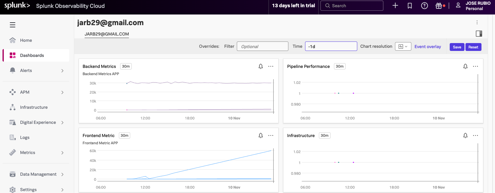
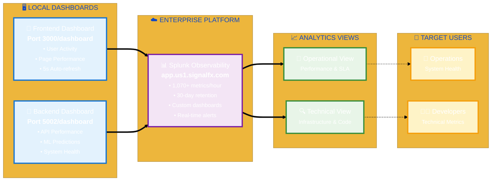
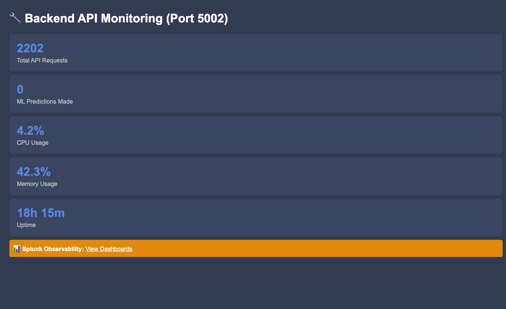

# 🚀 Car Price Prediction Platform

**Professional full-stack machine learning platform** for automotive price prediction with enterprise-grade DevOps architecture, comprehensive observability, and modern cloud deployment strategies.

### Business Value

=== "ML Intelligence"

    | Feature | Description | Impact |
    |---------|-------------|--------|
    | **Real-time Predictions** | Instant vehicle valuations using XGBoost algorithms | Immediate business decisions |
    | **Future Forecasting** | AI-powered depreciation modeling | Investment planning |
    | **Model Accuracy** | Production-grade ML with continuous validation | Reliable valuations |
    | **Scalable Processing** | High-throughput prediction engine | Enterprise capacity |

=== "Enterprise Operations"

    | Feature | Description | Impact |
    |---------|-------------|--------|
    | **Observability Platform** | 1,070+ metrics per hour with Splunk Cloud | Complete visibility |
    | **Real-time Monitoring** | Live dashboards with 5-second refresh | Proactive management |
    | **Health Monitoring** | Comprehensive service health checks | 99.9% availability |
    | **Performance Analytics** | Business and technical KPIs tracking | Data-driven optimization |

=== "DevOps Excellence"

    | Feature | Description | Impact |
    |---------|-------------|--------|
    | **Infrastructure as Code** | Complete AWS deployment automation | Consistent environments |
    | **CI/CD Pipeline** | Jenkins-based automated deployment | Rapid delivery |
    | **Multi-environment** | Development, staging, production workflows | Risk mitigation |
    | **Quality Assurance** | Automated testing and code quality gates | Production reliability |

=== "Enterprise Architecture"

    | Component | Technology | Purpose | Business Value |
    |-----------|------------|---------|----------------|
    | **Source Control** | Terraform + Ansible + Flask | 3-repository structure for separation of concerns | Maintainable codebase |
    | **Deployment Pipeline** | Jenkins CI/CD | Automated orchestration of infrastructure and applications | Rapid, reliable delivery |
    | **AWS Cloud Platform** | VPC + EC2 + S3 | Secure, scalable cloud infrastructure | Enterprise-grade hosting |
    | **Observability Stack** | OpenTelemetry + Splunk Cloud | End-to-end monitoring and analytics | Operational excellence |

---

<div style="text-align: center; background: linear-gradient(135deg, #667eea 0%, #764ba2 100%); color: white; padding: 20px; border-radius: 10px; margin: 20px 0; box-shadow: 0 4px 15px rgba(0,0,0,0.2);">
<h1 style="margin: 0; font-size: 2.2em; font-weight: bold;">🏗️ PART I: ENTERPRISE ARCHITECTURE & DEPLOYMENT</h1>
<p style="margin: 10px 0 0 0; font-size: 1.1em; opacity: 0.9;">Infrastructure as Code • CI/CD Pipeline • AWS Cloud Platform</p>
</div>

---

## 🏗️ Enterprise Architecture Overview

=== "Interactive Diagram"

    ```mermaid
    %%{init: {'theme': 'base', 'themeVariables': {'primaryColor': '#2563eb', 'primaryTextColor': '#ffffff', 'lineColor': '#374151'}}}%%

    flowchart LR
        subgraph SC ["🏛️ SOURCE CONTROL LAYER"]
            direction TB
            A["🏗️ Infrastructure<br/><b>Terraform IaC</b><br/><small>AWS Resources</small>"]
            B["⚙️ Configuration<br/><b>Ansible Automation</b><br/><small>System Setup</small>"]
            C["🚀 Application<br/><b>Flask + XGBoost</b><br/><small>ML Platform</small>"]
        end

        subgraph DP ["🔄 DEPLOYMENT PIPELINE"]
            D["🎯 Jenkins CI/CD<br/><b>Orchestration Engine</b><br/><small>Automated Deployment</small>"]
        end

        subgraph AWS ["☁️ AWS CLOUD INFRASTRUCTURE"]
            direction TB
            E["🌐 VPC Network<br/><b>Security & Isolation</b><br/><small>10.0.0.0/16</small>"]
            F["💻 EC2 Instance<br/><b>Application Runtime</b><br/><small>t3.small</small>"]
            G["📦 S3 Storage<br/><b>State Management</b><br/><small>Terraform Backend</small>"]
        end

        subgraph OBS ["📊 OBSERVABILITY PLATFORM"]
            direction TB
            H["📈 OpenTelemetry<br/><b>Metrics Collection</b><br/><small>Real-time Data</small>"]
            I["☁️ Splunk Cloud<br/><b>Enterprise Monitoring</b><br/><small>1,070+ metrics/hour</small>"]
        end

        A -.->|"Infrastructure Code"| D
        B -.->|"Configuration Scripts"| D
        C -.->|"Application Code"| D

        D ==>|"Provisions"| E
        D ==>|"Deploys"| F
        D ==>|"Manages"| G

        F ==>|"Streams Metrics"| H
        H ==>|"Exports Data"| I

        classDef sourceControl fill:#e3f2fd,stroke:#1976d2,stroke-width:3px
        classDef deployment fill:#f3e5f5,stroke:#7b1fa2,stroke-width:3px
        classDef aws fill:#e8f5e8,stroke:#388e3c,stroke-width:3px
        classDef observability fill:#fff3e0,stroke:#f57c00,stroke-width:3px

        class A,B,C sourceControl
        class D deployment
        class E,F,G aws
        class H,I observability
    ```

=== "Architecture Image"

    

    *Professional visualization of the complete enterprise architecture with AWS cloud infrastructure, CI/CD pipeline, and observability platform.*

**Architecture Flow:**

- **Three-Repository Structure** - Infrastructure, Configuration, and Application repositories provide **separation of concerns**
- **Jenkins CI/CD Orchestration** - Automated pipeline manages **end-to-end deployment** across all environments
- **AWS Cloud Infrastructure** - VPC, EC2, and S3 deliver **enterprise-grade hosting** with security isolation
- **Comprehensive Observability** - OpenTelemetry collectors stream **real-time metrics** to Splunk Cloud for analytics

---

## 🔄 Deployment Flow

=== "Interactive Diagram"

    ```mermaid
    flowchart LR
        subgraph "Pipeline Execution"
            A[🚀 Jenkins<br/>Orchestration]
            B[🏗️ Terraform<br/>Infrastructure]
            C[⚙️ Ansible<br/>Configuration]
            D[🎯 Health<br/>Validation]
        end

        subgraph "Infrastructure Layer"
            E[🌐 AWS VPC<br/>Network Isolation]
            F[💻 EC2 t3.small<br/>Compute Instance]
            G[📦 S3 Bucket<br/>State Management]
            H[🔒 Security Groups<br/>Access Control]
        end

        subgraph "Application Layer"
            I[🐍 Flask Services<br/>systemd Deployment]
            J[🔧 Python Environment<br/>Dependencies Setup]
        end

        subgraph "Monitoring Layer"
            K[📊 OpenTelemetry<br/>Collector Installation]
            L[☁️ Splunk Integration<br/>Observability Cloud]
        end

        A --> B
        B --> C
        C --> D

        B --> E
        B --> F
        B --> G
        B --> H

        C --> I
        C --> J
        C --> K

        K --> L

        D --> M[✅ Backend :5002<br/>Health Check]
        D --> N[✅ Frontend :3000<br/>Health Check]

        style A fill:#e1f5fe
        style D fill:#c8e6c9
        style L fill:#e8f5e8
    ```

=== "Jenkins Pipeline Code"

    <div style="font-size: 0.7em; font-family: 'JetBrains Mono', 'Fira Code', 'Consolas', monospace; line-height: 1.3; background: #1e1e1e; border-radius: 8px; padding: 12px; overflow-x: auto; color: #d4d4d4;">

    ```groovy
    pipeline {
      agent any
      parameters {
        booleanParam(name: 'PLAN_TERRAFORM', defaultValue: true, description: 'Run terraform plan')
        booleanParam(name: 'APPLY_TERRAFORM', defaultValue: true, description: 'Apply infrastructure')
        booleanParam(name: 'DEPLOY_ANSIBLE', defaultValue: true, description: 'Deploy Flask app')
        booleanParam(name: 'DESTROY_TERRAFORM', defaultValue: false, description: 'Destroy infra')
      }
      environment {
        ANSIBLE_DIR = 'configManagement-carPrice'
        INVENTORY_SCRIPT = "${ANSIBLE_DIR}/generate_inventory.sh"
        INVENTORY_FILE = "${ANSIBLE_DIR}/inventory.ini"
        PLAYBOOK_FILE = "${ANSIBLE_DIR}/playbook.yml"
      }
      stages {
        stage('Clone Repositories') {
          steps {
            echo 'Cleaning workspace and cloning repositories...'
            deleteDir()
            git branch: 'main', url: 'https://github.com/andreaendigital/tf-infra-demoCar'
            dir("${ANSIBLE_DIR}") {
              checkout([$class: 'GitSCM', branches: [[name: 'main']],
                       userRemoteConfigs: [[url: 'https://github.com/andreaendigital/configManagement-carPrice']]])
            }
          }
        }
        stage('Terraform Init') {
          steps {
            withCredentials([[$class: 'AmazonWebServicesCredentialsBinding', credentialsId: 'aws-jenkins-carprice']]) {
              dir('infra') { sh 'export AWS_PROFILE=""'; sh 'terraform init' }
            }
          }
        }
        stage('Terraform Plan') {
          when { expression { return params.PLAN_TERRAFORM } }
          steps {
            withCredentials([[$class: 'AmazonWebServicesCredentialsBinding', credentialsId: 'aws-jenkins-carprice']]) {
              dir('infra') { sh 'terraform plan -out=tfplan' }
            }
          }
        }
        stage('Terraform Apply') {
          when { expression { return params.APPLY_TERRAFORM } }
          steps {
            withCredentials([[$class: 'AmazonWebServicesCredentialsBinding', credentialsId: 'aws-jenkins-carprice']]) {
              dir('infra') { sh 'terraform apply -auto-approve tfplan' }
            }
          }
        }
        stage('Terraform Destroy') {
          when { expression { return params.DESTROY_TERRAFORM } }
          steps {
            withCredentials([[$class: 'AmazonWebServicesCredentialsBinding', credentialsId: 'aws-jenkins-carprice']]) {
              dir('infra') { sh 'terraform destroy -auto-approve' }
            }
          }
        }
        stage('Generate Ansible Inventory') {
          when { expression { return params.DEPLOY_ANSIBLE } }
          steps {
            withCredentials([[$class: 'AmazonWebServicesCredentialsBinding', credentialsId: 'aws-jenkins-carprice']]) {
              sh "chmod +x ${INVENTORY_SCRIPT}"; sh "${INVENTORY_SCRIPT}"
            }
          }
        }
        stage('Run Ansible Playbook') {
          when { expression { return params.DEPLOY_ANSIBLE } }
          steps {
            sshagent(credentials: ['ansible-ssh-key']) {
              sh "ansible-playbook -i ${INVENTORY_FILE} ${PLAYBOOK_FILE} --extra-vars 'ansible_ssh_common_args=\"-o StrictHostKeyChecking=no\"'"
            }
          }
        }
      }
      post {
        success {
          script {
            sh '''
              curl -X POST https://ingest.us1.signalfx.com/v2/datapoint \
              -H "X-SF-Token: PZuf3J0L2Op_Qj9hpAJzlw" \
              -H "Content-Type: application/json" \
              -d '{"gauge":[{"metric":"jenkins.pipeline.success","value":1,"dimensions":{"job":"''' + env.JOB_NAME + '''","build":"''' + env.BUILD_NUMBER + '''","result":"success"}}]}'
            '''
          }
          echo 'Deployment completed successfully!'
        }
        failure {
          script {
            sh '''
              curl -X POST https://ingest.us1.signalfx.com/v2/datapoint \
              -H "X-SF-Token: PZuf3J0L2Op_Qj9hpAJzlw" \
              -H "Content-Type: application/json" \
              -d '{"gauge":[{"metric":"jenkins.pipeline.failure","value":1,"dimensions":{"job":"''' + env.JOB_NAME + '''","build":"''' + env.BUILD_NUMBER + '''","result":"failure"}}]}'
            '''
          }
          echo 'Deployment failed. Check logs and Terraform state.'
        }
      }
    }
    ```

    </div>

    *Complete Jenkins pipeline implementing Infrastructure as Code with Terraform, configuration management with Ansible, and Splunk observability integration.*

**Deployment Process:**

- **Jenkins Orchestration** - Central pipeline manages **automated deployment** across all infrastructure layers
- **Terraform Provisioning** - Infrastructure as Code creates **AWS resources** (VPC, EC2, S3, Security Groups)
- **Ansible Configuration** - Automated setup deploys **Flask services** with Python dependencies
- **OpenTelemetry Integration** - Collectors installed for **real-time metrics** streaming to Splunk Cloud
- **Health Validation** - Automated checks verify **backend and frontend** services before completion

---

<div style="text-align: center; background: linear-gradient(135deg, #f093fb 0%, #f5576c 100%); color: white; padding: 20px; border-radius: 10px; margin: 20px 0; box-shadow: 0 4px 15px rgba(0,0,0,0.2);">
<h1 style="margin: 0; font-size: 2.2em; font-weight: bold;">📊 PART II: OBSERVABILITY & MONITORING FRAMEWORK</h1>
<p style="margin: 10px 0 0 0; font-size: 1.1em; opacity: 0.9;">Splunk Cloud • 1,070+ Metrics/Hour • Real-time Dashboards</p>
</div>

---

## 📊 Enterprise Observability Framework

=== "Telemetry Architecture"

    ```
    ┌─────────────────────────────────────────────────────────────────┐
    │                    SPLUNK OBSERVABILITY CLOUD                  │
    │                     Enterprise Monitoring Platform              │
    └─────────────────────────────────────────────────────────────────┘
                                        ▲
                                        │ Metrics & Telemetry
                        ┌───────────────┼───────────────┐
                        │               │               │
                ┌───────▼──────┐ ┌──────▼──────┐ ┌─────▼─────┐
                │ Application  │ │Infrastructure│ │ Pipeline  │
                │   Layer      │ │   Layer      │ │  Layer    │
                │              │ │              │ │           │
                │ • Backend    │ │ • EC2 Metrics│ │ • Jenkins │
                │ • Frontend   │ │ • CPU/Memory │ │ • Terraform│
                │ • ML Models  │ │ • Network    │ │ • Ansible │
                │ • Business   │ │ • Disk Usage │ │ • Health  │
                │   KPIs       │ │ • System     │ │   Checks  │
                └──────────────┘ └─────────────┘ └───────────┘
                        │               │               │
                ┌───────▼──────┐ ┌──────▼──────┐ ┌─────▼─────┐
                │ OpenTelemetry│ │HostMetrics  │ │ Jenkins   │
                │ Collector    │ │ Collector   │ │ Pipeline  │
                │ (Port 3000)  │ │ (10s int.)  │ │ Metrics   │
                │ (Port 5002)  │ │             │ │           │
                └──────────────┘ └─────────────┘ └───────────┘

    ```

    **Telemetry Flow:**

    - **Three-Layer Architecture** - Application, Infrastructure, and Pipeline layers provide **comprehensive coverage**
    - **Specialized Collectors** - OpenTelemetry, HostMetrics, and Jenkins collectors ensure **targeted data capture**
    - **Enterprise Platform** - Splunk Observability Cloud delivers **centralized monitoring** and analytics
    - **Real-Time Streaming** - Continuous metrics flow enables **proactive operational management**

=== "Observability Image"

    

    *Complete observability framework with Splunk Cloud integration, multi-layer telemetry collection, and enterprise-grade monitoring capabilities.*

### Data Collection Flow

=== "Interactive Diagram"

    ```mermaid
    %%{init: {'theme': 'base', 'themeVariables': {'primaryColor': '#2563eb', 'primaryTextColor': '#ffffff'}}}%%

    flowchart LR
        subgraph SOURCES ["📊 DATA SOURCES"]
            direction TB
            S1["🖥️ Backend App<br/><b>~360/hour</b><br/><small>30s interval</small>"]
            S2["🌐 Frontend App<br/><b>~360/hour</b><br/><small>30s interval</small>"]
            S3["🏗️ EC2 Infrastructure<br/><b>~200/hour</b><br/><small>10s interval</small>"]
            S4["🔧 Jenkins Pipeline<br/><b>~50/deployment</b><br/><small>Per build</small>"]
            S5["☁️ AWS Resources<br/><b>~100/hour</b><br/><small>60s interval</small>"]
        end

        subgraph COLLECTORS ["🔄 COLLECTION LAYER"]
            direction TB
            C1["📈 OpenTelemetry<br/><b>App Metrics</b>"]
            C2["📊 HostMetrics<br/><b>System Data</b>"]
            C3["🔄 Pipeline<br/><b>DevOps Metrics</b>"]
        end

        subgraph PROCESSING ["⚙️ PROCESSING"]
            direction TB
            P1["🔍 Resource Detection<br/><b>Auto-discovery</b><br/><small>Service identification</small>"]
            P2["🏷️ Attribute Processing<br/><b>Data Enrichment</b><br/><small>Metadata tagging</small>"]
            P3["📤 Splunk Export<br/><b>Real-time Stream</b><br/><small>Enterprise delivery</small>"]
        end

        subgraph ANALYTICS ["📊 ANALYTICS PLATFORM"]
            A1["☁️ Splunk Observability<br/><b>1,070+ metrics/hour</b><br/><small>Enterprise Analytics</small>"]
        end

        S1 --> C1
        S2 --> C1
        S3 --> C2
        S4 --> C3
        S5 --> C2

        C1 --> P1
        C2 --> P1
        C3 --> P1

        P1 --> P2
        P2 --> P3
        P3 --> A1

        classDef sources fill:#e3f2fd,stroke:#1976d2,stroke-width:3px
        classDef collectors fill:#f3e5f5,stroke:#7b1fa2,stroke-width:3px
        classDef processing fill:#e8f5e8,stroke:#388e3c,stroke-width:3px
        classDef analytics fill:#fff3e0,stroke:#f57c00,stroke-width:3px

        class S1,S2,S3,S4,S5 sources
        class C1,C2,C3 collectors
        class P1,P2,P3 processing
        class A1 analytics
    ```

=== "Splunk Collection Code"

    <div style="font-size: 0.7em; font-family: 'JetBrains Mono', 'Fira Code', 'Consolas', monospace; line-height: 1.3; background: #1e1e1e; border-radius: 8px; padding: 12px; overflow-x: auto; color: #d4d4d4;">

    ```python
    # Frontend Prediction Metrics Collection (car_price.frontend.predictions)

    @app.route("/predict", methods=["POST"])
    def predict():
        global prediction_requests
        prediction_requests += 1

        # Send metrics to Splunk Observability Cloud
        send_to_splunk_observability(
            "car_price.frontend.predictions", 1,
            {"user_ip": request.remote_addr or "unknown", "action": "current_prediction"}
        )
        send_to_splunk_observability("car_price.frontend.requests.total", prediction_requests)

    def send_to_splunk_observability(metric_name, value, dimensions=None):
        """Send metrics to Splunk Observability Cloud"""
        try:
            headers = {"X-SF-Token": SPLUNK_TOKEN, "Content-Type": "application/json"}

            if dimensions is None: dimensions = {}

            # Add default dimensions
            dimensions.update({
                "service": "car-price-frontend",
                "environment": "development",
                "host": "localhost"
            })

            payload = {
                "gauge": [{
                    "metric": metric_name,
                    "value": value,
                    "dimensions": dimensions,
                    "timestamp": int(time.time() * 1000)
                }]
            }

            response = requests.post(SPLUNK_URL, json=payload, headers=headers, timeout=5)
            if response.status_code != 200:
                print(f"❌ Splunk error: {response.status_code} - {response.text}")
        except Exception as e:
            print(f"❌ Splunk error: {e}")

    # Continuous Metrics Collection (every 10 seconds)
    def send_continuous_metrics():
        while continuous_monitoring:
            try:
                send_to_splunk_observability("car_price.frontend.cpu_percent", psutil.cpu_percent())
                send_to_splunk_observability("car_price.frontend.memory_percent", psutil.virtual_memory().percent)
                send_to_splunk_observability("car_price.frontend.uptime_seconds", time.time() - start_time)
                send_to_splunk_observability("car_price.frontend.total_requests", request_count)
                send_to_splunk_observability("car_price.frontend.prediction_requests", prediction_requests)
                time.sleep(10)  # Send metrics every 10 seconds
            except Exception as e:
                print(f"❌ Frontend continuous metrics error: {e}")
    ```

    </div>

    *Real-time metrics collection showing how `car_price.frontend.predictions` and other business metrics are captured and streamed to Splunk Observability Cloud with user context and dimensional data.*

**Data Collection Process:**

- **Multiple Data Sources** - Backend/Frontend apps, EC2 infrastructure, Jenkins pipeline generate **diverse metrics**
- **Specialized Collectors** - OpenTelemetry, HostMetrics, and Pipeline collectors provide **targeted monitoring**
- **Unified Processing** - Resource detection and attribute processing ensure **data consistency**
- **Splunk Integration** - Real-time export delivers **1,070+ metrics per hour** for enterprise analytics
- **Comprehensive Visibility** - Complete platform monitoring from **application to infrastructure**

### Implemented Metrics

=== "Metrics Volume"

    | Layer | Component | Metrics/Hour | Collection Interval |
    |-------|-----------|--------------|--------------------|
    | **Application** | Backend Service | ~360 | 30 seconds |
    | **Application** | Frontend Service | ~360 | 30 seconds |
    | **Infrastructure** | EC2 Host Metrics | ~200 | 10 seconds |
    | **Pipeline** | Jenkins Deployment | ~50 | Per deployment |
    | **Cloud** | AWS Resources | ~100 | 60 seconds |
    | **Total** | **Enterprise Platform** | **~1,070** | **Real-time** |

=== "Backend Metrics"

    | Metric Name | Description | Type |
    |-------------|-------------|------|
    | `car_price.system.cpu_percent` | System CPU usage | Performance |
    | `car_price.system.memory_percent` | Memory utilization | Performance |
    | `car_price.system.disk_usage` | Disk usage percentage | Performance |
    | `car_price.app.uptime_seconds` | Application uptime | Availability |
    | `car_price.app.total_requests` | Total API requests | Usage |
    | `car_price.app.total_predictions` | ML predictions made | Business |
    | `car_price.business.avg_prediction_value` | Average car price predicted | Business |
    | `car_price.business.model_accuracy` | ML model accuracy | Business |
    | `car_price.business.active_users` | Active user count | Business |
    | `car_price.predictions.current_value` | Current price predictions | Business |
    | `car_price.predictions.future_value` | Future price predictions | Business |
    | `car_price.business.months_forecast` | Forecast months requested | Business |
    | `car_price.requests.total` | Total requests counter | Usage |

=== "Frontend Metrics"

    | Metric Name | Description | Type |
    |-------------|-------------|------|
    | `car_price.frontend.cpu_percent` | Frontend CPU usage | Performance |
    | `car_price.frontend.memory_percent` | Frontend memory usage | Performance |
    | `car_price.frontend.uptime_seconds` | Frontend uptime | Availability |
    | `car_price.frontend.total_requests` | Web requests | Usage |
    | `car_price.frontend.prediction_requests` | Prediction requests | Business |
    | `car_price.frontend.publish_requests` | Vehicle publish requests | Business |
    | `car_price.frontend.page_load_time` | Page load performance | Performance |
    | `car_price.frontend.predictions` | User prediction actions | Business |
    | `car_price.frontend.publishes` | User publish actions | Business |
    | `car_price.frontend.requests.total` | Frontend request counter | Usage |
    | `car_price.frontend.publish.total` | Publish counter | Usage |

=== "Pipeline Metrics"

    | Metric Name | Description | Type |
    |-------------|-------------|------|
    | `jenkins.pipeline.success/failure` | Pipeline results | DevOps |
    | `jenkins.terraform.apply.duration` | Infrastructure deployment time | DevOps |
    | `jenkins.ansible.deploy.duration` | Configuration deployment time | DevOps |
    | `terraform.ec2.deployment` | Infrastructure changes | DevOps |
    | `ansible.deployment.success` | Configuration success | DevOps |

---

## 📊 Available Dashboards

### Dashboard Architecture



**Dashboard Ecosystem:**

- **Multi-Tier Visibility** - Local dashboards provide **application-level insights** for Backend and Frontend services
- **Real-Time Processing** - Unified data flow ensures **live metric collection** and processing
- **Dual Visualization** - Local interfaces and **Splunk Observability** platform offer comprehensive views
- **Enterprise Analytics** - Complete operational awareness from **granular details to strategic insights**
- **Operational Excellence** - Continuous monitoring enables **proactive management** and optimization

=== "Backend Monitoring"

    

    *Backend monitoring dashboard showing API performance, ML predictions, system health metrics, and real-time service status with 5-second auto-refresh.*

=== "Backend Dashboard"

    **Access**: Port 5002/dashboard | **URL**: http://13.220.64.167:5002/dashboard

    | Feature | Description | Update Frequency |
    |---------|-------------|------------------|
    | **System Metrics** | CPU, Memory, Uptime | Real-time |
    | **API Performance** | Total requests, ML predictions | Live tracking |
    | **Real-time Updates** | Auto-refresh dashboard | Every 5 seconds |
    | **Splunk Integration** | Direct link to observability platform | On-demand |

=== "Frontend Dashboard"

    **Access**: Port 3000/dashboard | **URL**: http://13.220.64.167:3000/dashboard

    | Feature | Description | Update Frequency |
    |---------|-------------|------------------|
    | **Web Metrics** | User requests, predictions, publishes | Real-time |
    | **System Performance** | CPU, Memory usage | Live monitoring |
    | **User Activity** | Real-time interaction tracking | Instant |
    | **Health Status** | Service connectivity monitoring | Continuous |

=== "Splunk Observability"

    **Access**: Enterprise Platform | **URL**: https://app.us1.signalfx.com

    | Feature | Description | Capability |
    |---------|-------------|------------|
    | **Comprehensive Metrics** | 1,070+ metrics/hour | Enterprise scale |
    | **Real-time Visualization** | Live data streaming | Instant insights |
    | **Historical Analysis** | 30-day data retention | Trend analysis |
    | **Custom Dashboards** | Business and technical KPIs | Configurable views |


---

<div style="text-align: center; background: linear-gradient(135deg, #4facfe 0%, #00f2fe 100%); color: white; padding: 20px; border-radius: 10px; margin: 20px 0; box-shadow: 0 4px 15px rgba(0,0,0,0.2);">
<h1 style="margin: 0; font-size: 2.2em; font-weight: bold;">🚀 PART III: DEPLOYMENT & OPERATIONS</h1>
<p style="margin: 10px 0 0 0; font-size: 1.1em; opacity: 0.9;">Production Environment • Health Monitoring • Access Points</p>
</div>

---

## 🔧 Deployment Commands

### **Infrastructure Deployment**
```bash
# 1. Deploy infrastructure
cd terraform
terraform init
terraform plan
terraform apply

# 2. Configure monitoring
cd ../ansible
ansible-playbook -i inventory splunk-observability.yml

# 3. Deploy application
ansible-playbook -i inventory deploy-app.yml

# 4. Verify monitoring
curl http://13.220.64.167:5002/health
curl http://13.220.64.167:3000/health
```

### **Access Points**
- **Splunk Observability**: https://app.us1.signalfx.com
- **Production Application**: http://13.220.64.167:3000/
- **Backend Dashboard**: http://13.220.64.167:5002/dashboard
- **Frontend Dashboard**: http://13.220.64.167:3000/dashboard
- **Health Checks**: http://13.220.64.167:5002/health & http://13.220.64.167:3000/health

---

## Implementation Summary

| Component | Details | Status |
|-----------|---------|--------|
| **Platform Status** | Production-ready ML prediction service with enterprise DevOps architecture | ✅ Active |
| **Monitoring Coverage** | Application, infrastructure, and pipeline metrics with Splunk Observability Cloud | ✅ Integrated |
| **Architecture** | 3-repository structure with Terraform IaC, Ansible configuration, and Flask application | ✅ Deployed |
| **Deployment** | Jenkins CI/CD pipeline with automated AWS provisioning and monitoring integration | ✅ Automated |
| **Team** | Jose Rubio (Project Lead) \| Full-stack MLOps \| SCRUM methodology | ✅ Operational |

---

---

*Enterprise DevOps documentation for Car Price Prediction Platform - Complete AWS deployment with comprehensive observability and monitoring.*
