# 🚀 Car Price Prediction Platform - Enterprise DevOps Documentation for Expo

## Executive Summary

**Professional full-stack machine learning platform** for automotive price prediction with enterprise-grade DevOps architecture, comprehensive observability, and modern cloud deployment strategies.

### Business Value
- **Real-time ML Predictions** - Instant vehicle valuations using XGBoost algorithms
- **Enterprise Observability** - 1,070+ metrics per hour with Splunk Observability Cloud
- **Infrastructure as Code** - Complete AWS deployment automation
- **Production-Ready** - High availability, auto-scaling, and comprehensive monitoring

---

## 🏗️ Enterprise Architecture Overview

### System Architecture

```mermaid
graph TB
    subgraph "Source Control Layer"
        A[🏗️ tf-infra-demoCar<br/>Infrastructure as Code<br/>Terraform Modules]
        B[⚙️ configManagement-carPrice<br/>Configuration Management<br/>Ansible Playbooks]
        C[🚀 CarPricePredictor-Demo<br/>ML Application<br/>Flask + XGBoost]
    end

    subgraph "CI/CD Orchestration"
        D[🔄 Jenkins Pipeline<br/>Automated Deployment<br/>Multi-Stage Validation]
    end

    subgraph "Cloud Infrastructure (AWS)"
        E[🌐 Virtual Private Cloud<br/>Network Isolation<br/>Multi-AZ Subnets]
        F[💻 EC2 Compute Instance<br/>Application Runtime<br/>Auto-Scaling Ready]
        I[📦 S3 State Management<br/>Terraform Backend<br/>Version Control]
    end

    subgraph "Observability Platform"
        J[☁️ Splunk Observability Cloud<br/>Enterprise Monitoring<br/>Real-time Analytics]
        K[📊 OpenTelemetry Collector<br/>Metrics Aggregation<br/>Multi-Protocol Support]
    end

    A --> D
    B --> D
    D --> E
    D --> F
    D --> I
    C --> F
    F --> K
    K --> J

    style A fill:#e3f2fd
    style B fill:#f3e5f5
    style C fill:#e8f5e8
    style D fill:#fff3e0
    style J fill:#e1f5fe
```



### Architecture Principles

**🔧 Infrastructure as Code**: Complete infrastructure automation using Terraform with modular design
**📋 Configuration Management**: Ansible-driven application deployment and environment consistency
**🔄 Continuous Integration**: Jenkins-orchestrated pipeline with automated testing and validation
**☁️ Cloud-Native Design**: AWS-optimized architecture with scalability and resilience built-in
**📊 Enterprise Observability**: Comprehensive monitoring with Splunk Observability Cloud integration
**🛡️ Security by Design**: Network isolation, encrypted communications, and access controls

### Technology Stack

| Layer | Technology | Purpose | Integration |
|-------|------------|---------|-------------|
| **ML Framework** | XGBoost + Flask | Prediction Engine | RESTful API |
| **Infrastructure** | Terraform + AWS | Cloud Provisioning | Modular IaC |
| **Configuration** | Ansible | Environment Setup | Idempotent Deployment |
| **CI/CD** | Jenkins | Pipeline Automation | Multi-Stage Validation |
| **Monitoring** | Splunk + OpenTelemetry | Enterprise Observability | Real-time Metrics |
| **Networking** | AWS VPC | Secure Connectivity | Multi-AZ Architecture |

### Multi-Repository Architecture

```mermaid
flowchart LR
    subgraph "Infrastructure Repository"
        A1[🏗️ tf-infra-demoCar]
        A2[Terraform Modules]
        A3[AWS Resources]
        A4[Network Configuration]
        A1 --> A2
        A2 --> A3
        A3 --> A4
    end

    subgraph "Configuration Repository"
        B1[⚙️ configManagement-carPrice]
        B2[Ansible Playbooks]
        B3[Application Roles]
        B4[Monitoring Setup]
        B1 --> B2
        B2 --> B3
        B3 --> B4
    end

    subgraph "Application Repository"
        C1[🚀 CarPricePredictor-Demo]
        C2[ML Application]
        C3[Flask Services]
        C4[XGBoost Model]
        C1 --> C2
        C2 --> C3
        C3 --> C4
    end

    A1 -.-> B1
    B1 -.-> C1

    style A1 fill:#e3f2fd
    style B1 fill:#f3e5f5
    style C1 fill:#e8f5e8
```



**Repository Responsibilities:**

- **🏗️ Infrastructure (tf-infra-demoCar)**: AWS resource provisioning, network setup, security configuration
- **⚙️ Configuration (configManagement-carPrice)**: Application deployment, environment setup, monitoring integration
- **🚀 Application (CarPricePredictor-Demo)**: ML prediction service, web interface, business logic

---

## 🔄 Deployment Flow

**Pipeline Execution**: Jenkins → Terraform (Infrastructure) → Ansible (Configuration) → Health Validation
**Infrastructure**: AWS VPC, EC2 t3.small, S3 state management, security groups
**Application**: Flask services deployment with systemd, Python environment setup
**Monitoring**: OpenTelemetry collector installation and Splunk Observability integration
**Validation**: Automated health checks for backend (5002) and frontend (3000) services


---

## 📊 Enterprise Observability Framework

### Telemetry Architecture

```
┌─────────────────────────────────────────────────────────────────┐
│                    SPLUNK OBSERVABILITY CLOUD                  │
│                     Enterprise Monitoring Platform              │
└─────────────────────────────────────────────────────────────────┘
                                    ▲
                                    │ Metrics & Telemetry
                    ┌───────────────┼───────────────┐
                    │               │               │
            ┌───────▼──────┐ ┌──────▼──────┐ ┌─────▼─────┐
            │ Application  │ │Infrastructure│ │ Pipeline  │
            │   Layer      │ │   Layer      │ │  Layer    │
            │              │ │              │ │           │
            │ • Backend    │ │ • EC2 Metrics│ │ • Jenkins │
            │ • Frontend   │ │ • CPU/Memory │ │ • Terraform│
            │ • ML Models  │ │ • Network    │ │ • Ansible │
            │ • Business   │ │ • Disk Usage │ │ • Health  │
            │   KPIs       │ │ • System     │ │   Checks  │
            └──────────────┘ └─────────────┘ └───────────┘
                    │               │               │
            ┌───────▼──────┐ ┌──────▼──────┐ ┌─────▼─────┐
            │ OpenTelemetry│ │HostMetrics  │ │ Jenkins   │
            │ Collector    │ │ Collector   │ │ Pipeline  │
            │ (Port 3000)  │ │ (10s int.)  │ │ Metrics   │
            │ (Port 5002)  │ │             │ │           │
            └──────────────┘ └─────────────┘ └───────────┘
```

### Data Collection Flow

```mermaid
flowchart LR
    subgraph "Data Sources"
        A[🖥️ Backend App<br/>~360/hour<br/>30s interval]
        B[🌐 Frontend App<br/>~360/hour<br/>30s interval]
        C[🏗️ EC2 Infrastructure<br/>~200/hour<br/>10s interval]
        D[🔧 Jenkins Pipeline<br/>~50/deployment]
        E[☁️ AWS Resources<br/>~100/hour<br/>60s interval]
    end

    subgraph "Collection Layer"
        F[📊 OpenTelemetry<br/>Collector]
        G[📈 HostMetrics<br/>Collector]
        H[🔄 Pipeline<br/>Metrics]
    end

    subgraph "Processing"
        I[🔄 Resource Detection]
        J[🏷️ Attribute Processing]
        K[📤 Splunk Export]
    end

    A --> F
    B --> F
    C --> G
    D --> H
    E --> G

    F --> I
    G --> I
    H --> I

    I --> J
    J --> K

    K --> L[☁️ Splunk Observability<br/>~1,070 metrics/hour]

    style L fill:#e1f5fe
```




### Implemented Metrics

=== "Backend Metrics"

    | Metric Name | Description | Type |
    |-------------|-------------|------|
    | `car_price.system.cpu_percent` | System CPU usage | Performance |
    | `car_price.system.memory_percent` | Memory utilization | Performance |
    | `car_price.system.disk_usage` | Disk usage percentage | Performance |
    | `car_price.app.uptime_seconds` | Application uptime | Availability |
    | `car_price.app.total_requests` | Total API requests | Usage |
    | `car_price.app.total_predictions` | ML predictions made | Business |
    | `car_price.business.avg_prediction_value` | Average car price predicted | Business |
    | `car_price.business.model_accuracy` | ML model accuracy | Business |
    | `car_price.business.active_users` | Active user count | Business |
    | `car_price.predictions.current_value` | Current price predictions | Business |
    | `car_price.predictions.future_value` | Future price predictions | Business |
    | `car_price.business.months_forecast` | Forecast months requested | Business |
    | `car_price.requests.total` | Total requests counter | Usage |

=== "Frontend Metrics"

    | Metric Name | Description | Type |
    |-------------|-------------|------|
    | `car_price.frontend.cpu_percent` | Frontend CPU usage | Performance |
    | `car_price.frontend.memory_percent` | Frontend memory usage | Performance |
    | `car_price.frontend.uptime_seconds` | Frontend uptime | Availability |
    | `car_price.frontend.total_requests` | Web requests | Usage |
    | `car_price.frontend.prediction_requests` | Prediction requests | Business |
    | `car_price.frontend.publish_requests` | Vehicle publish requests | Business |
    | `car_price.frontend.page_load_time` | Page load performance | Performance |
    | `car_price.frontend.predictions` | User prediction actions | Business |
    | `car_price.frontend.publishes` | User publish actions | Business |
    | `car_price.frontend.requests.total` | Frontend request counter | Usage |
    | `car_price.frontend.publish.total` | Publish counter | Usage |

=== "Pipeline Metrics"

    | Metric Name | Description | Type |
    |-------------|-------------|------|
    | `jenkins.pipeline.success/failure` | Pipeline results | DevOps |
    | `jenkins.terraform.apply.duration` | Infrastructure deployment time | DevOps |
    | `jenkins.ansible.deploy.duration` | Configuration deployment time | DevOps |
    | `terraform.ec2.deployment` | Infrastructure changes | DevOps |
    | `ansible.deployment.success` | Configuration success | DevOps |

---

## 🔧 Jenkins Pipeline Implementation

**Pipeline Stages**: Checkout → Terraform Plan → Terraform Apply → Ansible Deploy → Health Check
**Metrics Integration**: Each stage sends duration and status metrics to Splunk Observability Cloud
**Health Validation**: Automated backend and frontend service health verification
**Monitoring**: Real-time pipeline performance tracking with success/failure notifications

---


---

## 📊 Available Dashboards

### Dashboard Architecture

```mermaid
flowchart LR
    subgraph "Local Dashboards"
        A[🖥️ Backend Dashboard<br/>Port 5002/dashboard<br/>• System Metrics<br/>• API Performance<br/>• 5s Auto-refresh]
        B[🌐 Frontend Dashboard<br/>Port 3000/dashboard<br/>• Web Metrics<br/>• User Activity<br/>• Health Status]
    end

    subgraph "Enterprise Platform"
        C[☁️ Splunk Observability<br/>app.us1.signalfx.com<br/>• 1,070+ metrics/hour<br/>• Real-time streaming<br/>• 30-day retention<br/>• Custom dashboards]
    end

    subgraph "Data Flow"
        D[📊 Metrics Collection]
        E[🔄 Real-time Processing]
        F[📈 Visualization]
    end

    A --> D
    B --> D
    D --> E
    E --> F
    F --> C

    style C fill:#e1f5fe
    style A fill:#fff3e0
    style B fill:#f3e5f5
```



=== "Backend Dashboard"

    **Access**: Port 5002/dashboard | **URL**: http://13.220.64.167:5002/dashboard

    | Feature | Description | Update Frequency |
    |---------|-------------|------------------|
    | **System Metrics** | CPU, Memory, Uptime | Real-time |
    | **API Performance** | Total requests, ML predictions | Live tracking |
    | **Real-time Updates** | Auto-refresh dashboard | Every 5 seconds |
    | **Splunk Integration** | Direct link to observability platform | On-demand |

=== "Frontend Dashboard"

    **Access**: Port 3000/dashboard | **URL**: http://13.220.64.167:3000/dashboard

    | Feature | Description | Update Frequency |
    |---------|-------------|------------------|
    | **Web Metrics** | User requests, predictions, publishes | Real-time |
    | **System Performance** | CPU, Memory usage | Live monitoring |
    | **User Activity** | Real-time interaction tracking | Instant |
    | **Health Status** | Service connectivity monitoring | Continuous |

=== "Splunk Observability"

    **Access**: Enterprise Platform | **URL**: https://app.us1.signalfx.com

    | Feature | Description | Capability |
    |---------|-------------|------------|
    | **Comprehensive Metrics** | 1,070+ metrics/hour | Enterprise scale |
    | **Real-time Visualization** | Live data streaming | Instant insights |
    | **Historical Analysis** | 30-day data retention | Trend analysis |
    | **Custom Dashboards** | Business and technical KPIs | Configurable views |


### Real-time Monitoring Flow

```mermaid
flowchart TD
    subgraph "User Interactions"
        A[👤 User Prediction Request]
        B[📝 Vehicle Publish Action]
        C[🔍 Dashboard Access]
    end

    subgraph "Application Layer"
        D[🖥️ Backend Service<br/>Port 5002]
        E[🌐 Frontend Service<br/>Port 3000]
    end

    subgraph "Metrics Generation"
        F[📊 System Metrics<br/>CPU, Memory, Disk]
        G[🔢 Business KPIs<br/>Predictions, Accuracy]
        H[⚡ Event Metrics<br/>User Actions]
    end

    subgraph "Real-time Processing"
        I[📈 10s Continuous Collection]
        J[🎯 Event-driven Collection]
        K[💓 Health Monitoring]
    end

    A --> D
    B --> E
    C --> E

    D --> F
    D --> G
    E --> F
    E --> H

    F --> I
    G --> J
    H --> J

    I --> L[📊 Live Dashboards]
    J --> L
    K --> L

    L --> M[☁️ Splunk Observability]

    style M fill:#e1f5fe
    style L fill:#f3e5f5
```




---

## 🔧 Deployment Commands

### **Infrastructure Deployment**
```bash
# 1. Deploy infrastructure
cd terraform
terraform init
terraform plan
terraform apply

# 2. Configure monitoring
cd ../ansible
ansible-playbook -i inventory splunk-observability.yml

# 3. Deploy application
ansible-playbook -i inventory deploy-app.yml

# 4. Verify monitoring
curl http://13.220.64.167:5002/health
curl http://13.220.64.167:3000/health
```

### **Access Points**
- **Splunk Observability**: https://app.us1.signalfx.com
- **Production Application**: http://13.220.64.167:3000/
- **Backend Dashboard**: http://13.220.64.167:5002/dashboard
- **Frontend Dashboard**: http://13.220.64.167:3000/dashboard
- **Health Checks**: http://13.220.64.167:5002/health & http://13.220.64.167:3000/health

---

## Implementation Summary

**Platform Status**: Production-ready ML prediction service with enterprise DevOps architecture
**Monitoring Coverage**: Application, infrastructure, and pipeline metrics with Splunk Observability Cloud
**Architecture**: 3-repository structure with Terraform IaC, Ansible configuration, and Flask application
**Deployment**: Jenkins CI/CD pipeline with automated AWS provisioning and monitoring integration
**Team**: Jose Rubio (Project Lead) | Full-stack MLOps | SCRUM methodology

---

---

*Enterprise DevOps documentation for Car Price Prediction Platform - Complete AWS deployment with comprehensive observability and monitoring.*
