# 🚀 Car Price Prediction Platform - Enterprise DevOps Documentation for Expo

## Executive Summary

**Professional full-stack machine learning platform** for automotive price prediction with enterprise-grade DevOps architecture, comprehensive observability, and modern cloud deployment strategies.

### Business Value
- **Real-time ML Predictions** - Instant vehicle valuations using XGBoost algorithms
- **Enterprise Observability** - 1,070+ metrics per hour with Splunk Observability Cloud
- **Infrastructure as Code** - Complete AWS deployment automation
- **Production-Ready** - High availability, auto-scaling, and comprehensive monitoring

---

## 🏗️ Architecture Overview


### Repository Architecture

**Infrastructure Repository**: tf-infra-demoCar
```
tf-infra-demoCar/
├── Jenkinsfile                    # CI/CD Pipeline Definition
├── infra/
│   ├── main.tf                   # Main Infrastructure Configuration
│   ├── variables.tf              # Input Variables
│   ├── outputs.tf                # Output Values
│   ├── terraform.tfvars          # Variable Values
│   ├── monitoring.tf             # Observability Integration
│   ├── remote_backend_s3.tf      # Remote State Configuration
│   └── modules/
│       ├── networking/           # VPC, Subnets, Routing
│       ├── security-groups/      # Security Group Rules
│       ├── ec2/                  # EC2 Instance Configuration

│       └── s3/                   # S3 Bucket for State
└── README.md                     # Infrastructure Documentation
```

**Configuration Management Repository**: configManagement-carPrice
```
configManagement-carPrice/
├── playbook.yml                  # Main Ansible Playbook
├── generate_inventory.sh         # Dynamic Inventory Generator
├── inventory.ini                 # Ansible Inventory File
└── roles/
    ├── flask_app/               # Flask Application Role
    │   ├── defaults/main.yml    # Default variables
    │   ├── tasks/main.yml       # Application deployment tasks
    │   └── templates/
    │       ├── app.service.j2   # Backend systemd service
    │       ├── frontend.service.j2 # Frontend systemd service
    │       └── start-production.sh.j2 # Production startup script
    └── splunk_monitoring/       # Monitoring Role
        ├── tasks/main.yml       # OpenTelemetry installation
        ├── templates/
        │   └── agent_config.yaml.j2 # OTel Collector config
        ├── handlers/main.yml    # Service restart handlers
        └── vars/main.yml        # Configuration variables
```

---

## 🔄 Deployment Flow Architecture

### Complete Pipeline Flow

```mermaid
flowchart TD
    A[🚀 Jenkins Pipeline Start] --> B[📥 Clone Repositories]
    B --> C[tf-infra-demoCar]
    B --> D[configManagement-carPrice]

    C --> E[🏗️ Terraform Init]
    E --> F[📋 Terraform Plan]
    F --> G[🚀 Terraform Apply]

    G --> H[🌐 AWS Infrastructure]
    H --> I[VPC + Subnets<br/>10.0.0.0/16]
    H --> J[🔒 Security Groups<br/>SSH, HTTP, App Ports]
    H --> K[💻 EC2 Instance<br/>t3.small Amazon Linux]
    H --> L[📦 S3 Bucket<br/>Terraform State]

    D --> M[📝 Generate Inventory]
    M --> N[🔧 Ansible Deployment]

    N --> O[🐍 Flask App Role]
    N --> P[📊 Monitoring Role]

    O --> Q[System Updates]
    O --> R[Python Setup]
    O --> S[App Deployment]
    O --> T[Service Creation]

    P --> U[OpenTelemetry Install]
    P --> V[Metrics Configuration]
    P --> W[Splunk Integration]

    T --> X[🎯 Health Checks]
    W --> X
    X --> Y[✅ Production Ready]

    style A fill:#e1f5fe
    style Y fill:#c8e6c9
    style H fill:#fff3e0
```




---

## 📊 Enterprise Observability Framework

### Telemetry Architecture

```
┌─────────────────────────────────────────────────────────────────┐
│                    SPLUNK OBSERVABILITY CLOUD                  │
│                     Enterprise Monitoring Platform              │
└─────────────────────────────────────────────────────────────────┘
                                    ▲
                                    │ Metrics & Telemetry
                    ┌───────────────┼───────────────┐
                    │               │               │
            ┌───────▼──────┐ ┌──────▼──────┐ ┌─────▼─────┐
            │ Application  │ │Infrastructure│ │ Pipeline  │
            │   Layer      │ │   Layer      │ │  Layer    │
            │              │ │              │ │           │
            │ • Backend    │ │ • EC2 Metrics│ │ • Jenkins │
            │ • Frontend   │ │ • CPU/Memory │ │ • Terraform│
            │ • ML Models  │ │ • Network    │ │ • Ansible │
            │ • Business   │ │ • Disk Usage │ │ • Health  │
            │   KPIs       │ │ • System     │ │   Checks  │
            └──────────────┘ └─────────────┘ └───────────┘
                    │               │               │
            ┌───────▼──────┐ ┌──────▼──────┐ ┌─────▼─────┐
            │ OpenTelemetry│ │HostMetrics  │ │ Jenkins   │
            │ Collector    │ │ Collector   │ │ Pipeline  │
            │ (Port 3000)  │ │ (10s int.)  │ │ Metrics   │
            │ (Port 5002)  │ │             │ │           │
            └──────────────┘ └─────────────┘ └───────────┘
```

### Data Collection Flow

```mermaid
flowchart LR
    subgraph "Data Sources"
        A[🖥️ Backend App<br/>~360/hour<br/>30s interval]
        B[🌐 Frontend App<br/>~360/hour<br/>30s interval]
        C[🏗️ EC2 Infrastructure<br/>~200/hour<br/>10s interval]
        D[🔧 Jenkins Pipeline<br/>~50/deployment]
        E[☁️ AWS Resources<br/>~100/hour<br/>60s interval]
    end

    subgraph "Collection Layer"
        F[📊 OpenTelemetry<br/>Collector]
        G[📈 HostMetrics<br/>Collector]
        H[🔄 Pipeline<br/>Metrics]
    end

    subgraph "Processing"
        I[🔄 Resource Detection]
        J[🏷️ Attribute Processing]
        K[📤 Splunk Export]
    end

    A --> F
    B --> F
    C --> G
    D --> H
    E --> G

    F --> I
    G --> I
    H --> I

    I --> J
    J --> K

    K --> L[☁️ Splunk Observability<br/>~1,070 metrics/hour]

    style L fill:#e1f5fe
```




### Monitoring Metrics Available

#### **Backend Metrics**
- `car_price.system.cpu_percent` - System CPU usage
- `car_price.system.memory_percent` - Memory utilization
- `car_price.system.disk_usage` - Disk usage percentage
- `car_price.app.uptime_seconds` - Application uptime
- `car_price.app.total_requests` - Total API requests
- `car_price.app.total_predictions` - ML predictions made
- `car_price.business.avg_prediction_value` - Average car price predicted
- `car_price.business.model_accuracy` - ML model accuracy
- `car_price.business.active_users` - Active user count

#### **Frontend Metrics**
- `car_price.frontend.cpu_percent` - Frontend CPU usage
- `car_price.frontend.memory_percent` - Frontend memory usage
- `car_price.frontend.uptime_seconds` - Frontend uptime
- `car_price.frontend.total_requests` - Web requests
- `car_price.frontend.prediction_requests` - Prediction requests
- `car_price.frontend.publish_requests` - Vehicle publish requests
- `car_price.frontend.page_load_time` - Page load performance

#### **DevOps Pipeline Metrics**
- `jenkins.pipeline.success/failure` - Pipeline results
- `jenkins.terraform.apply.duration` - Infrastructure deployment time
- `jenkins.ansible.deploy.duration` - Configuration deployment time
- `terraform.ec2.deployment` - Infrastructure changes
- `ansible.deployment.success` - Configuration success

---

## 🔧 Jenkins Pipeline Implementation

### Pipeline Execution Flow

```mermaid
flowchart TD
    A[🚀 Pipeline Start] --> B[📥 Checkout Stage]
    B --> C[📊 Send Checkout Metric]

    C --> D[🏗️ Terraform Plan]
    D --> E[⏱️ Measure Duration]
    E --> F[📊 Send Plan Metric]

    F --> G[🚀 Terraform Apply]
    G --> H[⏱️ Measure Duration]
    H --> I[📊 Send Apply Metric]

    I --> J[🔧 Ansible Deploy]
    J --> K[⏱️ Measure Duration]
    K --> L[📊 Send Deploy Metric]

    L --> M[🎯 Health Check]
    M --> N[🔍 Backend Health]
    M --> O[🔍 Frontend Health]

    N --> P[📊 Send Health Metrics]
    O --> P

    P --> Q{✅ Success?}
    Q -->|Yes| R[📊 Success Metric]
    Q -->|No| S[❌ Failure Metric]

    R --> T[☁️ Splunk Observability]
    S --> T

    style A fill:#e1f5fe
    style T fill:#e8f5e8
    style Q fill:#fff3e0
```



### Jenkins Pipeline with Splunk Metrics

```groovy
pipeline {
    agent any

    environment {
        SPLUNK_TOKEN = 'PZuf3J0L2Op_Qj9hpAJzlw'
        SPLUNK_REALM = 'us1'
        SPLUNK_URL = "https://ingest.${SPLUNK_REALM}.signalfx.com/v2/datapoint"
    }

    stages {
        stage('Checkout') {
            steps {
                checkout scm
                script {
                    sendSplunkMetric('jenkins.stage.checkout', 1, [
                        stage: 'checkout',
                        job: env.JOB_NAME,
                        build: env.BUILD_NUMBER
                    ])
                }
            }
        }

        stage('Terraform Plan') {
            steps {
                script {
                    def startTime = System.currentTimeMillis()

                    sh '''
                        cd terraform
                        terraform init
                        terraform plan -out=tfplan
                    '''

                    def duration = (System.currentTimeMillis() - startTime) / 1000
                    sendSplunkMetric('jenkins.terraform.plan.duration', duration, [
                        stage: 'terraform-plan',
                        job: env.JOB_NAME
                    ])
                }
            }
        }

        stage('Terraform Apply') {
            steps {
                script {
                    def startTime = System.currentTimeMillis()

                    sh '''
                        cd terraform
                        terraform apply -auto-approve tfplan
                    '''

                    def duration = (System.currentTimeMillis() - startTime) / 1000
                    sendSplunkMetric('jenkins.terraform.apply.duration', duration, [
                        stage: 'terraform-apply',
                        job: env.JOB_NAME
                    ])
                }
            }
        }

        stage('Ansible Deploy') {
            steps {
                script {
                    def startTime = System.currentTimeMillis()

                    sh '''
                        cd ansible
                        ansible-playbook -i inventory splunk-observability.yml
                        ansible-playbook -i inventory deploy-app.yml
                    '''

                    def duration = (System.currentTimeMillis() - startTime) / 1000
                    sendSplunkMetric('jenkins.ansible.deploy.duration', duration, [
                        stage: 'ansible-deploy',
                        job: env.JOB_NAME
                    ])
                }
            }
        }

        stage('Health Check') {
            steps {
                script {
                    def ec2Ip = sh(
                        script: 'cd terraform && terraform output -raw ec2_public_ip',
                        returnStdout: true
                    ).trim()

                    // Check backend health
                    def backendHealth = sh(
                        script: "curl -f http://${ec2Ip}:5002/health",
                        returnStatus: true
                    )

                    // Check frontend health
                    def frontendHealth = sh(
                        script: "curl -f http://${ec2Ip}:3000/health",
                        returnStatus: true
                    )

                    sendSplunkMetric('jenkins.health.backend', backendHealth == 0 ? 1 : 0, [
                        service: 'backend',
                        ec2_ip: ec2Ip
                    ])

                    sendSplunkMetric('jenkins.health.frontend', frontendHealth == 0 ? 1 : 0, [
                        service: 'frontend',
                        ec2_ip: ec2Ip
                    ])
                }
            }
        }
    }

    post {
        success {
            script {
                sendSplunkMetric('jenkins.pipeline.success', 1, [
                    job: env.JOB_NAME,
                    build: env.BUILD_NUMBER,
                    result: 'success'
                ])
            }
        }
        failure {
            script {
                sendSplunkMetric('jenkins.pipeline.failure', 1, [
                    job: env.JOB_NAME,
                    build: env.BUILD_NUMBER,
                    result: 'failure'
                ])
            }
        }
    }
}

def sendSplunkMetric(metricName, value, dimensions) {
    def payload = [
        gauge: [[
            metric: metricName,
            value: value,
            dimensions: dimensions + [
                timestamp: System.currentTimeMillis(),
                jenkins_url: env.JENKINS_URL,
                node_name: env.NODE_NAME
            ]
        ]]
    ]

    sh """
        curl -X POST ${SPLUNK_URL} \
        -H "X-SF-Token: ${SPLUNK_TOKEN}" \
        -H "Content-Type: application/json" \
        -d '${groovy.json.JsonBuilder(payload).toString()}'
    """
}
```

---


---

## 📊 Available Dashboards

### Dashboard Architecture

```mermaid
flowchart LR
    subgraph "Local Dashboards"
        A[🖥️ Backend Dashboard<br/>Port 5002/dashboard<br/>• System Metrics<br/>• API Performance<br/>• 5s Auto-refresh]
        B[🌐 Frontend Dashboard<br/>Port 3000/dashboard<br/>• Web Metrics<br/>• User Activity<br/>• Health Status]
    end

    subgraph "Enterprise Platform"
        C[☁️ Splunk Observability<br/>app.us1.signalfx.com<br/>• 1,070+ metrics/hour<br/>• Real-time streaming<br/>• 30-day retention<br/>• Custom dashboards]
    end

    subgraph "Data Flow"
        D[📊 Metrics Collection]
        E[🔄 Real-time Processing]
        F[📈 Visualization]
    end

    A --> D
    B --> D
    D --> E
    E --> F
    F --> C

    style C fill:#e1f5fe
    style A fill:#fff3e0
    style B fill:#f3e5f5
```



### **Backend Dashboard** (Port 5002/dashboard)
- **System Metrics**: CPU, Memory, Uptime
- **API Performance**: Total requests, ML predictions
- **Real-time Updates**: Auto-refresh every 5 seconds
- **Splunk Integration**: Direct link to observability platform

### **Frontend Dashboard** (Port 3000/dashboard)
- **Web Metrics**: User requests, predictions, publishes
- **System Performance**: CPU, Memory usage
- **User Activity**: Real-time interaction tracking
- **Health Status**: Service connectivity monitoring

### **Splunk Observability Cloud**
- **Comprehensive Metrics**: 1,070+ metrics/hour
- **Real-time Visualization**: Live data streaming
- **Historical Analysis**: 30-day data retention
- **Custom Dashboards**: Business and technical KPIs

---

## 🚀 Implemented Metrics

### **Backend Metrics (Actually Implemented)**

```python
# System Performance Metrics
car_price.system.cpu_percent        # Real-time CPU usage
car_price.system.memory_percent     # Real-time memory usage
car_price.system.disk_usage         # Disk usage percentage

# Application Metrics
car_price.app.uptime_seconds        # Application uptime
car_price.app.total_requests        # Total API requests
car_price.app.total_predictions     # ML predictions made

# Business KPIs (Simulated)
car_price.business.avg_prediction_value  # Average car price predicted
car_price.business.model_accuracy        # ML model accuracy (simulated)
car_price.business.active_users          # Active user count (simulated)

# Prediction Tracking
car_price.predictions.current_value      # Current price predictions
car_price.predictions.future_value       # Future price predictions
car_price.business.months_forecast       # Forecast months requested
car_price.requests.total                 # Total requests counter
```

### **Frontend Metrics (Actually Implemented)**

```python
# System Performance Metrics
car_price.frontend.cpu_percent           # Frontend CPU usage
car_price.frontend.memory_percent        # Frontend memory usage

# Application Metrics
car_price.frontend.uptime_seconds        # Frontend uptime
car_price.frontend.total_requests        # Total web requests
car_price.frontend.prediction_requests   # Prediction requests
car_price.frontend.publish_requests      # Vehicle publish requests

# User Experience Metrics
car_price.frontend.page_load_time        # Page load performance (simulated)
car_price.frontend.predictions           # User prediction actions
car_price.frontend.publishes             # User publish actions
car_price.frontend.requests.total        # Frontend request counter
car_price.frontend.publish.total         # Publish counter
```

### Real-time Monitoring Flow

```mermaid
flowchart TD
    subgraph "User Interactions"
        A[👤 User Prediction Request]
        B[📝 Vehicle Publish Action]
        C[🔍 Dashboard Access]
    end

    subgraph "Application Layer"
        D[🖥️ Backend Service<br/>Port 5002]
        E[🌐 Frontend Service<br/>Port 3000]
    end

    subgraph "Metrics Generation"
        F[📊 System Metrics<br/>CPU, Memory, Disk]
        G[🔢 Business KPIs<br/>Predictions, Accuracy]
        H[⚡ Event Metrics<br/>User Actions]
    end

    subgraph "Real-time Processing"
        I[📈 10s Continuous Collection]
        J[🎯 Event-driven Collection]
        K[💓 Health Monitoring]
    end

    A --> D
    B --> E
    C --> E

    D --> F
    D --> G
    E --> F
    E --> H

    F --> I
    G --> J
    H --> J

    I --> L[📊 Live Dashboards]
    J --> L
    K --> L

    L --> M[☁️ Splunk Observability]

    style M fill:#e1f5fe
    style L fill:#f3e5f5
```




---

## 🔧 Deployment Commands

### **Infrastructure Deployment**
```bash
# 1. Deploy infrastructure
cd terraform
terraform init
terraform plan
terraform apply

# 2. Configure monitoring
cd ../ansible
ansible-playbook -i inventory splunk-observability.yml

# 3. Deploy application
ansible-playbook -i inventory deploy-app.yml

# 4. Verify monitoring
curl http://13.220.64.167:5002/health
curl http://13.220.64.167:3000/health
```

### **Access Points**
- **Splunk Observability**: https://app.us1.signalfx.com
- **Production Application**: http://13.220.64.167:3000/
- **Backend Dashboard**: http://13.220.64.167:5002/dashboard
- **Frontend Dashboard**: http://13.220.64.167:3000/dashboard
- **Health Checks**: http://13.220.64.167:5002/health & http://13.220.64.167:3000/health

---

## Implementation Summary

**Platform Status**: Production-ready ML prediction service with enterprise DevOps architecture
**Monitoring Coverage**: Application, infrastructure, and pipeline metrics with Splunk Observability Cloud
**Architecture**: 3-repository structure with Terraform IaC, Ansible configuration, and Flask application
**Deployment**: Jenkins CI/CD pipeline with automated AWS provisioning and monitoring integration
**Team**: Jose Rubio (Project Lead) | Full-stack MLOps | SCRUM methodology

---

---

*Enterprise DevOps documentation for Car Price Prediction Platform - Complete AWS deployment with comprehensive observability and monitoring.*
