# 🚀 Car Price Prediction Platform - Enterprise DevOps Documentation for Expo

## Executive Summary

**Professional full-stack machine learning platform** for automotive price prediction with enterprise-grade DevOps architecture, comprehensive observability, and modern cloud deployment strategies.

### Business Value

=== "ML Intelligence"

    | Feature | Description | Impact |
    |---------|-------------|--------|
    | **Real-time Predictions** | Instant vehicle valuations using XGBoost algorithms | Immediate business decisions |
    | **Future Forecasting** | AI-powered depreciation modeling | Investment planning |
    | **Model Accuracy** | Production-grade ML with continuous validation | Reliable valuations |
    | **Scalable Processing** | High-throughput prediction engine | Enterprise capacity |

=== "Enterprise Operations"

    | Feature | Description | Impact |
    |---------|-------------|--------|
    | **Observability Platform** | 1,070+ metrics per hour with Splunk Cloud | Complete visibility |
    | **Real-time Monitoring** | Live dashboards with 5-second refresh | Proactive management |
    | **Health Monitoring** | Comprehensive service health checks | 99.9% availability |
    | **Performance Analytics** | Business and technical KPIs tracking | Data-driven optimization |

=== "DevOps Excellence"

    | Feature | Description | Impact |
    |---------|-------------|--------|
    | **Infrastructure as Code** | Complete AWS deployment automation | Consistent environments |
    | **CI/CD Pipeline** | Jenkins-based automated deployment | Rapid delivery |
    | **Multi-environment** | Development, staging, production workflows | Risk mitigation |
    | **Quality Assurance** | Automated testing and code quality gates | Production reliability |

=== "Enterprise Architecture"

    | Component | Technology | Purpose | Business Value |
    |-----------|------------|---------|----------------|
    | **Source Control** | Terraform + Ansible + Flask | 3-repository structure for separation of concerns | Maintainable codebase |
    | **Deployment Pipeline** | Jenkins CI/CD | Automated orchestration of infrastructure and applications | Rapid, reliable delivery |
    | **AWS Cloud Platform** | VPC + EC2 + S3 | Secure, scalable cloud infrastructure | Enterprise-grade hosting |
    | **Observability Stack** | OpenTelemetry + Splunk Cloud | End-to-end monitoring and analytics | Operational excellence |

---

# 📋 PART I: ENTERPRISE ARCHITECTURE & DEPLOYMENT

---

## 🏗️ Enterprise Architecture Overview

```mermaid
flowchart LR
    subgraph "Source Control"
        A[🏗️ Infrastructure<br/>Terraform IaC]
        B[⚙️ Configuration<br/>Ansible Automation]
        C[🚀 Application<br/>Flask + XGBoost]
    end

    subgraph "Deployment"
        D[🔄 Jenkins CI/CD<br/>Automated Pipeline]
    end

    subgraph "AWS Cloud"
        E[🌐 VPC Network<br/>Security & Isolation]
        F[💻 EC2 Instance<br/>Application Runtime]
        G[📦 S3 Storage<br/>State Management]
    end

    subgraph "Observability"
        H[📊 OpenTelemetry<br/>Metrics Collection]
        I[☁️ Splunk Cloud<br/>Enterprise Monitoring]
    end

    A --> D
    B --> D
    C --> D

    D --> E
    D --> F
    D --> G

    F --> H
    H --> I

    style D fill:#e1f5fe
    style I fill:#e8f5e8
```



**Architecture Flow:**

- **Three-Repository Structure** - Infrastructure, Configuration, and Application repositories provide **separation of concerns**
- **Jenkins CI/CD Orchestration** - Automated pipeline manages **end-to-end deployment** across all environments
- **AWS Cloud Infrastructure** - VPC, EC2, and S3 deliver **enterprise-grade hosting** with security isolation
- **Comprehensive Observability** - OpenTelemetry collectors stream **real-time metrics** to Splunk Cloud for analytics

---

## 🔄 Deployment Flow

```mermaid
flowchart LR
    subgraph "Pipeline Execution"
        A[🚀 Jenkins<br/>Orchestration]
        B[🏗️ Terraform<br/>Infrastructure]
        C[⚙️ Ansible<br/>Configuration]
        D[🎯 Health<br/>Validation]
    end

    subgraph "Infrastructure Layer"
        E[🌐 AWS VPC<br/>Network Isolation]
        F[💻 EC2 t3.small<br/>Compute Instance]
        G[📦 S3 Bucket<br/>State Management]
        H[🔒 Security Groups<br/>Access Control]
    end

    subgraph "Application Layer"
        I[🐍 Flask Services<br/>systemd Deployment]
        J[🔧 Python Environment<br/>Dependencies Setup]
    end

    subgraph "Monitoring Layer"
        K[📊 OpenTelemetry<br/>Collector Installation]
        L[☁️ Splunk Integration<br/>Observability Cloud]
    end

    A --> B
    B --> C
    C --> D

    B --> E
    B --> F
    B --> G
    B --> H

    C --> I
    C --> J
    C --> K

    K --> L

    D --> M[✅ Backend :5002<br/>Health Check]
    D --> N[✅ Frontend :3000<br/>Health Check]

    style A fill:#e1f5fe
    style D fill:#c8e6c9
    style L fill:#e8f5e8
```



**Deployment Process:**

- **Jenkins Orchestration** - Central pipeline manages **automated deployment** across all infrastructure layers
- **Terraform Provisioning** - Infrastructure as Code creates **AWS resources** (VPC, EC2, S3, Security Groups)
- **Ansible Configuration** - Automated setup deploys **Flask services** with Python dependencies
- **OpenTelemetry Integration** - Collectors installed for **real-time metrics** streaming to Splunk Cloud
- **Health Validation** - Automated checks verify **backend and frontend** services before completion

---

# 📊 PART II: OBSERVABILITY & MONITORING FRAMEWORK

---

## 📊 Enterprise Observability Framework

=== "Telemetry Architecture"

    ```
    ┌─────────────────────────────────────────────────────────────────┐
    │                    SPLUNK OBSERVABILITY CLOUD                  │
    │                     Enterprise Monitoring Platform              │
    └─────────────────────────────────────────────────────────────────┘
                                        ▲
                                        │ Metrics & Telemetry
                        ┌───────────────┼───────────────┐
                        │               │               │
                ┌───────▼──────┐ ┌──────▼──────┐ ┌─────▼─────┐
                │ Application  │ │Infrastructure│ │ Pipeline  │
                │   Layer      │ │   Layer      │ │  Layer    │
                │              │ │              │ │           │
                │ • Backend    │ │ • EC2 Metrics│ │ • Jenkins │
                │ • Frontend   │ │ • CPU/Memory │ │ • Terraform│
                │ • ML Models  │ │ • Network    │ │ • Ansible │
                │ • Business   │ │ • Disk Usage │ │ • Health  │
                │   KPIs       │ │ • System     │ │   Checks  │
                └──────────────┘ └─────────────┘ └───────────┘
                        │               │               │
                ┌───────▼──────┐ ┌──────▼──────┐ ┌─────▼─────┐
                │ OpenTelemetry│ │HostMetrics  │ │ Jenkins   │
                │ Collector    │ │ Collector   │ │ Pipeline  │
                │ (Port 3000)  │ │ (10s int.)  │ │ Metrics   │
                │ (Port 5002)  │ │             │ │           │
                └──────────────┘ └─────────────┘ └───────────┘

    ```

**Telemetry Flow:**

- **Three-Layer Architecture** - Application, Infrastructure, and Pipeline layers provide **comprehensive coverage**
- **Specialized Collectors** - OpenTelemetry, HostMetrics, and Jenkins collectors ensure **targeted data capture**
- **Enterprise Platform** - Splunk Observability Cloud delivers **centralized monitoring** and analytics
- **Real-Time Streaming** - Continuous metrics flow enables **proactive operational management**

=== "Metrics Volume"

    | Layer | Component | Metrics/Hour | Collection Interval |
    |-------|-----------|--------------|--------------------|
    | **Application** | Backend Service | ~360 | 30 seconds |
    | **Application** | Frontend Service | ~360 | 30 seconds |
    | **Infrastructure** | EC2 Host Metrics | ~200 | 10 seconds |
    | **Pipeline** | Jenkins Deployment | ~50 | Per deployment |
    | **Cloud** | AWS Resources | ~100 | 60 seconds |
    | **Total** | **Enterprise Platform** | **~1,070** | **Real-time** |


### Data Collection Flow

```mermaid
flowchart LR
    subgraph "Data Sources"
        A[🖥️ Backend App<br/>~360/hour<br/>30s interval]
        B[🌐 Frontend App<br/>~360/hour<br/>30s interval]
        C[🏗️ EC2 Infrastructure<br/>~200/hour<br/>10s interval]
        D[🔧 Jenkins Pipeline<br/>~50/deployment]
        E[☁️ AWS Resources<br/>~100/hour<br/>60s interval]
    end

    subgraph "Collection Layer"
        F[📊 OpenTelemetry<br/>Collector]
        G[📈 HostMetrics<br/>Collector]
        H[🔄 Pipeline<br/>Metrics]
    end

    subgraph "Processing"
        I[🔄 Resource Detection]
        J[🏷️ Attribute Processing]
        K[📤 Splunk Export]
    end

    A --> F
    B --> F
    C --> G
    D --> H
    E --> G

    F --> I
    G --> I
    H --> I

    I --> J
    J --> K

    K --> L[☁️ Splunk Observability<br/>~1,070 metrics/hour]

    style L fill:#e1f5fe
```



**Data Collection Process:**

- **Multiple Data Sources** - Backend/Frontend apps, EC2 infrastructure, Jenkins pipeline generate **diverse metrics**
- **Specialized Collectors** - OpenTelemetry, HostMetrics, and Pipeline collectors provide **targeted monitoring**
- **Unified Processing** - Resource detection and attribute processing ensure **data consistency**
- **Splunk Integration** - Real-time export delivers **1,070+ metrics per hour** for enterprise analytics
- **Comprehensive Visibility** - Complete platform monitoring from **application to infrastructure**

### Implemented Metrics

=== "Backend Metrics"

    | Metric Name | Description | Type |
    |-------------|-------------|------|
    | `car_price.system.cpu_percent` | System CPU usage | Performance |
    | `car_price.system.memory_percent` | Memory utilization | Performance |
    | `car_price.system.disk_usage` | Disk usage percentage | Performance |
    | `car_price.app.uptime_seconds` | Application uptime | Availability |
    | `car_price.app.total_requests` | Total API requests | Usage |
    | `car_price.app.total_predictions` | ML predictions made | Business |
    | `car_price.business.avg_prediction_value` | Average car price predicted | Business |
    | `car_price.business.model_accuracy` | ML model accuracy | Business |
    | `car_price.business.active_users` | Active user count | Business |
    | `car_price.predictions.current_value` | Current price predictions | Business |
    | `car_price.predictions.future_value` | Future price predictions | Business |
    | `car_price.business.months_forecast` | Forecast months requested | Business |
    | `car_price.requests.total` | Total requests counter | Usage |

=== "Frontend Metrics"

    | Metric Name | Description | Type |
    |-------------|-------------|------|
    | `car_price.frontend.cpu_percent` | Frontend CPU usage | Performance |
    | `car_price.frontend.memory_percent` | Frontend memory usage | Performance |
    | `car_price.frontend.uptime_seconds` | Frontend uptime | Availability |
    | `car_price.frontend.total_requests` | Web requests | Usage |
    | `car_price.frontend.prediction_requests` | Prediction requests | Business |
    | `car_price.frontend.publish_requests` | Vehicle publish requests | Business |
    | `car_price.frontend.page_load_time` | Page load performance | Performance |
    | `car_price.frontend.predictions` | User prediction actions | Business |
    | `car_price.frontend.publishes` | User publish actions | Business |
    | `car_price.frontend.requests.total` | Frontend request counter | Usage |
    | `car_price.frontend.publish.total` | Publish counter | Usage |

=== "Pipeline Metrics"

    | Metric Name | Description | Type |
    |-------------|-------------|------|
    | `jenkins.pipeline.success/failure` | Pipeline results | DevOps |
    | `jenkins.terraform.apply.duration` | Infrastructure deployment time | DevOps |
    | `jenkins.ansible.deploy.duration` | Configuration deployment time | DevOps |
    | `terraform.ec2.deployment` | Infrastructure changes | DevOps |
    | `ansible.deployment.success` | Configuration success | DevOps |

---

## 📊 Available Dashboards

### Dashboard Architecture

```mermaid
flowchart LR
    subgraph "Local Dashboards"
        A[🖥️ Backend Dashboard<br/>Port 5002/dashboard<br/>• System Metrics<br/>• API Performance<br/>• 5s Auto-refresh]
        B[🌐 Frontend Dashboard<br/>Port 3000/dashboard<br/>• Web Metrics<br/>• User Activity<br/>• Health Status]
    end

    subgraph "Enterprise Platform"
        C[☁️ Splunk Observability<br/>app.us1.signalfx.com<br/>• 1,070+ metrics/hour<br/>• Real-time streaming<br/>• 30-day retention<br/>• Custom dashboards]
    end

    subgraph "Data Flow"
        D[📊 Metrics Collection]
        E[🔄 Real-time Processing]
        F[📈 Visualization]
    end

    A --> D
    B --> D
    D --> E
    E --> F
    F --> C

    style C fill:#e1f5fe
    style A fill:#fff3e0
    style B fill:#f3e5f5
```



**Dashboard Ecosystem:**

- **Multi-Tier Visibility** - Local dashboards provide **application-level insights** for Backend and Frontend services
- **Real-Time Processing** - Unified data flow ensures **live metric collection** and processing
- **Dual Visualization** - Local interfaces and **Splunk Observability** platform offer comprehensive views
- **Enterprise Analytics** - Complete operational awareness from **granular details to strategic insights**
- **Operational Excellence** - Continuous monitoring enables **proactive management** and optimization

=== "Backend Dashboard"

    **Access**: Port 5002/dashboard | **URL**: http://13.220.64.167:5002/dashboard

    | Feature | Description | Update Frequency |
    |---------|-------------|------------------|
    | **System Metrics** | CPU, Memory, Uptime | Real-time |
    | **API Performance** | Total requests, ML predictions | Live tracking |
    | **Real-time Updates** | Auto-refresh dashboard | Every 5 seconds |
    | **Splunk Integration** | Direct link to observability platform | On-demand |

=== "Frontend Dashboard"

    **Access**: Port 3000/dashboard | **URL**: http://13.220.64.167:3000/dashboard

    | Feature | Description | Update Frequency |
    |---------|-------------|------------------|
    | **Web Metrics** | User requests, predictions, publishes | Real-time |
    | **System Performance** | CPU, Memory usage | Live monitoring |
    | **User Activity** | Real-time interaction tracking | Instant |
    | **Health Status** | Service connectivity monitoring | Continuous |

=== "Splunk Observability"

    **Access**: Enterprise Platform | **URL**: https://app.us1.signalfx.com

    | Feature | Description | Capability |
    |---------|-------------|------------|
    | **Comprehensive Metrics** | 1,070+ metrics/hour | Enterprise scale |
    | **Real-time Visualization** | Live data streaming | Instant insights |
    | **Historical Analysis** | 30-day data retention | Trend analysis |
    | **Custom Dashboards** | Business and technical KPIs | Configurable views |


---

# 🚀 PART III: DEPLOYMENT & OPERATIONS

---

## 🔧 Deployment Commands

### **Infrastructure Deployment**
```bash
# 1. Deploy infrastructure
cd terraform
terraform init
terraform plan
terraform apply

# 2. Configure monitoring
cd ../ansible
ansible-playbook -i inventory splunk-observability.yml

# 3. Deploy application
ansible-playbook -i inventory deploy-app.yml

# 4. Verify monitoring
curl http://13.220.64.167:5002/health
curl http://13.220.64.167:3000/health
```

### **Access Points**
- **Splunk Observability**: https://app.us1.signalfx.com
- **Production Application**: http://13.220.64.167:3000/
- **Backend Dashboard**: http://13.220.64.167:5002/dashboard
- **Frontend Dashboard**: http://13.220.64.167:3000/dashboard
- **Health Checks**: http://13.220.64.167:5002/health & http://13.220.64.167:3000/health

---

## Implementation Summary

| Component | Details | Status |
|-----------|---------|--------|
| **Platform Status** | Production-ready ML prediction service with enterprise DevOps architecture | ✅ Active |
| **Monitoring Coverage** | Application, infrastructure, and pipeline metrics with Splunk Observability Cloud | ✅ Integrated |
| **Architecture** | 3-repository structure with Terraform IaC, Ansible configuration, and Flask application | ✅ Deployed |
| **Deployment** | Jenkins CI/CD pipeline with automated AWS provisioning and monitoring integration | ✅ Automated |
| **Team** | Jose Rubio (Project Lead) \| Full-stack MLOps \| SCRUM methodology | ✅ Operational |

---

---

*Enterprise DevOps documentation for Car Price Prediction Platform - Complete AWS deployment with comprehensive observability and monitoring.*
