 ## AWS Role-Based Access Control (RBAC)

```mermaid

    %%{init: {'theme': 'base', 'themeVariables': {'primaryColor': '#C6FA6B', 'primaryTextColor': '#000', 'lineColor': '#000'}}}%%

    flowchart TD
        subgraph Users
            U3(👤 seba)
            U1(👤 andrea)
            U2(👤 jose)
            U4(⚙️ terraform-user)
        end


        subgraph IAM Groups
            G1[👥 Group: devops]
            G2[👥 Group: dev]
            G3[⚙️ Group: terraform-service]
        end


        subgraph AWS Permissions Roles
            P1(Policy: PowerUserAccess + IAMReadOnly)
            P2(Policy: Developer/Read-Only)
        end


        U1 --> G1
        U2 --> G1
        U3 --> G2
        U4 --> G3

        G1 --> P1
        G3 --> P1
        G2 --> P2


        style U4 fill:#ffeb3b,stroke:#7005A6,color:#000000
        style G1 fill:#e3f2fd,stroke:#1976d2,stroke-width:2px
        style G2 fill:#e3f2fd,stroke:#1976d2,stroke-width:2px


        linkStyle 0 stroke:#0d47a1,stroke-width:2px
        linkStyle 1 stroke:#0d47a1,stroke-width:2px
        linkStyle 2 stroke:#0d47a1,stroke-width:2px
        linkStyle 3 stroke:#4caf50,stroke-width:2px

```



- A specific group is created for the terraform-user, allowing it to be isolated.
- Risk policies can only be added directly to this group, making auditing easier.
- Separation of functional roles: humans vs. services
Ensures isolation of service credentials

## Terraform Workflow

```mermaid

   %%{init: {'theme': 'base', 'themeVariables': {'primaryColor': '#388e3c', 'primaryTextColor': '#ffffff', 'lineColor': '#2e7d32', 'tertiaryColor': '#fff3e0', 'tertiaryTextColor': '#000000'}}}%%


graph TD
     subgraph Repo: tf-infra-demoCar
        direction TB
        A[main.tf <br/><b>Orchestration Layer</b><br/><small>Calls all modules</small>]
        B[remote_backend_s3.tf <br/><b>Remote State Config</b>]
        C[variables.tf / terraform.tfvars <br/><b>Input Customization</b>]
    end


    subgraph IaC Modules [infra/]
        direction LR
        M1[networking/<br/><b>VPC, Subnets</b>]
        M2[security-groups/<br/><b>Firewall Rules</b>]
        M3[ec2/<br/><b>Compute Instance</b>]
        M4[rds/<br/><b>DB Deployment</b>]
        M5[load-balancer/<br/><b>ALB Setup</b>]
        M6[load-balancer-target-group/<br/><b>Traffic Routing</b>]
        M7[s3/<br/><b>State Backend</b>]
    end

    %% Dependencias internas para mostrar el orden lógico
    A --> M1;
    M1 --> M2 & M3 & M5;
    M3 --> M6;
    M4 --> M2;
    B --> M7;
    %% El backend depende de que el módulo S3 esté configurado

    A --> AWS[☁️ AWS Cloud<br/><b>Deployed Resources</b>];
    B --> S3[📦 AWS S3/DynamoDB<br/><b>Remote State Locking</b>];


    classDef main fill:#8351E8,stroke:#8351E8,color:#ffffff;
    classDef module fill:#C227AA,stroke:#C227AA,color:#ffffff;
    classDef remote fill:#86C451,stroke:#86C451,color:#ffffff;

    class A,C main
    class M1,M2,M3,M4,M5,M6,M7 module
    class B,S3 remote

```




 - Our Terraform architecture is based on a local-per-service module pattern to manage infrastructure complexity. The main.tf file acts as our central orchestration layer, focusing on invoking and passing variables to each specialized module.


## Ansible Workflow


 - The Dynamic Inventory step is crucial: because we're working with a dynamic IP address for the EC2 instance (a common setup in the free tier), the generate_inventory.sh script is indispensable. This script resolves the coupling by programmatically extracting the IP address from the Terraform output, creating the inventory.ini file that Ansible requires.


## PlatOps pipeline graph:

 ```mermaid
%%{init: {'theme': 'base', 'themeVariables': {'primaryColor': '#E8E8E8', 'primaryTextColor': '#ffffff', 'lineColor': '#004d40'}}}%%

graph TD
    subgraph PlatOps
        direction TB
        L1[🚀 Jenkins CI/CD<br/>Orquestación & Self-Service]
        L2[🏗️ Terraform Modules<br/><b>Standardized Infrastructure</b>]
        L3[⚙️ Ansible Roles<br/><b>Abstracted Configuration</b>]
        L4[📊 Observability Stack<br/><b>Integrated Metrics</b>]
    end

    A[Car Price Predictor Demo <br/> -Flask/XGBoost App-</b>]

    A --> L1
    L1 --> L2 & L3 & L4
    L4 --> O[Operational Readiness];

    classDef platform fill:#8351E8,stroke:#8351E8,color:#ffffff;
    classDef dev fill:#C227AA,stroke:#C227AA,color:#ffffff;

    class L1,L2,L3,L4 platform
    class A, dev
    class O, dev

```

As a team, we understand PlatOps as the evolution of DevOps focused on building and maintaining an Internal Developer Platform (IDP).

While DevOps focuses on CI/CD practices, PlatOps focuses on the Platform team that builds the tooling, pipelines, templates, and infrastructure so that teams can focus on the application code.

This is achieved through Infrastructure as a Product: our Terraform modules are not one-time-use scripts, but standardized building blocks (ec2/, rds/). The Jenkins pipeline acts as a self-service deployment API that abstracts the complexity, orchestrating Terraform, Ansible, and the telemetry configuration for sending metrics to the Splunk cloud (via monitoring.tf and the splunk_monitoring role).
